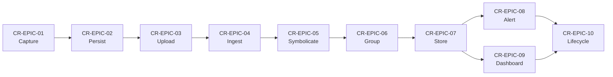

# Crashlytics Crash Reporting Pipeline — Epics & Stories

## Pipeline Overview

A Crashlytics-style crash-reporting pipeline observes a mobile application's process for anomalous termination signals — Java/Kotlin exceptions on Android, Objective-C/Swift exceptions on iOS, native NDK signals (SIGSEGV, SIGABRT, etc.), and Application Not Responding (ANR) events — captures a structured record of each, and delivers the record to an operator-facing web dashboard where on-call engineers, mobile developers, release managers, and product managers can triage and resolve issues. The pipeline must function under hostile conditions (the app is crashing) and on intermittent mobile connectivity, so it is designed around offline-first capture, serialization, and opportunistic upload.

The canonical pipeline has ten sequential stages: (1) on-device crash capture by signal/exception handlers installed at app start; (2) on-device serialization of the captured record plus contextual breadcrumbs and custom keys, with durable local persistence; (3) opportunistic upload to the ingestion endpoint on the next app launch (or in the background where supported); (4) server-side ingestion and validation that the upload conforms to the schema; (5) symbolication and deobfuscation using uploaded ProGuard/R8 mapping files (Android), dSYM bundles (iOS), and NDK symbol files (native); (6) issue grouping via stack-trace fingerprinting so duplicate crashes collapse into one issue; (7) storage and indexing for query, aggregation, and historical analysis; (8) alerting on velocity and regression conditions to notify on-call engineers; (9) delivery of issues, trends, and crash-free-user metrics to the operator-facing dashboard; and (10) issue lifecycle management (close, re-open, mute, snooze, assign) so triage state persists across releases.

This document decomposes each of those ten stages into a single epic keyed `CR-EPIC-NN` (two-digit zero-padded). Each epic carries a Summary, an In Scope / Out of Scope clarification, Dependencies, and 3–6 user stories in the canonical agile template "As a `<role>`, I want `<capability>`, so that `<outcome>`." Stories are keyed `CR-STORY-NNN` (three-digit zero-padded) and are numbered sequentially across all ten epics (so `CR-STORY-005` may live under `CR-EPIC-02`). Inline relative links to [`./glossary.md`](./glossary.md) anchor every domain-specific term so acceptance criteria can be evaluated unambiguously.

## Epic Catalog

- [`CR-EPIC-01` — On-Device Crash Capture](#cr-epic-01--on-device-crash-capture)
- [`CR-EPIC-02` — On-Device Serialization & Local Persistence](#cr-epic-02--on-device-serialization--local-persistence)
- [`CR-EPIC-03` — Upload to Ingestion Endpoint](#cr-epic-03--upload-to-ingestion-endpoint)
- [`CR-EPIC-04` — Server-Side Ingestion & Validation](#cr-epic-04--server-side-ingestion--validation)
- [`CR-EPIC-05` — Symbolication & Deobfuscation](#cr-epic-05--symbolication--deobfuscation)
- [`CR-EPIC-06` — Issue Grouping & Fingerprinting](#cr-epic-06--issue-grouping--fingerprinting)
- [`CR-EPIC-07` — Storage & Indexing](#cr-epic-07--storage--indexing)
- [`CR-EPIC-08` — Alerting](#cr-epic-08--alerting)
- [`CR-EPIC-09` — Dashboard Delivery](#cr-epic-09--dashboard-delivery)
- [`CR-EPIC-10` — Issue Lifecycle Management](#cr-epic-10--issue-lifecycle-management)

## CR-EPIC-01 — On-Device Crash Capture

**Summary:** Install platform-appropriate signal and exception handlers at application start so that every anomalous termination — Java/Kotlin uncaught exception on Android, Objective-C/Swift exception on iOS, native NDK signal (SIGSEGV, SIGABRT, SIGILL, SIGBUS, SIGFPE), and [ANR](./glossary.md#anr) on Android — is intercepted before the process exits. This epic owns the entry point of the entire pipeline: a crash not captured here cannot be reported anywhere downstream.

**In Scope:**
- Install a JVM uncaught-exception handler in the Android `Application.onCreate(...)` lifecycle hook so [fatal exceptions](./glossary.md#fatal-exception) are intercepted.
- Install an `NSSetUncaughtExceptionHandler` (Objective-C / Swift) in the iOS `AppDelegate.application(_:didFinishLaunchingWithOptions:)` hook.
- Install platform-specific signal handlers for native NDK crashes (SIGSEGV, SIGABRT, SIGILL, SIGBUS, SIGFPE).
- Detect [ANR](./glossary.md#anr) events on Android via watchdog thread or platform-provided trace files.
- Provide a non-blocking API for the application to record [non-fatal exceptions](./glossary.md#non-fatal-exception) caught by application code.

**Out of Scope:**
- Serialization and persistence of the captured record — that belongs to `CR-EPIC-02`.
- Uploading the captured record — that belongs to `CR-EPIC-03`.
- Server-side handling — that belongs to `CR-EPIC-04` and beyond.

**Dependencies:** None (this epic is the entry point of the pipeline).

### Stories

#### CR-STORY-001 — Capture JVM Uncaught Exceptions

As a `mobile app user`, I want any uncaught Java or Kotlin exception in my Android app to be recorded before the process exits, so that the engineering team can diagnose and fix the issue before I encounter it again. (References [fatal exception](./glossary.md#fatal-exception).)

#### CR-STORY-002 — Capture iOS Uncaught Exceptions and Signals

As a `mobile app developer`, I want every uncaught Objective-C / Swift exception and platform signal (SIGSEGV, SIGABRT, SIGILL, SIGBUS, SIGFPE) in the iOS app to be intercepted, so that crashes are recorded for diagnostics regardless of the underlying language layer.

#### CR-STORY-003 — Detect Application Not Responding Events

As an `on-call engineer`, I want the SDK to detect [ANR](./glossary.md#anr) events on Android via a watchdog or platform-provided trace files, so that responsiveness failures show up alongside hard crashes in our triage queue.

#### CR-STORY-004 — Record Non-Fatal Exceptions on Demand

As an `SRE`, I want the application to programmatically record [non-fatal exceptions](./glossary.md#non-fatal-exception) caught and handled inline, so that recoverable error paths contribute to issue-frequency dashboards without crashing the app.

## CR-EPIC-02 — On-Device Serialization & Local Persistence

**Summary:** Convert the captured crash record into a durable, well-defined serialized payload — including stack trace, thread state, device metadata, application metadata, [breadcrumb](./glossary.md#breadcrumb) log, [custom key](./glossary.md#custom-key) snapshot, and timestamps — and write it to a local file before the crashing process exits. Persistence must survive the crash itself, the OS reaping the process, the user force-quitting the app, and intermittent network availability.

**In Scope:**
- Serialize stack frames (per thread), device hardware/OS metadata, app version/build identifier, locale, foreground state, and a session ID.
- Append the in-memory [breadcrumb](./glossary.md#breadcrumb) log (UI events, network calls, lifecycle transitions) to the serialized record.
- Snapshot the current [custom key](./glossary.md#custom-key) set (developer-supplied key/value pairs) into the serialized record.
- Write to a crash-record file in the application's private storage atomically so a partial write is never observed.
- Cap on-disk crash-record storage so a misbehaving app cannot fill the device.

**Out of Scope:**
- Uploading the persisted record — that belongs to `CR-EPIC-03`.
- Reading the persisted record on the server — `CR-EPIC-04`.
- Symbolication — `CR-EPIC-05`.

**Dependencies:** Depends on `CR-EPIC-01` for the captured in-memory crash record.

### Stories

#### CR-STORY-005 — Persist Crash Record Before Process Exit

As a `mobile app developer`, I want the captured crash record to be written to durable local storage before the crashing process exits, so that no crash is ever lost even when the OS reaps the process within milliseconds.

#### CR-STORY-006 — Include Breadcrumbs in the Persisted Record

As an `on-call engineer`, I want the most recent N [breadcrumb](./glossary.md#breadcrumb) entries (UI events, network calls, lifecycle transitions) to be embedded in the persisted record, so that I can reconstruct what the user was doing in the seconds before the crash.

#### CR-STORY-007 — Snapshot Custom Keys at Crash Time

As a `support engineer`, I want the application's [custom key](./glossary.md#custom-key) snapshot at crash time to be included in the persisted record, so that customer-reported issues can be cross-referenced with the developer-supplied state (feature flags, A/B variants, account tier).

#### CR-STORY-008 — Cap Local Storage Usage

As an `SRE`, I want the on-device crash-record store to cap its size and discard the oldest records when full, so that a runaway crash loop cannot fill the device and degrade the user experience further.

## CR-EPIC-03 — Upload to Ingestion Endpoint

**Summary:** Move every persisted crash record from on-device storage to the server-side ingestion endpoint using an [opportunistic upload](./glossary.md#opportunistic-upload) strategy that respects intermittent connectivity, battery, and metered networks. Uploads must be idempotent so a network retry never duplicates an issue.

**In Scope:**
- Schedule [opportunistic upload](./glossary.md#opportunistic-upload) on the next app launch and (where supported) in background work.
- Respect platform constraints: defer over cellular if the user has disabled crash reporting on metered networks; defer when battery is critically low.
- Use HTTPS with certificate pinning where the platform supports it.
- Use a deterministic upload identifier (UUID per crash record) so retries are idempotent.
- Delete the local crash-record file only after the server returns a successful 2xx response.

**Out of Scope:**
- Ingestion-side validation of the uploaded payload — `CR-EPIC-04`.
- Symbolication — `CR-EPIC-05`.

**Dependencies:** Depends on `CR-EPIC-02` for the persisted on-device record.

### Stories

#### CR-STORY-009 — Opportunistic Upload on Next App Launch

As a `mobile app developer`, I want persisted crash records to be uploaded [opportunistically](./glossary.md#opportunistic-upload) on the next app launch, so that crashes from previously-killed sessions are reported as soon as the user returns to the app.

#### CR-STORY-010 — Respect Metered Networks and Battery State

As a `mobile app user`, I want the SDK to defer uploads when I am on a metered cellular network or my battery is critically low, so that crash reporting never drains my data plan or accelerates battery exhaustion.

#### CR-STORY-011 — Idempotent Retries

As an `on-call engineer`, I want each crash record to be uploaded with a deterministic UUID so that network retries do not produce duplicate server-side records, so that issue counts in the dashboard reflect reality rather than retry storms.

#### CR-STORY-012 — Delete Local Record Only After Server Acknowledgement

As an `SRE`, I want the on-device crash-record file to be deleted only after the server returns a successful 2xx response, so that a transient server outage never causes crash data loss.

## CR-EPIC-04 — Server-Side Ingestion & Validation

**Summary:** Receive uploaded crash records at the ingestion endpoint, validate that they conform to the schema (required fields, plausible values, signed payload), and route valid records to downstream symbolication while rejecting or quarantining malformed payloads.

**In Scope:**
- Accept HTTPS uploads from the on-device SDK at a versioned API endpoint.
- Authenticate uploads via a per-application API key (or equivalent token).
- Enforce a JSON-schema (or protobuf-schema) validation on every payload.
- Quarantine payloads that fail schema validation with a structured rejection reason.
- Emit metrics (counters, histograms) for upload volume, validation failure rate, and per-app upload rate.

**Out of Scope:**
- Symbolication — `CR-EPIC-05`.
- Grouping — `CR-EPIC-06`.

**Dependencies:** Depends on `CR-EPIC-03` for the uploaded payload.

### Stories

#### CR-STORY-013 — Authenticate Every Upload

As an `SRE`, I want every uploaded crash record to be authenticated via a per-application API key, so that the ingestion endpoint cannot be flooded by anonymous attackers and our crash counts remain trustworthy. (See [fingerprint](./glossary.md#fingerprint) for downstream grouping.)

#### CR-STORY-014 — Schema-Validate Every Payload

As an `on-call engineer`, I want each upload to be schema-validated and quarantined with a structured reason if it fails, so that downstream pipeline stages never have to defend against malformed input.

#### CR-STORY-015 — Emit Ingestion Metrics

As a `mobile app developer`, I want the ingestion endpoint to emit per-app upload-volume and validation-failure metrics, so that the engineering team can detect SDK misbehavior (sudden upload spike) before it impacts the broader pipeline.

#### CR-STORY-016 — Reject Replay Attacks

As a `product manager`, I want the ingestion endpoint to reject duplicate UUIDs within a configurable window, so that adversarial replay does not skew our crash-free metrics or alert thresholds.

## CR-EPIC-05 — Symbolication & Deobfuscation

**Summary:** Convert obfuscated and minified stack frames in the uploaded crash record into human-readable class, method, and source-file names using [symbolication](./glossary.md#symbolication) artifacts uploaded at release-build time: Android [mapping files](./glossary.md#mapping-file) (ProGuard/R8), iOS [dSYM](./glossary.md#dsym) bundles, and [NDK symbol files](./glossary.md#ndk-symbol-file) for native code.

**In Scope:**
- Accept symbol uploads from the release build pipeline at a dedicated endpoint, indexed by app ID + version + build ID.
- For Android stack frames, apply the matching ProGuard/R8 [mapping file](./glossary.md#mapping-file) to translate obfuscated names back to original ones.
- For iOS stack frames, apply the matching [dSYM](./glossary.md#dsym) bundle to resolve hex addresses into source locations.
- For native NDK frames, apply [NDK symbol files](./glossary.md#ndk-symbol-file) to demangle and resolve.
- Mark frames as "[deobfuscated](./glossary.md#deobfuscation)" or "raw" in the stored record so consumers know the quality of the trace.

**Out of Scope:**
- Issue grouping — `CR-EPIC-06`.
- Dashboard rendering — `CR-EPIC-09`.

**Dependencies:** Depends on `CR-EPIC-04` for validated input.

### Stories

#### CR-STORY-017 — Upload Mapping Files at Release Time

As a `release manager`, I want the release build pipeline to upload the matching [mapping file](./glossary.md#mapping-file) (Android) and [dSYM](./glossary.md#dsym) bundle (iOS) for every release variant, so that every crash report from that release can be [symbolicated](./glossary.md#symbolication).

#### CR-STORY-018 — Symbolicate Native NDK Frames

As a `mobile app developer`, I want NDK stack frames to be resolved via the corresponding [NDK symbol file](./glossary.md#ndk-symbol-file), so that native crashes show me the original C/C++ function names and line numbers.

#### CR-STORY-019 — Mark Frame Quality

As an `on-call engineer`, I want every stored stack frame to be marked "[deobfuscated](./glossary.md#deobfuscation)" or "raw", so that I know whether the demangled function names are trustworthy or whether the matching symbol file is missing.

#### CR-STORY-020 — Backfill Symbolication When a Mapping File Arrives Late

As an `SRE`, I want crash records whose mapping file was missing at first ingest to be re-symbolicated when the mapping file is later uploaded, so that no diagnostic value is lost due to release-pipeline race conditions.

## CR-EPIC-06 — Issue Grouping & Fingerprinting

**Summary:** Compute a deterministic [fingerprint](./glossary.md#fingerprint) over the symbolicated stack trace so that two crashes with the same underlying root cause are collapsed into a single "issue" with an aggregated event count. Without grouping, the dashboard becomes a list of millions of nearly identical entries instead of a triage-friendly issue list.

**In Scope:**
- Compute a stable [fingerprint](./glossary.md#fingerprint) over a canonicalized representation of the symbolicated stack trace (e.g., top-N frames, normalized by line-number noise).
- Map every incoming crash record to an existing issue (if the fingerprint matches) or create a new issue (if not).
- Track per-issue counters: total events, distinct users, first-seen / last-seen timestamps, affected app versions.
- Allow operators to merge two issues that are conceptually the same but have different fingerprints (manual override).
- Allow operators to split an issue when it has accidentally absorbed two distinct root causes.

**Out of Scope:**
- Storage and retrieval — `CR-EPIC-07`.
- Alerting on issue activity — `CR-EPIC-08`.

**Dependencies:** Depends on `CR-EPIC-05` for symbolicated input.

### Stories

#### CR-STORY-021 — Deterministic Fingerprint Algorithm

As an `on-call engineer`, I want the [fingerprint](./glossary.md#fingerprint) of an issue to be deterministic and stable across releases, so that the same underlying root cause is always grouped under the same issue ID and trend data is meaningful.

#### CR-STORY-022 — Track First-Seen / Last-Seen and Affected Versions

As a `product manager`, I want each issue to track first-seen and last-seen timestamps along with the set of affected app versions, so that I can quickly assess whether an issue is a regression in the current release.

#### CR-STORY-023 — Manual Merge of Equivalent Issues

As a `data analyst`, I want to manually merge two issues whose fingerprints differ but whose root cause is the same, so that downstream trend reports do not double-count obvious duplicates.

#### CR-STORY-024 — Manual Split of Conflated Issues

As a `mobile app developer`, I want to split an issue into two when I discover that the [fingerprint](./glossary.md#fingerprint) has accidentally collapsed two distinct root causes, so that each can be tracked, prioritized, and resolved independently.

## CR-EPIC-07 — Storage & Indexing

**Summary:** Store every ingested crash record and every grouped issue in a durable, query-friendly data store with indexes for the dimensions operators query most frequently: app, version, OS, device model, time window, and [fingerprint](./glossary.md#fingerprint). Storage is the foundation that alerts, dashboards, and analytics all read from.

**In Scope:**
- Durable storage of every crash record and every issue with version history.
- Time-series indexes for fast time-bucketed queries (issue counts per hour / per day / per release).
- Per-dimension indexes (app, OS version, device model, locale) for filterable dashboards.
- Retention policy (e.g., raw events 90 days, aggregated issue metadata indefinitely) configurable per app.
- Read replicas to isolate dashboard read traffic from ingestion write traffic.

**Out of Scope:**
- Alerting — `CR-EPIC-08`.
- Dashboard rendering — `CR-EPIC-09`.

**Dependencies:** Depends on `CR-EPIC-04` (raw records), `CR-EPIC-05` (symbolicated frames), and `CR-EPIC-06` (issue grouping). Also feeds the [fingerprint](./glossary.md#fingerprint)-driven indexes.

### Stories

#### CR-STORY-025 — Time-Series Indexes for Trend Queries

As an `SRE`, I want crash data indexed by time bucket and [fingerprint](./glossary.md#fingerprint) so dashboards can render hour / day / week trends in well under one second, so that triage meetings stay focused on data instead of waiting on queries.

#### CR-STORY-026 — Configurable Retention Policy

As a `data analyst`, I want raw crash events retained for 90 days and aggregated issue metadata retained indefinitely (configurable per app), so that long-term trend analysis remains possible while raw-storage cost stays bounded.

#### CR-STORY-027 — Read-Replica Isolation

As an `on-call engineer`, I want dashboard read traffic to be served from read replicas so that a query spike during an incident never throttles the ingestion path, so that we never lose crash data while triaging an outage.

## CR-EPIC-08 — Alerting

**Summary:** Emit operator-facing notifications when issue activity crosses configured thresholds — a [velocity alert](./glossary.md#velocity-alert) when a new or existing issue spikes, a [regression alert](./glossary.md#regression-alert) when a previously-resolved issue re-appears, and an ANR-rate alert when [ANR](./glossary.md#anr) events exceed a per-app baseline. Alerts must be reliable, deduplicated, and routable to multiple destinations (Slack, PagerDuty, email).

**In Scope:**
- [Velocity alerts](./glossary.md#velocity-alert) when an issue's event-count per minute exceeds a configurable threshold.
- [Regression alerts](./glossary.md#regression-alert) when an issue marked "resolved" produces a new event in the current release.
- ANR-rate alerts when [ANR](./glossary.md#anr) frequency per app version exceeds a configurable baseline.
- Configurable alert routing (Slack channel, PagerDuty service, email distribution).
- Alert deduplication so a single spike does not produce dozens of notifications.

**Out of Scope:**
- Dashboard rendering of alerts — `CR-EPIC-09`.
- On-call rotation management — out of pipeline scope.

**Dependencies:** Depends on `CR-EPIC-07` for the indexed event stream.

### Stories

#### CR-STORY-028 — Velocity Alert on New Issue Spike

As an `on-call engineer`, I want a [velocity alert](./glossary.md#velocity-alert) to fire when a new issue's event count exceeds the configured threshold within a short window, so that I can page on user-impacting regressions before a release goes broadly available.

#### CR-STORY-029 — Regression Alert on Resolved Issue Re-appearance

As a `release manager`, I want a [regression alert](./glossary.md#regression-alert) when an issue that was marked resolved produces a new event in the current release, so that QA gaps are caught before they propagate to customer support tickets.

#### CR-STORY-030 — Alert Routing to Multiple Destinations

As an `SRE`, I want alerts to route to a Slack channel and a PagerDuty service in parallel, so that both broadcast and paging recipients receive the notification without manual fan-out.

#### CR-STORY-031 — Alert Deduplication

As a `product manager`, I want recurring alerts for the same issue to be deduplicated within a configurable window, so that a single incident produces one actionable notification instead of a continuous stream.

## CR-EPIC-09 — Dashboard Delivery

**Summary:** Render the operator-facing web dashboard that surfaces issues, trends, [crash-free user](./glossary.md#crash-free-user) percentage, ANR rate, and per-issue detail (stack trace, breadcrumbs, custom keys, affected sessions). The dashboard is the primary consumption surface that the user's prompt names ("to dashboard delivery").

**In Scope:**
- Issue list view with sort by event count, [crash-free user](./glossary.md#crash-free-user) %, first-seen, last-seen, affected versions.
- Per-issue detail view with full symbolicated stack trace, breadcrumb timeline, custom-key snapshot, and recent-event sample.
- Trend charts (event count, [crash-free user](./glossary.md#crash-free-user) %, ANR rate) over arbitrary time windows.
- Filtering by app version, OS, device model, locale.
- Deep links to a specific issue ID that on-call notifications can use.

**Out of Scope:**
- Alerting (the dashboard surfaces alerts but does not generate them — `CR-EPIC-08`).
- Lifecycle state changes — `CR-EPIC-10`.

**Dependencies:** Depends on `CR-EPIC-07` for query data and `CR-EPIC-05` for symbolicated frames.

### Stories

#### CR-STORY-032 — Issue List with Sortable Columns

As an `on-call engineer`, I want the dashboard's issue list to be sortable by event count, [crash-free user](./glossary.md#crash-free-user) %, first-seen, and affected versions, so that triage meetings can prioritize work without exporting data into a spreadsheet.

#### CR-STORY-033 — Trend Charts for Crash-Free Users

As a `product manager`, I want trend charts of [crash-free user](./glossary.md#crash-free-user) % over the last 7, 30, and 90 days, so that release-quality gates can be evaluated objectively.

#### CR-STORY-034 — Per-Issue Detail with Breadcrumbs and Custom Keys

As a `support engineer`, I want the per-issue detail view to show the breadcrumb timeline and [custom key](./glossary.md#custom-key) snapshot for a sampled event, so that customer-reported issues can be matched to a specific issue ID quickly.

#### CR-STORY-035 — Deep Links from Alerts

As a `mobile app developer`, I want alerts to include a deep link to the issue detail view in the dashboard, so that I can move from notification to triage in a single click.

## CR-EPIC-10 — Issue Lifecycle Management

**Summary:** Allow operators to manage the lifecycle state of an issue: close, re-open, mute, snooze, assign, comment. State persists across releases and feeds back into [regression alerts](./glossary.md#regression-alert) (a closed issue re-appearing in a new release is a regression). Lifecycle is what turns a passive dashboard into an active triage tool.

**In Scope:**
- Close an issue (mark resolved) with a free-text note.
- Re-open an issue when a new event arrives after a close — automatic or manual.
- Mute an issue so it does not page the on-call but still accumulates events.
- Snooze an issue until a future timestamp or until a future release.
- Assign an issue to a team member or team.
- Audit log of every lifecycle transition with timestamp and actor.

**Out of Scope:**
- The underlying issue-grouping logic — `CR-EPIC-06`.
- The dashboard rendering — `CR-EPIC-09`.

**Dependencies:** Depends on `CR-EPIC-06` (issue identity) and `CR-EPIC-09` (operator-facing surface). Updates feed back into `CR-EPIC-08` for [regression alerts](./glossary.md#regression-alert).

### Stories

#### CR-STORY-036 — Close an Issue With a Resolution Note

As an `on-call engineer`, I want to close an issue with a free-text resolution note, so that the next on-call shift sees a concise explanation when reviewing recent triage history.

#### CR-STORY-037 — Auto Re-Open on New Event

As a `release manager`, I want closed issues to auto re-open when a new event arrives, so that no regression is missed because a fix in the previous release did not actually land.

#### CR-STORY-038 — Mute Without Closing

As a `mobile app developer`, I want to mute an issue that I am actively investigating without closing it, so that the on-call queue stays clean while I work on the fix.

#### CR-STORY-039 — Audit Log of Lifecycle Transitions

As a `product manager`, I want a full audit log of every lifecycle transition (open, close, re-open, mute, snooze, assign) with timestamp and actor, so that post-incident reviews can reconstruct what was known when. Closing this loop ensures the [symbol upload](./glossary.md#symbol-upload) pipeline never has stale entries because resolutions are durable.

## Story-to-Stage Traceability Matrix

| Story ID | Pipeline Stage | Epic ID | Primary Role |
|---|---|---|---|
| `CR-STORY-001` | On-Device Crash Capture | `CR-EPIC-01` | `mobile app user` |
| `CR-STORY-002` | On-Device Crash Capture | `CR-EPIC-01` | `mobile app developer` |
| `CR-STORY-003` | On-Device Crash Capture | `CR-EPIC-01` | `on-call engineer` |
| `CR-STORY-004` | On-Device Crash Capture | `CR-EPIC-01` | `SRE` |
| `CR-STORY-005` | On-Device Serialization & Local Persistence | `CR-EPIC-02` | `mobile app developer` |
| `CR-STORY-006` | On-Device Serialization & Local Persistence | `CR-EPIC-02` | `on-call engineer` |
| `CR-STORY-007` | On-Device Serialization & Local Persistence | `CR-EPIC-02` | `support engineer` |
| `CR-STORY-008` | On-Device Serialization & Local Persistence | `CR-EPIC-02` | `SRE` |
| `CR-STORY-009` | Upload to Ingestion Endpoint | `CR-EPIC-03` | `mobile app developer` |
| `CR-STORY-010` | Upload to Ingestion Endpoint | `CR-EPIC-03` | `mobile app user` |
| `CR-STORY-011` | Upload to Ingestion Endpoint | `CR-EPIC-03` | `on-call engineer` |
| `CR-STORY-012` | Upload to Ingestion Endpoint | `CR-EPIC-03` | `SRE` |
| `CR-STORY-013` | Server-Side Ingestion & Validation | `CR-EPIC-04` | `SRE` |
| `CR-STORY-014` | Server-Side Ingestion & Validation | `CR-EPIC-04` | `on-call engineer` |
| `CR-STORY-015` | Server-Side Ingestion & Validation | `CR-EPIC-04` | `mobile app developer` |
| `CR-STORY-016` | Server-Side Ingestion & Validation | `CR-EPIC-04` | `product manager` |
| `CR-STORY-017` | Symbolication & Deobfuscation | `CR-EPIC-05` | `release manager` |
| `CR-STORY-018` | Symbolication & Deobfuscation | `CR-EPIC-05` | `mobile app developer` |
| `CR-STORY-019` | Symbolication & Deobfuscation | `CR-EPIC-05` | `on-call engineer` |
| `CR-STORY-020` | Symbolication & Deobfuscation | `CR-EPIC-05` | `SRE` |
| `CR-STORY-021` | Issue Grouping & Fingerprinting | `CR-EPIC-06` | `on-call engineer` |
| `CR-STORY-022` | Issue Grouping & Fingerprinting | `CR-EPIC-06` | `product manager` |
| `CR-STORY-023` | Issue Grouping & Fingerprinting | `CR-EPIC-06` | `data analyst` |
| `CR-STORY-024` | Issue Grouping & Fingerprinting | `CR-EPIC-06` | `mobile app developer` |
| `CR-STORY-025` | Storage & Indexing | `CR-EPIC-07` | `SRE` |
| `CR-STORY-026` | Storage & Indexing | `CR-EPIC-07` | `data analyst` |
| `CR-STORY-027` | Storage & Indexing | `CR-EPIC-07` | `on-call engineer` |
| `CR-STORY-028` | Alerting | `CR-EPIC-08` | `on-call engineer` |
| `CR-STORY-029` | Alerting | `CR-EPIC-08` | `release manager` |
| `CR-STORY-030` | Alerting | `CR-EPIC-08` | `SRE` |
| `CR-STORY-031` | Alerting | `CR-EPIC-08` | `product manager` |
| `CR-STORY-032` | Dashboard Delivery | `CR-EPIC-09` | `on-call engineer` |
| `CR-STORY-033` | Dashboard Delivery | `CR-EPIC-09` | `product manager` |
| `CR-STORY-034` | Dashboard Delivery | `CR-EPIC-09` | `support engineer` |
| `CR-STORY-035` | Dashboard Delivery | `CR-EPIC-09` | `mobile app developer` |
| `CR-STORY-036` | Issue Lifecycle Management | `CR-EPIC-10` | `on-call engineer` |
| `CR-STORY-037` | Issue Lifecycle Management | `CR-EPIC-10` | `release manager` |
| `CR-STORY-038` | Issue Lifecycle Management | `CR-EPIC-10` | `mobile app developer` |
| `CR-STORY-039` | Issue Lifecycle Management | `CR-EPIC-10` | `product manager` |

## Cross-References

- [`./glossary.md`](./glossary.md) — Pipeline domain glossary defining ANR, breadcrumb, crash-free user, custom key, deobfuscation, dSYM, fatal exception, fingerprint, mapping file, NDK symbol file, non-fatal exception, opportunistic upload, regression alert, symbolication, symbol upload, and velocity alert. Every glossary term linked from the stories above resolves to its definition here.
- [`../README.md`](../README.md) — Planning documents index (`docs/README.md`).
- [`../../README.md`](../../README.md) — Project root README (`README.md`). Note: the host repository is a Spring Boot 3.4.4 / Java 17 backend service (see `../../pom.xml` lines 8 and 30) that hosts these planning documents; it is neither the producer nor the consumer of the crash-reporting pipeline described above.
