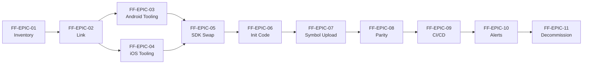

# Fabric → Firebase Crashlytics Migration — Epics & Acceptance Criteria

## Migration Overview

Fabric was sunset by Google in March 2020. Mobile applications that historically depended on the Fabric SDK (Crashlytics, Answers, Beta) for crash reporting must migrate to Firebase Crashlytics to retain crash-reporting capability. This document decomposes that migration into eleven canonical epics keyed `FF-EPIC-01` through `FF-EPIC-11`, each carrying 3–6 Given/When/Then acceptance criteria keyed `FF-AC-NNN` so that progress can be measured continuously rather than only at epic completion.

The parity targets that gate cutover are: (a) crash-free users % remains within an agreed parity threshold (for example ±0.05 %) between Fabric and Firebase for a continuous validation window, (b) ANR rate remains within an agreed parity threshold, (c) the top-N issues reported by Fabric and Firebase substantially overlap (typically ≥ 80 % of the top 20 issues match), and (d) symbolication (Android ProGuard/R8 mapping files, iOS dSYMs, NDK symbols if applicable) succeeds for every release build uploaded to Firebase. These targets are concretized as the gating items in the **Parity Validation Checklist** at the bottom of this document and are referenced by `FF-EPIC-08`.

The eleven phases are sequential at a conceptual level: inventory the current Fabric footprint, link Fabric apps to Firebase projects, swap Android Gradle and iOS CocoaPods/SPM build tooling, swap the SDK dependency, migrate initialization code, migrate the symbol upload pipeline, validate parity, update CI/CD, re-route alerts and dashboards, and finally decommission Fabric while enabling the team on the Firebase Crashlytics dashboard. The supporting operational sequence with pre-conditions, actions, validation hooks, and rollback paths is in [`./runbook.md`](./runbook.md). The host repository is the Spring Boot 3.4.4 / Java 17 backend service (see [`../../pom.xml`](../../pom.xml) lines 8 and 30 for the project metadata); it merely hosts these planning documents and is neither the producer nor the consumer of crash reports — the documents describe a generic mobile crash-reporting migration.

## Epic Catalog

- [`FF-EPIC-01` — Inventory & Discovery of Current Fabric Footprint](#ff-epic-01--inventory--discovery-of-current-fabric-footprint)
- [`FF-EPIC-02` — Link Fabric Apps to Firebase Projects](#ff-epic-02--link-fabric-apps-to-firebase-projects)
- [`FF-EPIC-03` — Build Tooling Migration (Android Gradle Plugin)](#ff-epic-03--build-tooling-migration-android-gradle-plugin)
- [`FF-EPIC-04` — Build Tooling Migration (iOS CocoaPods / SPM)](#ff-epic-04--build-tooling-migration-ios-cocoapods--spm)
- [`FF-EPIC-05` — SDK Dependency Swap](#ff-epic-05--sdk-dependency-swap)
- [`FF-EPIC-06` — Initialization Code Migration](#ff-epic-06--initialization-code-migration)
- [`FF-EPIC-07` — Symbol Upload Pipeline Migration](#ff-epic-07--symbol-upload-pipeline-migration)
- [`FF-EPIC-08` — Parity Validation Between Fabric and Firebase](#ff-epic-08--parity-validation-between-fabric-and-firebase)
- [`FF-EPIC-09` — CI/CD Pipeline Updates](#ff-epic-09--cicd-pipeline-updates)
- [`FF-EPIC-10` — Alert & Dashboard Re-routing](#ff-epic-10--alert--dashboard-re-routing)
- [`FF-EPIC-11` — Decommissioning & Team Enablement](#ff-epic-11--decommissioning--team-enablement)

## FF-EPIC-01 — Inventory & Discovery of Current Fabric Footprint

**Summary:** Identify every place Fabric is referenced in the codebase, build configuration, CI/CD pipelines, manifests, plists, and developer documentation. A complete inventory is the foundation of a low-risk migration — every entry becomes a checklist item for subsequent epics.

**In Scope:**

- Catalog all references to the `io.fabric` Gradle plugin and `com.crashlytics.sdk.android:crashlytics` SDK in Android modules.
- Catalog all references to the `Fabric/Crashlytics` CocoaPods pod and any Carthage entries in iOS targets.
- Catalog all initialization sites (`Fabric.with(this, new Crashlytics())` and equivalent Swift / Objective-C calls).
- Catalog all Fabric API keys, organization IDs, and build secrets in manifests (`AndroidManifest.xml`), plists (`Info.plist`), CI secret stores, and developer documentation.
- Catalog any Fabric Beta / Answers / Crashlytics dashboard integrations (Slack, email, third-party alerting).

**Out of Scope:**

- Actually removing or replacing any of the catalogued references — that work belongs to `FF-EPIC-03` through `FF-EPIC-11`.
- Changes to the host repository's Spring Boot service ([`../../pom.xml`](../../pom.xml) lines 8 and 30: Spring Boot 3.4.4 / Java 17), which has no Fabric or Firebase coupling and is unrelated to this migration.

**Dependencies:** None (this epic is the starting point).

### Acceptance Criteria

#### FF-AC-001 — Repo Audit Complete

- **Given** the Fabric-using application repository is checked out at the migration baseline commit
- **When** an inventory script greps for `io.fabric`, `com.crashlytics`, `Crashlytics.framework`, and `Fabric/` across all Gradle, CocoaPods, Swift Package Manager, Java, Kotlin, Swift, and Objective-C sources
- **Then** a report file `MIGRATION_INVENTORY.md` is produced enumerating every match with file path and line number
- **And** the report is committed to the repository under the migration branch

#### FF-AC-002 — Initialization Sites Catalogued

- **Given** the inventory report from `FF-AC-001` exists
- **When** the report's "Initialization sites" section is reviewed
- **Then** every call to `Fabric.with(this, new Crashlytics())` (or equivalent `Fabric.with(...)` invocations in Swift / Objective-C) is listed with file path, line number, and surrounding 5 lines of context
- **And** any conditional initialization (debug-only, flavor-specific, environment-specific) is annotated in the report

#### FF-AC-003 — Secrets & API Keys Catalogued

- **Given** the inventory report from `FF-AC-001` exists
- **When** the report's "Secrets & API keys" section is reviewed
- **Then** every `io.fabric.ApiKey` `<meta-data>` element in `AndroidManifest.xml`, every `Fabric` entry in `Info.plist`, and every `FABRIC_API_KEY`-like CI secret reference is listed
- **And** no real key value (only stand-ins such as `FAKE_API_TOKEN_DO_NOT_USE`) appears in the committed report

## FF-EPIC-02 — Link Fabric Apps to Firebase Projects

**Summary:** Bind every Fabric application to a Firebase project so the same crash stream can flow into both Fabric and Firebase during parity validation. Linking is performed in the Firebase console and must be completed before any SDK swap so that the Firebase backend can accept crash uploads from a parallel build.

**In Scope:**

- Create or identify a Firebase project per environment (development, staging, production) referenced by the placeholder `MY_FIREBASE_PROJECT_ID`.
- Use the Firebase console's "Link Fabric apps to Firebase" workflow to attach each Fabric application (identified by its bundle ID, for example `com.example.app`) to the appropriate Firebase project.
- Download fresh `google-services.json` (Android) and `GoogleService-Info.plist` (iOS) placeholders for each environment and store them in a secure secret manager — they are NOT committed to the host repository, which is the Spring Boot service.

**Out of Scope:**

- Actually swapping any Android or iOS build tooling — that work belongs to `FF-EPIC-03` and `FF-EPIC-04`.
- Adding any Firebase SDK or plugin to the host repository's [`../../pom.xml`](../../pom.xml).

**Dependencies:** Depends on `FF-EPIC-01` (inventory complete so every Fabric app is known).

### Acceptance Criteria

#### FF-AC-004 — Firebase Projects Provisioned per Environment

- **Given** the development, staging, and production environments are inventoried
- **When** a Firebase project is created (or identified) for each environment with project ID `MY_FIREBASE_PROJECT_ID` (per-environment stand-in)
- **Then** each project is visible in the Firebase console under the migrating organization's billing account
- **And** the project IDs are recorded in the migration runbook (see [`./runbook.md`](./runbook.md))

#### FF-AC-005 — Fabric Apps Linked to Firebase Projects

- **Given** the Firebase projects from `FF-AC-004` exist
- **When** the Firebase console's "Link Fabric apps to Firebase" wizard is run for each Fabric application (for example `com.example.app` on Android and `com.example.app` bundle ID on iOS)
- **Then** the wizard reports successful linkage and each Fabric app is associated with exactly one Firebase project
- **And** the linkage status is reflected in the Firebase project's Crashlytics dashboard within 24 hours

#### FF-AC-006 — Configuration Artifacts Retrieved

- **Given** the linked Firebase projects from `FF-AC-005`
- **When** the Firebase console download links for `google-services.json` (Android) and `GoogleService-Info.plist` (iOS) are used for each environment
- **Then** the downloaded files are stored in a secure secret manager (not committed to the host repository)
- **And** the file names and storage locations are listed in `MIGRATION_INVENTORY.md` without disclosing the file contents

#### FF-AC-007 — Firebase Crashlytics Dashboard Accessible

- **Given** the linked Firebase projects from `FF-AC-005`
- **When** a team member opens the Firebase Crashlytics dashboard for each project
- **Then** the dashboard renders with a "no crashes yet" or equivalent empty state
- **And** the team member's IAM role grants at least Crashlytics Viewer access

## FF-EPIC-03 — Build Tooling Migration (Android Gradle Plugin)

**Summary:** Replace the legacy `io.fabric` Gradle plugin with the `com.google.firebase.crashlytics` Gradle plugin in every Android module. The plugin swap is a prerequisite for the SDK dependency swap in `FF-EPIC-05` and for the Android symbol-upload migration in `FF-EPIC-07`.

**In Scope:**

- Remove the `apply plugin: 'io.fabric'` or `id 'io.fabric'` declaration from every Android `build.gradle` / `build.gradle.kts`.
- Add the `com.google.firebase.crashlytics` Gradle plugin to the same modules.
- Add or verify the `com.google.gms.google-services` Gradle plugin (a prerequisite for Crashlytics on Android).
- Update the project-level `build.gradle` `classpath` declarations to reference the Firebase Crashlytics Gradle plugin and the Google Services Gradle plugin.

**Out of Scope:**

- Changing the SDK dependency line — that belongs to `FF-EPIC-05`.
- Changing iOS build tooling — that belongs to `FF-EPIC-04`.
- Any change to the host repository's [`../../pom.xml`](../../pom.xml) (no Android Gradle plugin is added to a Spring Boot Maven POM).

**Dependencies:** Depends on `FF-EPIC-01` (inventory) and `FF-EPIC-02` (Firebase project linked).

### Acceptance Criteria

#### FF-AC-008 — Project-Level Plugin Classpath Updated

- **Given** the root `build.gradle` of the Android application declares the `io.fabric.tools:gradle:<version>` classpath
- **When** the classpath is replaced with `com.google.firebase:firebase-crashlytics-gradle:<version>` (and the `com.google.gms:google-services:<version>` classpath is also present)
- **Then** the file no longer contains the substring `io.fabric.tools`
- **And** `./gradlew tasks --all | grep -i crashlytics` lists Firebase Crashlytics tasks (e.g., `uploadCrashlyticsMappingFile<Variant>`)

#### FF-AC-009 — App-Level Plugin Declaration Swapped

- **Given** the Android application module's `build.gradle` declares `apply plugin: 'io.fabric'` (or `id 'io.fabric'` in the plugins block)
- **When** the declaration is replaced with the Firebase Crashlytics Gradle plugin coordinate `com.google.firebase.crashlytics`
- **Then** the file no longer contains the substring `io.fabric`
- **And** the file contains `com.google.firebase.crashlytics` exactly once in its plugins/apply block

#### FF-AC-010 — Fabric Plugin Fully Removed from All Modules

- **Given** the Android project contains multiple modules (for example `:app`, `:feature-foo`, `:feature-bar`)
- **When** every module's `build.gradle` is audited
- **Then** zero references to `io.fabric` remain across every module
- **And** zero references to `apply plugin: 'io.fabric'` remain across every module

#### FF-AC-011 — Android Build Succeeds With New Plugin

- **Given** the Android project after `FF-AC-008`, `FF-AC-009`, and `FF-AC-010`
- **When** `./gradlew assembleDebug assembleRelease` is executed
- **Then** the build completes with exit code 0
- **And** the resulting APKs (or AABs) contain the Firebase Crashlytics initialization metadata in their manifest merger report

## FF-EPIC-04 — Build Tooling Migration (iOS CocoaPods / SPM)

**Summary:** Replace the Fabric/Crashlytics CocoaPod (or the equivalent Carthage entry) with the Firebase Crashlytics pod, or migrate to Swift Package Manager (SPM) using the Firebase iOS SDK package. The iOS tooling swap parallels `FF-EPIC-03` and is a prerequisite for the SDK dependency swap and the iOS symbol-upload migration.

**In Scope:**

- Remove `pod 'Fabric'` and `pod 'Crashlytics'` lines from the `Podfile`.
- Add `pod 'FirebaseCrashlytics'` (typically alongside `pod 'Firebase/Analytics'` if Analytics is used) to the `Podfile`.
- Alternatively migrate to SPM by adding the Firebase iOS SDK package to the Xcode project and selecting the `FirebaseCrashlytics` product.
- Re-run `pod install` or refresh SPM packages and commit the resulting `Podfile.lock` (or `Package.resolved`) changes.

**Out of Scope:**

- Changing initialization code — that belongs to `FF-EPIC-06`.
- Changing Android build tooling — covered by `FF-EPIC-03`.

**Dependencies:** Depends on `FF-EPIC-01` (inventory) and `FF-EPIC-02` (Firebase project linked).

### Acceptance Criteria

#### FF-AC-012 — Podfile Replaced With Firebase Crashlytics Pod

- **Given** the iOS application's `Podfile` declares `pod 'Fabric'` and/or `pod 'Crashlytics'`
- **When** those lines are removed and `pod 'FirebaseCrashlytics'` is added
- **Then** the `Podfile` no longer contains the substrings `Fabric` or `Crashlytics` (except as part of `FirebaseCrashlytics`)
- **And** the `Podfile` contains `FirebaseCrashlytics` exactly once

#### FF-AC-013 — Pod Install Succeeds

- **Given** the updated `Podfile` from `FF-AC-012`
- **When** `pod install --repo-update` is executed
- **Then** the command exits with status 0 and the new pods are downloaded
- **And** `Podfile.lock` is updated with the resolved version of `FirebaseCrashlytics`

#### FF-AC-014 — Optional SPM Path Documented

- **Given** the team chooses Swift Package Manager instead of CocoaPods
- **When** the Firebase iOS SDK package is added to the Xcode project via SPM and `FirebaseCrashlytics` is selected as a product
- **Then** the `Package.resolved` file is updated and committed
- **And** the choice (CocoaPods vs. SPM) is recorded in [`./runbook.md`](./runbook.md) Step 04

#### FF-AC-015 — iOS Build Succeeds With Firebase Pod

- **Given** the iOS workspace after `FF-AC-013` (or `FF-AC-014`)
- **When** `xcodebuild -workspace <workspace>.xcworkspace -scheme <scheme> -configuration Release build` is executed
- **Then** the build succeeds with exit code 0
- **And** the resulting `.app` bundle links against the `FirebaseCrashlytics` framework

## FF-EPIC-05 — SDK Dependency Swap

**Summary:** Replace the legacy `com.crashlytics.sdk.android:crashlytics` SDK dependency (Android) and the Fabric/Crashlytics pod consumption (iOS) with the Firebase Crashlytics SDK. On Android this typically means consuming `com.google.firebase:firebase-crashlytics` through the Firebase BoM (`firebase-bom`) so versioning is centralized.

**In Scope:**

- Remove the `implementation 'com.crashlytics.sdk.android:crashlytics:<version>'` dependency from every Android module.
- Add `implementation platform('com.google.firebase:firebase-bom:<version>')` and `implementation 'com.google.firebase:firebase-crashlytics'` (no explicit version when using the BoM).
- Verify on iOS that the `FirebaseCrashlytics` framework is linked into every target via the result of `FF-EPIC-04`.
- Remove transitive Fabric Answers and Beta dependencies if any modules still reference them.

**Out of Scope:**

- Changing initialization code — that belongs to `FF-EPIC-06`.
- Changing symbol upload tasks — that belongs to `FF-EPIC-07`.
- Adding any Firebase SDK to the host Spring Boot service's [`../../pom.xml`](../../pom.xml).

**Dependencies:** Depends on `FF-EPIC-03` (Android plugin in place) and `FF-EPIC-04` (iOS pod or SPM package in place).

### Acceptance Criteria

#### FF-AC-016 — Legacy Crashlytics SDK Removed (Android)

- **Given** an Android module's `build.gradle` declares `implementation 'com.crashlytics.sdk.android:crashlytics:<version>'`
- **When** the line is deleted across all modules
- **Then** `grep -R "com.crashlytics.sdk.android" .` returns zero matches in the Android project
- **And** `./gradlew :app:dependencies` no longer lists `com.crashlytics.sdk.android:crashlytics`

#### FF-AC-017 — Firebase BoM Declared (Android)

- **Given** the Android application module's `build.gradle`
- **When** `implementation platform('com.google.firebase:firebase-bom:<version>')` is added to the dependencies block
- **Then** the BoM platform constraint is visible in `./gradlew :app:dependencies` output
- **And** no explicit version is required on any `com.google.firebase:firebase-*` dependency in the same module

#### FF-AC-018 — Firebase Crashlytics SDK Added (Android)

- **Given** the Firebase BoM from `FF-AC-017` is present
- **When** `implementation 'com.google.firebase:firebase-crashlytics'` is added
- **Then** `./gradlew :app:dependencies` lists `com.google.firebase:firebase-crashlytics` with the BoM-resolved version
- **And** the module compiles without missing-symbol errors when Crashlytics APIs are referenced

#### FF-AC-019 — Firebase Crashlytics Framework Linked (iOS)

- **Given** the iOS workspace after `FF-EPIC-04`
- **When** a target's "Frameworks, Libraries, and Embedded Content" section is inspected
- **Then** `FirebaseCrashlytics` appears in the linked-frameworks list for every target that previously linked `Crashlytics.framework`
- **And** no target still links the legacy `Crashlytics.framework`

#### FF-AC-020 — Transitive Fabric Dependencies Cleaned

- **Given** the Android and iOS dependency graphs after `FF-AC-016` through `FF-AC-019`
- **When** transitive dependency reports are generated (`./gradlew :app:dependencies` on Android; `pod deintegrate && pod install` plus framework inspection on iOS)
- **Then** no transitive Fabric Answers (`com.crashlytics.sdk.android:answers`) or Fabric Beta (`com.crashlytics.sdk.android:beta`) artifacts remain
- **And** no `Fabric.framework` appears in any iOS target

## FF-EPIC-06 — Initialization Code Migration

**Summary:** Replace the legacy Fabric initialization (`Fabric.with(this, new Crashlytics())` and equivalents) with the Firebase Crashlytics initialization model based on `FirebaseApp.initializeApp(...)`. In most modern Firebase setups the SDK auto-initializes when the `google-services` plugin (Android) or `FirebaseApp.configure()` (iOS) runs, so the explicit Fabric call is removed.

**In Scope:**

- Remove all `Fabric.with(this, new Crashlytics())` calls from Android `Application` subclasses, activities, and any flavor-specific initialization paths.
- Remove `Fabric` import statements from the same files.
- Ensure `FirebaseApp.initializeApp(this)` (Android) or `FirebaseApp.configure()` (iOS, typically in `AppDelegate.application(_:didFinishLaunchingWithOptions:)`) is invoked exactly once per app launch.
- Migrate optional Crashlytics customizations: `setUserIdentifier` → `setUserId`, `setString/setInt/setBool/setFloat` → `setCustomKey`, `log` → `log`, `recordCustomExceptionName` → `recordException`.

**Out of Scope:**

- Symbol upload migration — `FF-EPIC-07`.
- Removing the Firebase BoM or Crashlytics SDK — those are managed in `FF-EPIC-05`.

**Dependencies:** Depends on `FF-EPIC-05` (Firebase Crashlytics SDK present and linked).

### Acceptance Criteria

#### FF-AC-021 — Fabric Initialization Calls Removed

- **Given** the Android codebase contains one or more `Fabric.with(this, new Crashlytics())` invocations (per `FF-AC-002`)
- **When** every such invocation is deleted, along with the surrounding `import io.fabric.sdk.android.Fabric;` and `import com.crashlytics.android.Crashlytics;` imports
- **Then** `grep -R "Fabric.with" .` returns zero matches in Java and Kotlin sources
- **And** the project compiles successfully

#### FF-AC-022 — Firebase Auto-Initialization Verified

- **Given** the Android application's `AndroidManifest.xml` declares the `Application` class
- **When** the app is launched on an emulator or device
- **Then** Firebase logs (`FirebaseApp initialization successful`) appear in `logcat` within 5 seconds of launch
- **And** Firebase Crashlytics reports its installation in the Firebase console "Latest activity" view within 5 minutes

#### FF-AC-023 — Custom Keys & User Identifiers Migrated

- **Given** the legacy code calls `Crashlytics.setUserIdentifier(...)`, `Crashlytics.setString(...)`, `Crashlytics.setInt(...)`, or equivalent
- **When** each call is rewritten to use `FirebaseCrashlytics.getInstance().setUserId(...)` and `FirebaseCrashlytics.getInstance().setCustomKey(...)`
- **Then** no compilation errors are produced
- **And** a smoke test crash on a debug build surfaces the user ID and custom keys in the Firebase Crashlytics issue detail view

#### FF-AC-024 — Non-Fatal Exception Reporting Migrated

- **Given** the legacy code calls `Crashlytics.logException(throwable)` (or equivalent)
- **When** each call is rewritten to `FirebaseCrashlytics.getInstance().recordException(throwable)`
- **Then** `grep -R "Crashlytics.logException" .` returns zero matches
- **And** a smoke-test non-fatal exception surfaces in the Firebase Crashlytics non-fatals view within 5 minutes

## FF-EPIC-07 — Symbol Upload Pipeline Migration

**Summary:** Replace the legacy Fabric mapping-upload step with the Firebase Crashlytics symbol-upload Gradle tasks (Android: `uploadCrashlyticsMappingFile<Variant>`; native: `uploadCrashlyticsSymbolFile<Variant>`) and the equivalent iOS dSYM upload via the Crashlytics run script. Without working symbol upload, crashes report obfuscated stack traces and parity validation in `FF-EPIC-08` fails.

**In Scope:**

- Remove any Fabric `crashlyticsUploadDistribution<Variant>` or `crashlyticsUploadDeobs<Variant>` task invocations from CI scripts.
- Add `./gradlew uploadCrashlyticsMappingFile<Variant>` invocations to the Android release pipeline for every release variant.
- For native (NDK) modules, add `./gradlew uploadCrashlyticsSymbolFile<Variant>` invocations and configure the `firebaseCrashlytics` Gradle block with `nativeSymbolUploadEnabled = true`.
- For iOS, configure the Crashlytics run-script build phase to upload dSYMs (via `Pods/FirebaseCrashlytics/upload-symbols` or the SPM equivalent).

**Out of Scope:**

- Parity validation between Fabric and Firebase issues — `FF-EPIC-08`.
- Generic CI/CD pipeline restructuring — `FF-EPIC-09`.

**Dependencies:** Depends on `FF-EPIC-05` (SDK present) and `FF-EPIC-06` (initialization migrated).

### Acceptance Criteria

#### FF-AC-025 — Android Mapping File Upload Task Wired

- **Given** the Android release build produces a ProGuard/R8 `mapping.txt` artifact at `app/build/outputs/mapping/release/MAPPING_FILE.txt`
- **When** the release pipeline invokes `./gradlew uploadCrashlyticsMappingFile<Release-Variant>` after the assemble step
- **Then** the task exits with status 0
- **And** the Firebase Crashlytics dashboard "Mapping files" view lists the uploaded mapping with the matching build ID within 10 minutes

#### FF-AC-026 — NDK Symbol Upload Task Wired (If Applicable)

- **Given** the Android project contains a module that produces native libraries (NDK)
- **When** the `firebaseCrashlytics { nativeSymbolUploadEnabled = true }` block is added and `./gradlew uploadCrashlyticsSymbolFile<Release-Variant>` is invoked in the release pipeline
- **Then** the task exits with status 0
- **And** the symbolicated traces of a native crash surface in the Firebase Crashlytics dashboard within 10 minutes of upload

#### FF-AC-027 — iOS dSYM Upload Configured

- **Given** the iOS release archive produces dSYM bundles under `<DerivedData>/Build/Products/Release-iphoneos/<scheme>.app.dSYM`
- **When** the Crashlytics run-script build phase executes `${PODS_ROOT}/FirebaseCrashlytics/upload-symbols` (or the SPM equivalent) with the dSYM path
- **Then** the script exits with status 0
- **And** the dSYMs appear in the Firebase Crashlytics dashboard for the corresponding release within 10 minutes

#### FF-AC-028 — Symbol Artifacts Visible in Firebase Console

- **Given** at least one Android and one iOS release have been uploaded via `FF-AC-025` and `FF-AC-027`
- **When** the Firebase Crashlytics dashboard "dSYMs/mapping files" management view is opened for the relevant Firebase project (`MY_FIREBASE_PROJECT_ID`)
- **Then** the uploaded artifacts (for example `MAPPING_FILE.txt`, `app-release.symbols.zip`) are listed with green status indicators
- **And** no artifacts are listed with red or yellow status indicators

#### FF-AC-029 — Deobfuscated Stack Traces Verified

- **Given** the symbol uploads from `FF-AC-025` through `FF-AC-027` succeeded
- **When** a deliberate test crash is triggered in a release build of `com.example.app`
- **Then** the resulting issue in Firebase Crashlytics shows fully demangled / deobfuscated stack frames with original class, method, and source-file names
- **And** the line numbers in the deobfuscated stack frames map to the original source

## FF-EPIC-08 — Parity Validation Between Fabric and Firebase

**Summary:** Run both Fabric and Firebase in parallel for a validation window (typically 7–14 days) to confirm that crash-free user %, ANR rate, and top-issue lists match within agreed thresholds before decommissioning Fabric. Parity validation is the cutover gate.

**In Scope:**

- Define numerical parity thresholds (crash-free users %, ANR rate, top-N issue overlap %) and the validation window length.
- Collect daily crash-free user % and ANR rate from both Fabric and Firebase dashboards over the validation window.
- Compare the top-N issue lists between Fabric and Firebase using stack-trace [fingerprints](../crashlytics-pipeline/glossary.md).
- Document any parity gaps and their root causes (for example differences in [symbolication](../crashlytics-pipeline/glossary.md), sampling, or grouping).

**Out of Scope:**

- Actually removing Fabric — that belongs to `FF-EPIC-11`.
- CI/CD pipeline restructuring — `FF-EPIC-09`.

**Dependencies:** Depends on `FF-EPIC-05` (SDK), `FF-EPIC-06` (init), and `FF-EPIC-07` (symbols).

### Acceptance Criteria

#### FF-AC-030 — Parity Thresholds Defined and Approved

- **Given** stakeholders (engineering lead, release manager, product manager) are convened
- **When** the parity thresholds are negotiated and recorded
- **Then** numerical thresholds are documented in [`./runbook.md`](./runbook.md) Step 08 (for example crash-free users delta ≤ 0.05 %, ANR rate delta ≤ 0.01 %, top-20 issue overlap ≥ 80 %)
- **And** all stakeholders sign off on the thresholds before the validation window starts

#### FF-AC-031 — Crash-Free Users Parity Within Threshold

- **Given** the validation window of N days has elapsed (N defined in `FF-AC-030`)
- **When** the daily crash-free user % is read from both Fabric and Firebase
- **Then** the absolute delta for each day stays within the threshold defined in `FF-AC-030`
- **And** the deltas are tabulated and committed to `PARITY_REPORT.md`

#### FF-AC-032 — ANR Rate Parity Within Threshold

- **Given** the validation window from `FF-AC-031`
- **When** the daily ANR rate is read from both Fabric and Firebase
- **Then** the absolute delta for each day stays within the threshold defined in `FF-AC-030`
- **And** the deltas are tabulated in `PARITY_REPORT.md`

#### FF-AC-033 — Top-N Issue Overlap Meets Threshold

- **Given** the validation window from `FF-AC-031`
- **When** the top 20 issues from Fabric and Firebase (ranked by event count) are compared by stack-trace fingerprint
- **Then** the overlap percentage meets or exceeds the threshold defined in `FF-AC-030`
- **And** any non-overlapping issues are listed with root-cause analysis in `PARITY_REPORT.md`

#### FF-AC-034 — Gap Analysis Documented

- **Given** parity gaps surfaced in `FF-AC-031` through `FF-AC-033`
- **When** each gap is investigated
- **Then** each gap has a root cause recorded (for example symbolication failure, sampling difference, grouping algorithm difference) in `PARITY_REPORT.md`
- **And** mitigations or accepted-risk decisions are recorded alongside each gap

#### FF-AC-035 — Parity Sign-Off Recorded

- **Given** the `PARITY_REPORT.md` from `FF-AC-031` through `FF-AC-034` exists
- **When** the release manager and engineering lead review the report
- **Then** the report is annotated with a "PARITY APPROVED" or "PARITY REJECTED" decision
- **And** if approved, the cutover authorization is recorded with date, decision-maker name (or stand-in role label such as `RELEASE_MANAGER`), and the threshold values used

## FF-EPIC-09 — CI/CD Pipeline Updates

**Summary:** Update the build and release pipelines so that every release build executes the Firebase Crashlytics symbol-upload tasks in place of the legacy Fabric upload tasks, and so that build secrets (Firebase API keys, service-account JSON) are correctly injected. The runbook is intentionally tool-agnostic — replace "your CI provider" with the tracker your team uses.

**In Scope:**

- Replace `crashlyticsUploadDistribution<Variant>` and `crashlyticsUploadDeobs<Variant>` invocations with `uploadCrashlyticsMappingFile<Variant>` and `uploadCrashlyticsSymbolFile<Variant>`.
- Configure CI secret storage so that the Firebase service-account JSON (or per-app upload credentials) is injected at build time without committing real values to the repository (use stand-ins like `FAKE_API_TOKEN_DO_NOT_USE`).
- Ensure release pipelines fail fast if symbol upload fails (no "best effort" semantics).

**Out of Scope:**

- Adding new CI providers — the migration is tool-agnostic with respect to CI vendor.
- Modifying the host repository's Maven build ([`../../pom.xml`](../../pom.xml) is untouched).

**Dependencies:** Depends on `FF-EPIC-07` (symbol upload tasks work locally) and `FF-EPIC-08` (parity validated, ready to cut over).

### Acceptance Criteria

#### FF-AC-036 — Fabric Upload Tasks Removed From CI

- **Given** the CI release pipeline previously invoked `./gradlew crashlyticsUploadDistribution<Release-Variant>` or `./gradlew crashlyticsUploadDeobs<Release-Variant>`
- **When** every such invocation is removed
- **Then** a grep across the CI configuration files returns zero matches for `crashlyticsUploadDistribution` and `crashlyticsUploadDeobs`
- **And** the previous Fabric API key environment variable (for example `FABRIC_API_KEY`) is removed from the CI secret store

#### FF-AC-037 — Firebase Symbol Upload Tasks Invoked In CI

- **Given** the CI release pipeline from `FF-AC-036`
- **When** the pipeline invokes `./gradlew uploadCrashlyticsMappingFile<Release-Variant>` and (if applicable) `./gradlew uploadCrashlyticsSymbolFile<Release-Variant>` after the assemble/bundle step
- **Then** the next release build's CI logs show successful task execution for both tasks
- **And** the artifacts appear in the Firebase Crashlytics dashboard within 10 minutes of pipeline completion

#### FF-AC-038 — Firebase Credentials Injected Securely

- **Given** the CI provider's secret store
- **When** the Firebase service-account JSON (or per-app upload credential) is uploaded as a CI secret (referenced by a stand-in name like `FIREBASE_SERVICE_ACCOUNT_JSON`) and exposed to the build only as an environment variable
- **Then** the secret value never appears in CI logs, repository files, or PR diffs
- **And** the symbol-upload tasks succeed using the injected credential

#### FF-AC-039 — Pipeline Fails Fast on Symbol Upload Failure

- **Given** the CI release pipeline from `FF-AC-037`
- **When** the symbol-upload task fails (simulated by temporarily revoking the upload credential)
- **Then** the pipeline exits with non-zero status and is marked failed
- **And** subsequent deployment steps (artifact promotion, store upload) are skipped automatically

## FF-EPIC-10 — Alert & Dashboard Re-routing

**Summary:** Re-create or re-point alerting integrations (Slack, PagerDuty, email, BigQuery export) so that on-call engineers receive Firebase Crashlytics alerts instead of (or in addition to, during the parity window) Fabric Beta / Answers / Crashlytics alerts. Velocity and regression alerts must be tuned to the Firebase thresholds.

**In Scope:**

- Configure Firebase Crashlytics velocity alerts and regression alerts per environment.
- Configure Firebase → Slack and Firebase → PagerDuty integrations (or the equivalent for your alerting stack).
- Set up Firebase Crashlytics BigQuery export (optional) for ad-hoc analytics queries previously served by Fabric Answers.
- Update on-call runbooks and dashboards (Datadog, Grafana, internal wikis) to reference Firebase Crashlytics issue links.

**Out of Scope:**

- Removing Fabric — `FF-EPIC-11`.
- Building new alerting tools — only re-pointing existing integrations.

**Dependencies:** Depends on `FF-EPIC-08` (parity validated, alerts can safely re-point).

### Acceptance Criteria

#### FF-AC-040 — Velocity and Regression Alerts Configured

- **Given** the Firebase Crashlytics dashboard for `MY_FIREBASE_PROJECT_ID`
- **When** velocity alerts (sudden spike in crash rate) and regression alerts (re-appearance of resolved issues) are enabled with thresholds matching the legacy Fabric configuration
- **Then** the alert configuration is visible in the Firebase Crashlytics "Alerts" settings
- **And** the alert thresholds are documented in [`./runbook.md`](./runbook.md) Step 10

#### FF-AC-041 — Slack and PagerDuty Routing Verified

- **Given** the alerts from `FF-AC-040`
- **When** a synthetic velocity alert is triggered (for example by replaying a known crash signal in a test environment)
- **Then** the corresponding alert notification arrives in the target Slack channel and PagerDuty service within 5 minutes
- **And** the notification includes a deep link to the Firebase Crashlytics issue detail view

#### FF-AC-042 — Operational Dashboards Updated

- **Given** the team's operational dashboards previously embedded Fabric Crashlytics widgets or links
- **When** every dashboard is updated to reference the Firebase Crashlytics equivalent
- **Then** dashboard audits return zero remaining links to `fabric.io` or `crashlytics.com`
- **And** the new Firebase Crashlytics links resolve to live data

#### FF-AC-043 — Optional BigQuery Export Configured

- **Given** the team relied on Fabric Answers / Answers events for ad-hoc analytics
- **When** Firebase Crashlytics BigQuery export is enabled for `MY_FIREBASE_PROJECT_ID` (optional opt-in)
- **Then** a daily Crashlytics dataset appears in BigQuery and is queryable by the analytics team
- **And** the migration of any analytics queries from Fabric Answers to BigQuery is recorded in `PARITY_REPORT.md`

## FF-EPIC-11 — Decommissioning & Team Enablement

**Summary:** Remove the last vestiges of Fabric from the repository (API keys, residual references in docs), terminate the Fabric workspace, and enable the team to operate the Firebase Crashlytics dashboard with confidence (training, runbook walk-through, on-call rotation update). This epic closes the migration.

**In Scope:**

- Remove the Fabric API key `<meta-data>` from `AndroidManifest.xml` (per environment).
- Remove the Fabric API key key/value from `Info.plist` (per environment).
- Remove any residual `io.fabric.ApiKey` or `Fabric` references from documentation.
- Archive the Fabric workspace (after the Firebase parity window passes and a 30-day rollback window).
- Run a team-enablement session covering the Firebase Crashlytics dashboard, the alert escalation flow, and the symbol upload pipeline.

**Out of Scope:**

- Re-running parity validation — already completed in `FF-EPIC-08`.
- Adding additional Firebase capabilities (Remote Config, Analytics, A/B Testing) — out of scope of this migration.

**Dependencies:** Depends on `FF-EPIC-08` (parity approved), `FF-EPIC-09` (CI updated), and `FF-EPIC-10` (alerts re-routed).

### Acceptance Criteria

#### FF-AC-044 — Fabric API Keys Removed (Android)

- **Given** every `AndroidManifest.xml` previously declared an `io.fabric.ApiKey` `<meta-data>` element
- **When** every such `<meta-data>` element is deleted
- **Then** `grep -R "io.fabric.ApiKey" .` returns zero matches
- **And** the CI secret store no longer references the legacy `FABRIC_API_KEY` variable

#### FF-AC-045 — Fabric API Keys Removed (iOS)

- **Given** every `Info.plist` previously declared a `Fabric` dictionary with an `APIKey` entry (real values stored only in the secure secret manager)
- **When** the `Fabric` dictionary is deleted from every `Info.plist`
- **Then** `grep -R "Fabric" *.plist` returns zero matches
- **And** the project builds and runs unchanged

#### FF-AC-046 — Residual References Removed From Documentation

- **Given** internal documentation (READMEs, contributor guides, onboarding wikis) previously referenced Fabric
- **When** every such reference is updated to point to Firebase Crashlytics, or removed if no longer applicable
- **Then** an organization-wide search for "Fabric" returns only contextual references (for example "We migrated from Fabric to Firebase in YYYY")
- **And** no developer onboarding step instructs a new hire to set up Fabric

#### FF-AC-047 — Fabric Workspace Archived

- **Given** the parity sign-off from `FF-AC-035` is at least 30 days old (rollback window expired)
- **When** the Fabric organization workspace is archived (or its access is revoked for all team members) following the Fabric organization administrator's archival procedure
- **Then** the Fabric web console returns "Workspace archived" or equivalent for the migrating organization
- **And** an archival record is committed to [`./runbook.md`](./runbook.md) Step 11 with date and decision-maker role

#### FF-AC-048 — Team Enablement Session Complete

- **Given** the migration is functionally complete after `FF-AC-001` through `FF-AC-047`
- **When** a team-enablement session is held covering the Firebase Crashlytics dashboard, alert escalation, symbol-upload troubleshooting, and the [crashlytics-pipeline glossary](../crashlytics-pipeline/glossary.md)
- **Then** every on-call engineer signs an attendance roster (or the equivalent in a session-tracking tool)
- **And** the on-call rotation is updated to reference the Firebase Crashlytics issue link format instead of the legacy Fabric link format

## Parity Validation Checklist

The following items gate the cutover from Fabric to Firebase. Each item must be checked off before `FF-EPIC-11` (Decommissioning) begins. See `FF-EPIC-08` for the verification process and [`./runbook.md`](./runbook.md) Step 08 for the operational procedure.

- [ ] Crash-free users % within the parity threshold defined in `FF-AC-030` over the validation window
- [ ] ANR rate within the parity threshold defined in `FF-AC-030` over the validation window
- [ ] Top-N issues match between Fabric and Firebase per `FF-AC-033`
- [ ] Symbol uploads succeeding for Android ProGuard/R8 mapping per `FF-AC-025`
- [ ] Symbol uploads succeeding for iOS dSYMs per `FF-AC-027`
- [ ] Symbol uploads succeeding for NDK symbols per `FF-AC-026` (if NDK applicable)
- [ ] Alerts re-routed and verified per `FF-AC-040` and `FF-AC-041`
- [ ] Fabric Beta / Answers / Crashlytics integrations removed per `FF-AC-046`
- [ ] CI/CD pipeline updated to invoke Firebase symbol-upload tasks per `FF-AC-037`
- [ ] Firebase Crashlytics dashboards documented and shared with the on-call team per `FF-AC-048`

## Cross-References

- [`./runbook.md`](./runbook.md) — Operational stepwise runbook with pre-conditions, action, validation, and rollback for each migration phase. Each step's anchor matches the corresponding `FF-EPIC-NN`.
- [`../crashlytics-pipeline/glossary.md`](../crashlytics-pipeline/glossary.md) — Domain glossary defining ANR, dSYM, mapping file, symbolication, fingerprint, velocity alert, regression alert, and other vocabulary used in the acceptance criteria above.
- [`../README.md`](../README.md) — Planning documents index (`docs/README.md`).
- [`../../README.md`](../../README.md) — Project root README (`README.md`).
