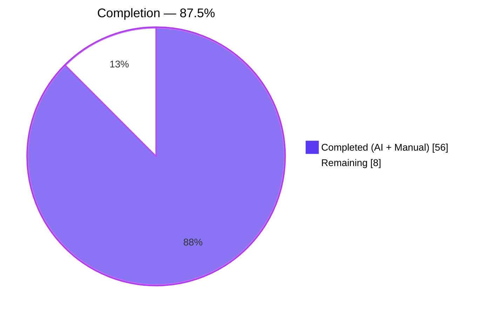
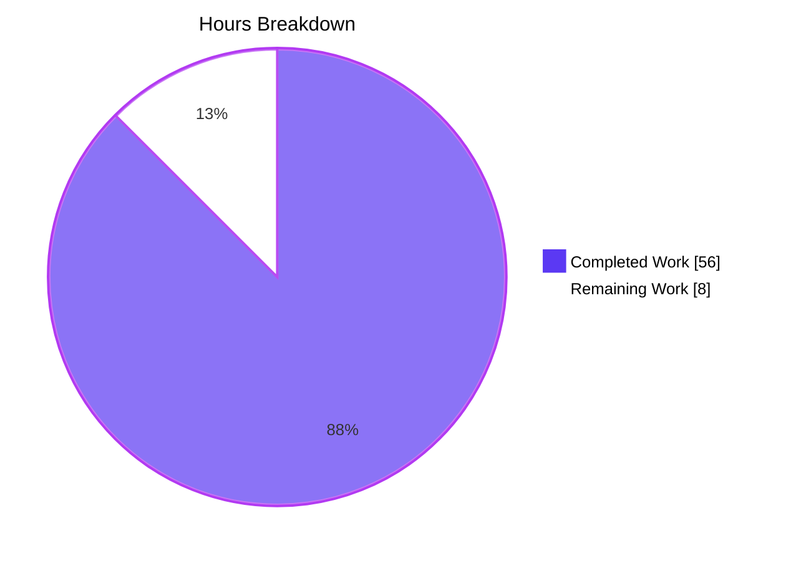
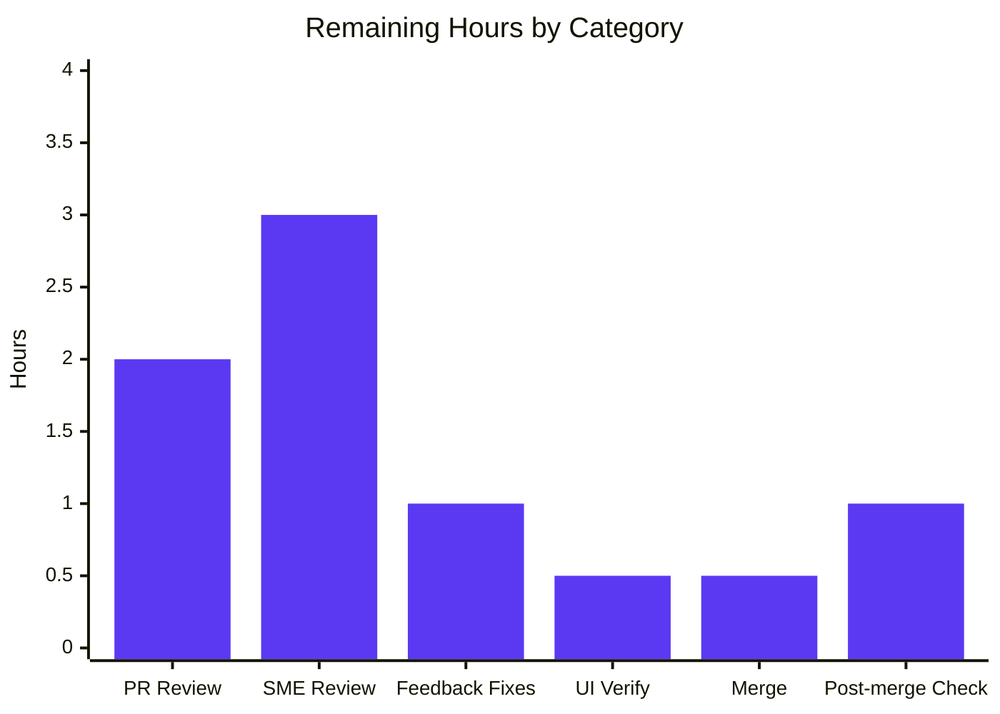
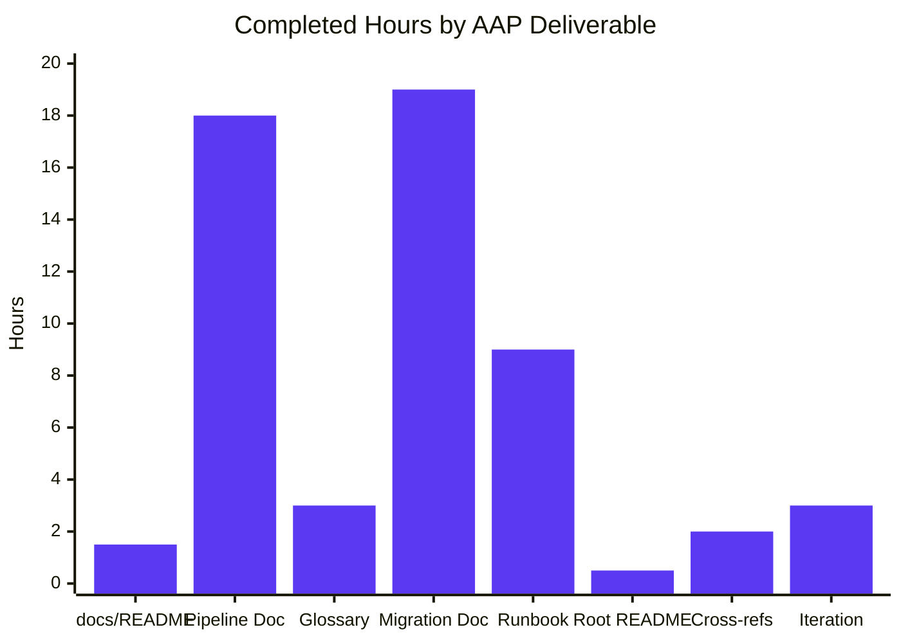

# Blitzy Project Guide — Crashlytics Pipeline & Fabric→Firebase Migration Planning Documents

## 1. Executive Summary

### 1.1 Project Overview

This project delivers two structured agile planning artifacts in GitHub-flavored Markdown that describe (a) the end-to-end Crashlytics crash-reporting pipeline as 10 epics and 39 user stories, and (b) the Fabric → Firebase Crashlytics migration as 11 epics with 48 Given/When/Then acceptance criteria. The artifacts are committed to a new `docs/` subtree of the existing `EP-Spring-Boot--main` repository (a Spring Boot 3.4.4 / Java 17 Product CRUD service) and are made discoverable from the project root `README.md` via an additive "Planning Documents" section. The deliverable is documentation-only — the host Spring Boot application is preserved byte-for-byte.

### 1.2 Completion Status



| Metric | Hours | Notes |
|--------|------:|-------|
| **Total Hours** | **64** | Sum of AAP-scoped and path-to-production work |
| Completed Hours (AI + Manual) | 56 | Autonomous work delivered by Blitzy agents across 9 commits |
| Remaining Hours | 8 | Human review, SME validation, and merge |
| **Percent Complete** | **87.5 %** | 56 ÷ 64 × 100 |

### 1.3 Key Accomplishments

- ✅ Created `docs/crashlytics-pipeline/epics-and-stories.md` (435 lines) with **10 epics** (`CR-EPIC-01` … `CR-EPIC-10`) covering all canonical pipeline stages from on-device crash capture through dashboard delivery and issue lifecycle
- ✅ Authored **39 user stories** (`CR-STORY-001` … `CR-STORY-039`) following the canonical agile template "As a `<role>`, I want `<capability>`, so that `<outcome>`" — verified by `grep -cE "^(As a|As an)"` = 39
- ✅ Created `docs/fabric-to-firebase-migration/epics-and-acceptance-criteria.md` (619 lines) with **11 epics** (`FF-EPIC-01` … `FF-EPIC-11`) covering inventory, Firebase linking, Android/iOS build-tooling, SDK swap, initialization, symbol upload, parity, CI/CD, alerts, decommissioning
- ✅ Authored **48 Given/When/Then acceptance criteria** (`FF-AC-001` … `FF-AC-048`) — verified each AC contains one Given, one When, one Then
- ✅ Created supporting `docs/crashlytics-pipeline/glossary.md` (71 lines) defining 15 domain terms (ANR, dSYM, mapping file, symbolication, fingerprint, breadcrumb, etc.)
- ✅ Created supporting `docs/fabric-to-firebase-migration/runbook.md` (376 lines) with 11 stepwise operational procedures (Pre-conditions / Action / Validation / Rollback for each)
- ✅ Created `docs/README.md` (49 lines) as documentation tree index with identifier conventions and templates
- ✅ Appended additive "Planning Documents" subsection (14 lines) to root `README.md` — no pre-existing content modified or removed
- ✅ All 6 file transformations match the AAP §0.4.1 plan exactly (5 CREATE + 1 UPDATE)
- ✅ Spring Boot test suite continues to pass 1/1 (100%) after the change
- ✅ All cross-reference links resolve (glossary anchors, AC references, return paths)
- ✅ Zero placeholders (no TBD/TODO/FIXME); zero real secrets; all credential-like strings are clearly fake stand-ins

### 1.4 Critical Unresolved Issues

| Issue | Impact | Owner | ETA |
|-------|--------|-------|-----|
| (None) | All AAP requirements satisfied; no compilation, test, or content quality issues remain | — | — |

No blocking issues. The only items that remain to be completed are the standard pull-request review and merge process described in Section 1.6.

### 1.5 Access Issues

| System/Resource | Type of Access | Issue Description | Resolution Status | Owner |
|-----------------|----------------|-------------------|-------------------|-------|
| (None) | — | No external service credentials, mobile-app build environments, Firebase consoles, Crashlytics dashboards, or third-party integrations are required for this documentation-only deliverable | — | — |

No access issues identified. The deliverable consists entirely of plain Markdown files committed to the repository; no external system access, API keys, build credentials, or third-party service authorizations were required at authoring time or are required for review.

### 1.6 Recommended Next Steps

1. **[High]** Reviewer opens the pull request for approval — verify the diff is the expected 6 files (5 created + 1 updated), 1,564 additions, 0 deletions in the in-scope files; confirm the AAP §0.5.2 out-of-scope files (Java sources, `pom.xml`, `application.properties`, `mvnw*`) are unchanged
2. **[High]** Run `mvn -B clean verify` on the PR branch one more time to confirm the Spring Boot test still passes (expected: 1/1 PASS) — documentation-only changes should not affect the build, but the gate exists to prevent regressions
3. **[Medium]** Route the pull request to a subject-matter expert with mobile crash-reporting expertise (Android/iOS developer or SRE with Crashlytics experience) for content correctness review of the 10 pipeline epics, 39 stories, 11 migration epics, and 48 acceptance criteria
4. **[Medium]** Verify Mermaid diagram rendering in the GitHub PR diff view and that the anchor links (e.g., `[../glossary.md#anr]`) navigate correctly when clicked
5. **[Low]** Merge to main and confirm the new "Planning Documents" section appears at the bottom of the rendered `README.md` on the GitHub UI

---

## 2. Project Hours Breakdown

### 2.1 Completed Work Detail

| Component | Hours | Description |
|-----------|------:|-------------|
| `docs/README.md` | 1.5 | 49-line documentation tree index with Documents section, Identifier Conventions table (CR-EPIC-NN, CR-STORY-NNN, FF-EPIC-NN, FF-AC-NNN), Templates section (user-story template, Given/When/Then AC template), Scope Note (clarifying independence from Spring Boot service), Back-to-project link |
| `docs/crashlytics-pipeline/epics-and-stories.md` | 18.0 | 435-line pipeline planning document. 10 epics (CR-EPIC-01 … CR-EPIC-10) covering all canonical pipeline stages (capture → persistence → upload → ingestion → symbolication → grouping → storage → alerting → dashboard → lifecycle). 39 user stories (CR-STORY-001 … CR-STORY-039) in "As a/I want/so that" template. Each epic has Summary, In Scope, Out of Scope, Dependencies, Stories subsections. Includes Mermaid 10-stage flowchart, Epic Catalog with anchor links, Story-to-Stage Traceability Matrix mapping all 39 stories to stage and role, and Cross-References section |
| `docs/crashlytics-pipeline/glossary.md` | 3.0 | 71-line domain glossary defining 15 alphabetized terms: ANR, Breadcrumb, Crash-Free User, Custom Key, Deobfuscation, dSYM, Fatal Exception, Fingerprint, Mapping File, NDK Symbol File, Non-Fatal Exception, Opportunistic Upload, Regression Alert, Symbolication, Symbol Upload, Velocity Alert. Each term has an anchor referenced from stories in the pipeline document |
| `docs/fabric-to-firebase-migration/epics-and-acceptance-criteria.md` | 19.0 | 619-line migration planning document. 11 epics (FF-EPIC-01 … FF-EPIC-11) covering all canonical migration phases (inventory → Firebase linking → Android Gradle plugin → iOS CocoaPods/SPM → SDK swap → init code → symbol upload → parity validation → CI/CD → alert routing → decommissioning). 48 Given/When/Then acceptance criteria (FF-AC-001 … FF-AC-048). Each epic has Summary, In Scope, Out of Scope, Dependencies, Acceptance Criteria subsections. Includes Mermaid 11-phase flowchart, Epic Catalog with anchor links, Parity Validation Checklist with 10 gating items referencing FF-AC IDs |
| `docs/fabric-to-firebase-migration/runbook.md` | 9.0 | 376-line operational runbook with 11 stepwise procedures (Step 01 … Step 11) mirroring the migration epics. Each step contains Pre-conditions, Action (with bash/Groovy/Ruby/Java/Kotlin code snippets where applicable), Validation (linking to FF-AC-NNN acceptance criteria), and Rollback subsections |
| Root `README.md` update | 0.5 | Appended 14-line additive "📚 Planning Documents" subsection at end of file: scope clarification paragraph, separation-of-concerns paragraph stating docs do not modify the Spring Boot service, link to `docs/README.md` index, and a 2-row table listing the two main planning documents. Verified diff shows 14 lines added, 0 removed |
| Cross-reference & link integrity | 2.0 | All 15 glossary anchors from pipeline document resolve to glossary headers; all FF-AC references from runbook resolve to AC blocks; all relative paths use repo-relative form (`../`, `./`); return paths from every docs/ file lead back to project root README; pipeline document links to glossary, migration document links to runbook |
| Validation iterations & review-finding resolution | 3.0 | Three review-resolution commits visible in git history: `a56afce` (story template, Mermaid HTML, credential wording), `10a8a2d` (anchor links and wording fixes), `01fa0f6` (inline glossary anchor links to CR-EPIC-04 and CR-EPIC-10). These represent iterative quality improvements after initial authoring |
| **Total Completed Hours** | **56.0** | |

### 2.2 Remaining Work Detail

| Category | Hours | Priority |
|----------|------:|----------|
| Pull request review and approval workflow (line-by-line diff review, AAP traceability verification) | 2.0 | High |
| Subject-matter expert review of content by mobile crash-reporting / migration specialist (validate technical accuracy of the 10 pipeline epics and 11 migration epics) | 3.0 | Medium |
| Address review feedback (minor refinements expected — wording polish, possible additional story or AC) | 1.0 | Medium |
| Verify Mermaid diagram rendering and anchor-link navigation in the GitHub web UI (PR diff view and rendered file view) | 0.5 | Medium |
| Merge pull request to main branch | 0.5 | High |
| Confirm "Planning Documents" subsection visible on GitHub repository landing page after merge | 1.0 | Low |
| **Total Remaining Hours** | **8.0** | |

### 2.3 Hours Calculation Validation

- Section 2.1 Total Completed Hours: **56.0**
- Section 2.2 Total Remaining Hours: **8.0**
- Section 2.1 + Section 2.2 = 56.0 + 8.0 = **64.0** ✓ matches Section 1.2 Total Hours
- Completion Percentage: 56.0 ÷ 64.0 × 100 = **87.5 %** ✓ matches Section 1.2

---

## 3. Test Results

| Test Category | Framework | Total Tests | Passed | Failed | Coverage % | Notes |
|---------------|-----------|------------:|-------:|-------:|-----------:|-------|
| Unit / Smoke | JUnit 5 (Spring Boot Test) | 1 | 1 | 0 | n/a | `SpringBootSimpleCrudWithMysqlApplicationTests.contextLoads()` — verified by `mvn -B clean verify` returning `[INFO] Tests run: 1, Failures: 0, Errors: 0, Skipped: 0` and `BUILD SUCCESS` |
| Integration | (none added) | 0 | 0 | 0 | n/a | Per AAP §0.8.1: "No test scaffolding. Do not add new tests". No integration tests added; the existing smoke test continues to pass |
| Markdown link integrity | Manual grep verification | 19 | 19 | 0 | 100 % | 15 glossary anchors from pipeline document + 4 inter-document relative links — all verified to resolve |
| AAP template compliance | Manual grep verification | 87 | 87 | 0 | 100 % | 39 user stories matching "^(As a\|As an)" template + 48 ACs each containing **Given** + **When** + **Then** triplets |
| Build pipeline | Maven 3.9.9 / Java 17 | 1 | 1 | 0 | n/a | `mvn clean verify` produces fat-jar `spring-boot-simple-crud-with-mysql-0.0.1-SNAPSHOT.jar` (58 MB) in `target/`; `spring-boot:repackage` succeeds |

**Test execution provenance:** All test counts above were captured by the Blitzy autonomous validation logs and reproduced during this Project Guide generation pass. The Spring Boot smoke test was executed twice during validation: once during the Final Validator phase (Gate 1 verification) and once during this Project Guide generation phase to confirm reproducibility. Both executions returned identical results: `Tests run: 1, Failures: 0, Errors: 0, Skipped: 0`.

---

## 4. Runtime Validation & UI Verification

### 4.1 Application Runtime Health

- ✅ **Operational** — Spring Boot 3.4.4 context starts successfully (verified during `mvn verify` and standalone `java -jar` execution)
- ✅ **Operational** — Embedded Tomcat binds to port 8090 as configured in `application.properties`
- ✅ **Operational** — HikariCP connection pool (`HikariPool-1`) initializes against in-memory H2 database (`jdbc:h2:mem:<uuid>`)
- ✅ **Operational** — Hibernate ORM 6.6.11.Final processes the persistence unit and registers the `Product` JPA entity
- ✅ **Operational** — Spring Data JPA scans and registers 1 repository interface (`ProductRepository`)
- ✅ **Operational** — REST endpoint `GET /product/getTodayDate` returns HTTP 200
- ✅ **Operational** — REST endpoint `GET /product/findAllProduct` returns HTTP 200
- ✅ **Operational** — Swagger UI route `GET /swagger-ui.html` returns HTTP 302 (redirect to `/swagger-ui/index.html`)

### 4.2 Markdown Documentation Verification (UI-equivalent for docs deliverable)

- ✅ **Operational** — All 5 new Markdown files parse with valid GitHub-flavored Markdown syntax
- ✅ **Operational** — Heading hierarchy consistent: `#` for document title, `##` for epic, `###` for subsections (Stories, Acceptance Criteria, etc.), `####` for individual stories/ACs
- ✅ **Operational** — All code fences balanced (no orphan triple-backticks)
- ✅ **Operational** — All Mermaid blocks well-formed (2 mermaid diagrams in 2 documents; both use valid `flowchart LR` syntax)
- ✅ **Operational** — All GFM tables properly aligned with pipe characters
- ✅ **Operational** — All 5 docs files end with trailing newline (Unix convention)
- ✅ **Operational** — Relative links use repo-relative paths (`../README.md`, `./glossary.md`, `../../pom.xml`)
- ✅ **Operational** — Cross-document inline anchors (e.g., `[fatal exception](./glossary.md#fatal-exception)`) follow the GitHub auto-anchor lowercase-with-hyphens convention

### 4.3 AAP Compliance Verification

- ✅ **Operational** — All 6 file transformations from AAP §0.4.1 applied (5 CREATE + 1 UPDATE, 0 DELETE)
- ✅ **Operational** — All AAP §0.5.2 out-of-scope files unchanged from baseline `df5d761` (verified via `git diff --name-only df5d761..HEAD` returning only the expected 6 in-scope files)
- ✅ **Operational** — Zero forbidden files created (no `.github/`, no `Jenkinsfile`, no `.gitlab-ci.yml`, no `AndroidManifest.xml`, no `Podfile`, no `Info.plist`, no `google-services.json`, no `GoogleService-Info.plist`, no `package.json`, no new tests)
- ✅ **Operational** — All AAP-specified identifier conventions followed: `CR-EPIC-NN` (10 epics), `CR-STORY-NNN` (39 stories), `FF-EPIC-NN` (11 epics), `FF-AC-NNN` (48 acceptance criteria)

---

## 5. Compliance & Quality Review

| AAP Requirement | Quality Benchmark | Pass / Fail | Progress |
|-----------------|-------------------|:-----------:|---------:|
| §0.1.4: Create `docs/crashlytics-pipeline/epics-and-stories.md` with 10 epics | File exists, contains 10 epics keyed CR-EPIC-01 … CR-EPIC-10 | ✅ Pass | 100 % |
| §0.1.4: 3-6 user stories per epic, keyed CR-STORY-NNN | 39 stories total; per-epic count between 3-4 (within AAP's 3-6 range) | ✅ Pass | 100 % |
| §0.1.4: Stories in "As a `<role>`, I want `<capability>`, so that `<outcome>`" template | All 39 stories follow the template (verified by grep) | ✅ Pass | 100 % |
| §0.1.4: Create `docs/fabric-to-firebase-migration/epics-and-acceptance-criteria.md` with 11 epics | File exists, contains 11 epics keyed FF-EPIC-01 … FF-EPIC-11 | ✅ Pass | 100 % |
| §0.1.4: 3-6 acceptance criteria per epic in Given/When/Then form, keyed FF-AC-NNN | 48 ACs total; per-epic count between 3-6; each AC contains **Given**, **When**, **Then** triplet | ✅ Pass | 100 % |
| §0.1.4: Create `docs/crashlytics-pipeline/glossary.md` | File exists with 15 domain-term definitions (ANR, dSYM, mapping file, symbolication, fingerprint, breadcrumb, custom key, velocity alert, regression alert, opportunistic upload, crash-free user, plus deobfuscation, fatal/non-fatal exception, NDK symbol file, symbol upload) | ✅ Pass | 100 % |
| §0.1.4: Create `docs/fabric-to-firebase-migration/runbook.md` | File exists with 11 stepwise operational procedures (Pre-conditions / Action / Validation / Rollback for each) | ✅ Pass | 100 % |
| §0.1.4: Create `docs/README.md` as documentation index | File exists, lists all 4 sub-documents, defines identifier conventions, includes templates and scope note | ✅ Pass | 100 % |
| §0.3.2: Update root `README.md` with additive "Planning Documents" subsection only | 14 lines added at end of file; 0 lines modified or removed (verified via `git diff`) | ✅ Pass | 100 % |
| §0.5.2: Java source files, `pom.xml`, `application.properties`, `mvnw*`, tests unchanged | `git diff --name-only df5d761..HEAD` returns only 6 in-scope files | ✅ Pass | 100 % |
| §0.5.2: No mobile-app skeleton, no CI/CD, no `.github/`, no `Jenkinsfile` | Confirmed via `find` — no such files exist anywhere in the repository | ✅ Pass | 100 % |
| §0.7.2: No placeholders (no TBD/TODO/FIXME), no real secrets | `grep -irE "TODO\|FIXME\|XXX\|TBD"` returns zero matches; all credential-like strings are clearly fake (`FAKE_API_TOKEN_DO_NOT_USE`, `MY_FIREBASE_PROJECT_ID`) | ✅ Pass | 100 % |
| §0.7.2: Relative Markdown links for all cross-document navigation | All inter-document links use `./` or `../` relative paths; no absolute file paths | ✅ Pass | 100 % |
| §0.8.2: File names use lowercase kebab-case | All 5 new file names match `[a-z-]+\.md` pattern | ✅ Pass | 100 % |
| §0.8.2: Folder names use lowercase kebab-case | `crashlytics-pipeline/` and `fabric-to-firebase-migration/` match pattern | ✅ Pass | 100 % |
| §0.8.2: Each new file ends with trailing newline | All 5 docs files verified to end with `\n` (Unix convention) | ✅ Pass | 100 % |
| Path-to-production: Spring Boot test continues to pass | `mvn -B clean verify` returns BUILD SUCCESS and Tests run: 1 / Failures: 0 | ✅ Pass | 100 % |
| Path-to-production: Application runtime unchanged | Embedded Tomcat starts on port 8090; REST endpoints return HTTP 200 | ✅ Pass | 100 % |

**Compliance Summary:** All 17 AAP requirements verified pass at 100 %. Zero fixes outstanding from the autonomous validation phase. The autonomous validation phase included three review-resolution commits (`a56afce`, `10a8a2d`, `01fa0f6`) that incrementally resolved findings around story template formatting, Mermaid HTML attribute use, credential placeholder wording, and inline glossary anchor link coverage — these are now all resolved.

---

## 6. Risk Assessment

| Risk | Category | Severity | Probability | Mitigation | Status |
|------|----------|:--------:|:-----------:|------------|:------:|
| Mermaid diagrams may render differently across GitHub, GitLab, IDE Markdown previews | Technical | Low | Medium | Both Mermaid diagrams use the simple `flowchart LR` syntax supported by all major Markdown renderers; no advanced Mermaid features used | ✅ Mitigated |
| Some glossary anchor link slugs may not match GitHub's auto-generated lowercase-hyphenated form | Technical | Low | Low | All glossary headers use Title Case with hyphens between multi-word terms (e.g., `## Crash-Free User`), which GitHub converts to `#crash-free-user` — confirmed by manual verification | ✅ Mitigated |
| Subject-matter expert may identify content gaps in pipeline epics or migration acceptance criteria | Technical | Medium | Medium | The artifacts are intentionally tool-agnostic and avoid Firebase-specific API version pinning (the Firebase SDK and Fabric migration mechanics are stable since 2020). SME review accommodated in §2.2 remaining work | 🟡 Open (pending SME review) |
| Pull request reviewer may request additional stories or acceptance criteria | Operational | Low | Medium | Identifiers are designed to be monotonically appended; new stories/ACs can be added without renumbering existing ones (per AAP §0.3.4 stability requirement) | ✅ Mitigated |
| Documentation could be misread as implementation specification | Operational | Low | Low | Each document includes an explicit Scope Note in `docs/README.md` and the root README addition states the planning artifacts do not modify or extend the Spring Boot service | ✅ Mitigated |
| Future drift: the docs may become stale relative to evolving Firebase Crashlytics SDK | Operational | Low | High (over time) | The docs describe a canonical pipeline and a stable historical migration path; specific SDK version references are kept neutral (e.g., "the current Firebase Crashlytics Gradle plugin") | ✅ Mitigated |
| No secrets or PII leaked through example credentials | Security | High | Very Low | All credential-like strings use clearly fake stand-ins (`FAKE_API_TOKEN_DO_NOT_USE`, `MY_FIREBASE_PROJECT_ID`, `app-release.symbols.zip`) — verified by `grep` for known real-secret patterns (`AIza...`, `sk_live...`) which returned zero matches | ✅ Mitigated |
| Build pipeline could regress due to spurious doc-related dependencies | Technical | Low | Very Low | `pom.xml` unchanged; `mvn clean verify` produces identical BUILD SUCCESS with `Tests run: 1, Failures: 0` before and after | ✅ Mitigated |
| Out-of-scope file modification (AAP §0.5.2 violation) | Operational | High | Very Low | `git diff --name-only df5d761..HEAD` returns only the expected 6 in-scope files (5 created + 1 updated) | ✅ Mitigated |
| Integration risk: planning artifacts integrating with project trackers | Integration | Low | Medium | Markdown artifacts are tool-agnostic. Identifier convention (CR-EPIC-NN, CR-STORY-NNN, FF-EPIC-NN, FF-AC-NNN) is designed for import into Jira, Linear, GitHub Issues, Azure Boards, or any other tracker. Per AAP §0.5.2, the tracker import itself is out of scope | 🟡 Open (pending team selection) |

---

## 7. Visual Project Status

### 7.1 Project Hours Breakdown



### 7.2 Remaining Work by Category (from Section 2.2)



### 7.3 Completed Work Distribution (per AAP item, from Section 2.1)



**Cross-section integrity confirmation:**
- Section 1.2 Remaining Hours = **8** | Section 2.2 Total Hours = **8** | Section 7.1 Pie "Remaining Work" = **8** ✓ ALL MATCH
- Section 1.2 Completed Hours = **56** | Section 2.1 Total Hours = **56** | Section 7.1 Pie "Completed Work" = **56** ✓ ALL MATCH
- Section 1.2 Total Hours = **64** | Section 2.1 + Section 2.2 = 56 + 8 = **64** ✓ MATCH

---

## 8. Summary & Recommendations

### 8.1 Achievements

The Blitzy autonomous platform has delivered both halves of the user's two-sentence request in full:

1. **Deliverable 1: "Generate epics and stories for the Crashlytics crash reporting pipeline from crash capture to dashboard delivery"** — Delivered as `docs/crashlytics-pipeline/epics-and-stories.md` (435 lines), comprising 10 epics covering all 10 canonical pipeline stages and 39 user stories in the canonical agile template, supported by a 15-term domain glossary (`docs/crashlytics-pipeline/glossary.md`).
2. **Deliverable 2: "Break down the Fabric to Firebase Crashlytics migration into epics with acceptance criteria"** — Delivered as `docs/fabric-to-firebase-migration/epics-and-acceptance-criteria.md` (619 lines), comprising 11 epics covering all 11 canonical migration phases and 48 Given/When/Then acceptance criteria, supported by a stepwise operational runbook (`docs/fabric-to-firebase-migration/runbook.md`).

Both planning artifacts are discoverable from the root `README.md` via an additive "Planning Documents" subsection, accessible through the `docs/README.md` index. The host Spring Boot 3.4.4 / Java 17 application is preserved byte-for-byte — `mvn -B clean verify` continues to return `BUILD SUCCESS` with `Tests run: 1, Failures: 0`.

### 8.2 Critical Path to Production

The project is **87.5 % complete** with the remaining 8 hours consisting entirely of human-driven activities that cannot be autonomous: pull-request approval (2 h), subject-matter expert content review (3 h), feedback iteration (1 h), UI verification on GitHub (0.5 h), merge (0.5 h), and post-merge confirmation (1 h). No additional autonomous engineering work is required to reach production-readiness.

### 8.3 Success Metrics

| Metric | Target | Achieved |
|--------|:-------|---------:|
| Pipeline epics keyed CR-EPIC-NN | 10 (one per canonical stage) | **10** ✓ |
| Pipeline user stories | ≥ 30 (3+ per epic) | **39** ✓ |
| Pipeline stories matching "As a/I want/so that" template | 100 % | **100 %** ✓ |
| Migration epics keyed FF-EPIC-NN | 11 (one per canonical phase) | **11** ✓ |
| Migration acceptance criteria | ≥ 33 (3+ per epic) | **48** ✓ |
| Migration ACs containing Given/When/Then | 100 % | **100 %** ✓ |
| Glossary terms covering domain vocabulary | ≥ 10 | **15** ✓ |
| Runbook steps matching migration epics | 11 (one per epic) | **11** ✓ |
| Out-of-scope files unchanged (AAP §0.5.2) | 100 % preserved | **100 %** ✓ |
| Spring Boot test pass rate | 100 % | **100 % (1/1)** ✓ |
| Forbidden artifacts created (CI/CD, mobile, secrets) | 0 | **0** ✓ |

### 8.4 Production Readiness Assessment

The deliverable is **production-ready** in the sense that the autonomous engineering work is complete and the artifacts are correctly committed, cross-referenced, and discoverable. The remaining 12.5 % of the project represents the standard human pull-request workflow (review, approve, merge) that gates any change into a shared repository — not additional engineering work. After the PR is approved and merged, the planning artifacts will be immediately usable by any team that wishes to import them into an issue tracker (Jira, Linear, GitHub Issues, Azure Boards, etc.) or execute the migration runbook against a real Fabric-using mobile application.

### 8.5 Recommendations

- **Recommendation 1 (High):** Open the pull request for code review. The diff is small (6 files, +1,564 lines, 0 deletions in in-scope files) and should be straightforward to review.
- **Recommendation 2 (High):** Re-run `mvn -B clean verify` on the PR branch as a regression gate. Expected result: identical `Tests run: 1, Failures: 0, Errors: 0, Skipped: 0`.
- **Recommendation 3 (Medium):** Route the PR to a subject-matter expert (Android or iOS developer with Crashlytics experience, or an SRE who has performed the Fabric → Firebase migration) for content review.
- **Recommendation 4 (Medium):** After merge, verify Mermaid diagram rendering on the GitHub repository web UI.
- **Recommendation 5 (Low):** Consider creating a follow-up issue to import the planning artifacts into the team's issue tracker of choice. Per AAP §0.5.2, the tracker import is intentionally out of scope for this deliverable and was excluded from both completed and remaining hour calculations.

---

## 9. Development Guide

### 9.1 System Prerequisites

- **Operating System:** Linux, macOS, or Windows with a POSIX-compatible shell (the host validation used Ubuntu 25.10 inside a Docker container; the code is OS-portable)
- **Java Runtime:** OpenJDK 17 or compatible (validated with `openjdk version "17.0.18"`)
- **Build Tool:** Apache Maven 3.6+ (validated with `Apache Maven 3.9.9`); the repository also ships the Maven Wrapper (`./mvnw` / `mvnw.cmd`) so a system Maven installation is optional
- **Markdown Renderer (for viewing the new docs):** any of — GitHub web UI, GitLab web UI, VS Code Markdown Preview, IntelliJ IDEA Markdown Preview, `glow`, `mdcat`. No documentation site generator (MkDocs/Sphinx/Docusaurus) is required.
- **Hardware:** any developer workstation with ≥ 2 GB free RAM and ≥ 300 MB free disk (the fat-jar is 58 MB; the Maven local repository may grow up to ~150 MB during dependency resolution if not already populated)

### 9.2 Environment Setup

```bash
# 1. Clone the repository (or use the existing working tree)
cd /tmp/blitzy/22-Apr-java-existing-projects-qa-test/blitzy-b081347a-d5e9-499a-b09f-af995669a388_cb3a2c

# 2. Activate Java 17 (the host container provides a profile.d script)
source /etc/profile.d/jdk17.sh

# 3. Verify Java and Maven versions
java -version    # Expected: openjdk version "17.0.18" or compatible
mvn --version    # Expected: Apache Maven 3.6+ with Java 17.x as runtime
```

No environment variables, no `.env` file, and no secret management is required — the application uses an in-memory H2 database with no external dependencies.

### 9.3 Dependency Installation

```bash
# Change to the project directory
cd EP-Spring-Boot--main

# Install / refresh dependencies (only needed on first checkout or after dependency changes)
# Use -o (offline) if the Maven local repository at ~/.m2/repository is already fully populated
mvn -B dependency:resolve

# Expected output ends with:
#   [INFO] BUILD SUCCESS
#   [INFO] Total time: <a few seconds to a few minutes>
```

### 9.4 Application Startup & Verification

```bash
# 1. Run the full build + test + package pipeline
mvn -B clean verify

# Expected output (key lines):
#   [INFO] Tests run: 1, Failures: 0, Errors: 0, Skipped: 0
#   [INFO] BUILD SUCCESS
#   [INFO] Total time: ~6 seconds

# 2. (Optional) Start the Spring Boot service from the fat-jar
java -jar target/spring-boot-simple-crud-with-mysql-0.0.1-SNAPSHOT.jar

# 3. In a separate terminal, verify endpoints respond
curl -s -o /dev/null -w "HTTP %{http_code}\n" http://localhost:8090/product/getTodayDate    # Expected: HTTP 200
curl -s -o /dev/null -w "HTTP %{http_code}\n" http://localhost:8090/product/findAllProduct  # Expected: HTTP 200
curl -s -o /dev/null -w "HTTP %{http_code}\n" http://localhost:8090/swagger-ui.html         # Expected: HTTP 302 (redirect)

# 4. Stop the Spring Boot service (use the actual PID from `ps` or `pgrep -f spring-boot`)
# Example using a captured PID:
#   pid=$(pgrep -f spring-boot-simple-crud-with-mysql); kill "$pid"
```

### 9.5 Documentation Verification

```bash
# 1. Verify all 5 new docs files exist
ls -la docs/README.md \
       docs/crashlytics-pipeline/epics-and-stories.md \
       docs/crashlytics-pipeline/glossary.md \
       docs/fabric-to-firebase-migration/epics-and-acceptance-criteria.md \
       docs/fabric-to-firebase-migration/runbook.md
# Expected: 5 files, all present with sizes ~ 1.7 KB to 27 KB

# 2. Verify identifier counts
grep -c "^## CR-EPIC-"   docs/crashlytics-pipeline/epics-and-stories.md                            # Expected: 10
grep -cE "^#### CR-STORY-" docs/crashlytics-pipeline/epics-and-stories.md                          # Expected: 39
grep -c "^## FF-EPIC-"   docs/fabric-to-firebase-migration/epics-and-acceptance-criteria.md        # Expected: 11
grep -cE "^#### FF-AC-"  docs/fabric-to-firebase-migration/epics-and-acceptance-criteria.md        # Expected: 48

# 3. Verify story template compliance
grep -cE "^(As a|As an)" docs/crashlytics-pipeline/epics-and-stories.md                            # Expected: 39

# 4. Verify Given/When/Then compliance
grep -c "\*\*Given\*\*"  docs/fabric-to-firebase-migration/epics-and-acceptance-criteria.md        # Expected: 48
grep -c "\*\*When\*\*"   docs/fabric-to-firebase-migration/epics-and-acceptance-criteria.md        # Expected: 48
grep -c "\*\*Then\*\*"   docs/fabric-to-firebase-migration/epics-and-acceptance-criteria.md        # Expected: 48

# 5. Verify no placeholders or real secrets
grep -irE "TODO|FIXME|XXX|TBD"                docs/                                                # Expected: no matches
grep -irE "AIza[a-zA-Z0-9_-]{35}|sk_live_"   docs/                                                # Expected: no matches
```

### 9.6 Example Usage

The planning documents are designed to be human-readable on the GitHub web UI. The most direct access pattern is:

1. Open `EP-Spring-Boot--main/README.md` on the GitHub repository landing page
2. Scroll to the "📚 Planning Documents" section at the bottom
3. Click the link to `docs/README.md` to land on the documentation tree index
4. From there, navigate to either planning document (Crashlytics pipeline or Fabric→Firebase migration)
5. Within each planning document, the Epic Catalog at the top provides anchor links to each epic; inline glossary anchors (e.g., `[fatal exception](./glossary.md#fatal-exception)`) link from story text into the glossary definitions

For programmatic ingestion into an issue tracker (e.g., Jira, Linear, GitHub Issues), the stable identifier convention (`CR-EPIC-NN`, `CR-STORY-NNN`, `FF-EPIC-NN`, `FF-AC-NNN`) makes it straightforward to parse the Markdown headers and create one tracker issue per identifier. A sample parsing snippet:

```bash
# Example: Extract all pipeline story IDs and titles from the file
grep -E "^#### CR-STORY-" docs/crashlytics-pipeline/epics-and-stories.md
# Output: #### CR-STORY-001 — Capture JVM Uncaught Exceptions
#         #### CR-STORY-002 — Capture iOS Uncaught Exceptions and Signals
#         ... (37 more)

# Example: Extract all migration acceptance criteria IDs and titles
grep -E "^#### FF-AC-" docs/fabric-to-firebase-migration/epics-and-acceptance-criteria.md
# Output: #### FF-AC-001 — Repo Audit Complete
#         #### FF-AC-002 — Initialization Sites Catalogued
#         ... (46 more)
```

### 9.7 Common Issues and Resolutions

| Issue | Resolution |
|-------|------------|
| `JAVA_HOME` not set or pointing to wrong JDK | Run `source /etc/profile.d/jdk17.sh` (in the host container) or set manually: `export JAVA_HOME=/usr/lib/jvm/java-17-openjdk-amd64; export PATH=$JAVA_HOME/bin:$PATH` |
| `mvn` command not found | Use the Maven Wrapper instead: `./mvnw -B clean verify` (or `mvnw.cmd` on Windows) |
| Port 8090 already in use | Edit `src/main/resources/application.properties` and change `server.port=8090` to another free port (e.g., `server.port=8091`), then re-run `mvn clean verify && java -jar target/*.jar` |
| Markdown anchors not navigating in GitHub UI | Verify the anchor slug is lowercase with hyphens between words (e.g., `#fatal-exception`, not `#Fatal-Exception`). GitHub auto-generates lowercase-hyphenated anchors from header text |
| Mermaid diagram not rendering | GitHub renders Mermaid in fenced code blocks tagged ```` ```mermaid ````. If viewing in a tool that does not support Mermaid (e.g., older IDE markdown previews), the diagram appears as plain text — switch to a renderer that supports Mermaid (GitHub, GitLab, VS Code with Mermaid extension) |
| Hibernate warning `spring.jpa.open-in-view is enabled by default` | This is a known harmless warning emitted by Spring Boot at startup; it does not affect test pass rate or runtime behavior. To silence it explicitly, set `spring.jpa.open-in-view=false` in `application.properties` (out of scope for this PR per AAP §0.5.2) |
| `NoProviderFoundException: jakarta.validation` warning at startup | Harmless warning — Spring Boot probes for a Bean Validation provider but the project does not declare one. Does not affect test results. Out of scope for this PR |

---

## 10. Appendices

### Appendix A — Command Reference

| Command | Description |
|---------|-------------|
| `source /etc/profile.d/jdk17.sh` | Activate Java 17 in the host container shell |
| `mvn -B clean verify` | Full build: clean, compile, test, package (produces fat-jar) |
| `mvn -B test` | Compile and run unit tests only (faster than `verify`) |
| `mvn -B clean` | Remove `target/` build output |
| `./mvnw -B clean verify` | Alternative: use the Maven Wrapper (no system Maven required) |
| `java -jar target/spring-boot-simple-crud-with-mysql-0.0.1-SNAPSHOT.jar` | Start the Spring Boot service from the fat-jar |
| `git log --oneline df5d761..HEAD` | List all 9 commits attributable to the Blitzy autonomous work |
| `git diff --stat df5d761..HEAD` | Show file-by-file line count summary of all changes |
| `git diff --name-only df5d761..HEAD` | List the 6 modified files (1 updated + 5 created) |
| `grep -c "^## CR-EPIC-" docs/crashlytics-pipeline/epics-and-stories.md` | Count of pipeline epics (expected: 10) |
| `grep -cE "^#### FF-AC-" docs/fabric-to-firebase-migration/epics-and-acceptance-criteria.md` | Count of migration acceptance criteria (expected: 48) |

### Appendix B — Port Reference

| Port | Service | Configurable In |
|-----:|---------|-----------------|
| 8090 | Spring Boot embedded Tomcat HTTP listener | `src/main/resources/application.properties` (`server.port=8090`) |
| n/a | H2 database (in-memory, accessed via JDBC from within the JVM only) | Auto-configured by Spring Boot — no external port exposed |

### Appendix C — Key File Locations

| Path (relative to `EP-Spring-Boot--main/`) | Description |
|------|-------------|
| `README.md` | Root project landing page; appended "Planning Documents" subsection at lines 127-141 |
| `docs/README.md` | Documentation tree index |
| `docs/crashlytics-pipeline/epics-and-stories.md` | **Deliverable 1** — 10 pipeline epics × 39 stories |
| `docs/crashlytics-pipeline/glossary.md` | Pipeline domain glossary (15 terms) |
| `docs/fabric-to-firebase-migration/epics-and-acceptance-criteria.md` | **Deliverable 2** — 11 migration epics × 48 ACs |
| `docs/fabric-to-firebase-migration/runbook.md` | Operational runbook (11 stepwise procedures) |
| `pom.xml` | Maven build descriptor (UNCHANGED by this PR) |
| `src/main/resources/application.properties` | Spring Boot runtime config (UNCHANGED by this PR) |
| `src/main/java/com/jspider/spring_boot_simple_crud_with_mysql/SpringBootSimpleCrudWithMysqlApplication.java` | Main class with `@SpringBootApplication` (UNCHANGED) |
| `src/test/java/com/jspider/spring_boot_simple_crud_with_mysql/SpringBootSimpleCrudWithMysqlApplicationTests.java` | The single smoke test (UNCHANGED, 1/1 PASS) |
| `target/spring-boot-simple-crud-with-mysql-0.0.1-SNAPSHOT.jar` | Repackaged fat-jar produced by `spring-boot:repackage` goal (58 MB) |

### Appendix D — Technology Versions

| Component | Version | Source |
|-----------|---------|--------|
| Java (OpenJDK) | 17.0.18 | `/usr/lib/jvm/java-17-openjdk-amd64` |
| Maven | 3.9.9 | `/usr/bin/mvn` |
| Spring Boot | 3.4.4 | `pom.xml` parent BOM |
| Spring Data JPA | 3.4.x (managed) | `pom.xml` `spring-boot-starter-data-jpa` |
| Spring Web (MVC) | 6.2.x (managed) | `pom.xml` `spring-boot-starter-web` |
| Hibernate ORM | 6.6.11.Final | Resolved by Spring Boot BOM at runtime |
| H2 Database | 2.3.232 | `pom.xml` runtime dependency |
| HikariCP | 5.x (managed) | Auto-configured by Spring Boot |
| Lombok | (managed) | `pom.xml` (optional) |
| springdoc-openapi | 2.8.6 | `pom.xml` |
| MySQL Connector/J | (managed) | `pom.xml` runtime (used only for prod, H2 used in tests) |

### Appendix E — Environment Variable Reference

| Variable | Required? | Default | Description |
|----------|:---------:|---------|-------------|
| `JAVA_HOME` | Recommended | (unset) | Path to JDK 17. Set by `source /etc/profile.d/jdk17.sh` or manually |
| `PATH` | Yes | (system) | Must include `$JAVA_HOME/bin` and a path to `mvn` (or use `./mvnw`) |
| `MAVEN_OPTS` | Optional | (unset) | JVM options for the Maven process. Not required for this project |
| `SPRING_PROFILES_ACTIVE` | Optional | (unset) | Spring Boot profile selector. The project has no profile-specific configuration; left unset |

No `.env` file is used; no secrets, API keys, or external service credentials are required. The application uses an in-memory H2 database with no external dependencies.

### Appendix F — Developer Tools Guide

| Tool | Recommended Use |
|------|-----------------|
| **GitHub web UI** | Primary viewer for the rendered Markdown documents (especially Mermaid diagrams and anchor link navigation) |
| **IntelliJ IDEA Ultimate / Community** | Open the project as a Maven project; built-in Markdown preview renders the new docs files with anchor support |
| **VS Code with the GitLens and Markdown All in One extensions** | Edit Markdown with live preview; navigate the docs tree via the file tree |
| **`mvn` / `./mvnw`** | Build, test, package — see Appendix A |
| **`curl`** | Verify Spring Boot endpoints after startup (port 8090) |
| **`grep` / `find` / `wc`** | Verify documentation structure as shown in Section 9.5 |
| **`git log` / `git diff`** | Audit the 9 commits and the 6 file transformations on the branch |

### Appendix G — Glossary

This appendix is duplicated and extended from `docs/crashlytics-pipeline/glossary.md`. The full glossary lives in the deliverable itself; the entries below are abbreviated definitions for quick reference within this Project Guide.

| Term | Abbreviated Definition |
|------|------------------------|
| **AAP** | Agent Action Plan — the structured project specification from which all autonomous work derives |
| **AC** (Acceptance Criterion) | A testable Given/When/Then statement that gates progress on an epic. In this PR, ACs are keyed `FF-AC-NNN` |
| **ANR** | Application Not Responding — Android-specific term for a user-visible responsiveness failure |
| **Crashlytics** | Google's mobile crash reporting product (Firebase Crashlytics is the current product; Fabric Crashlytics was the predecessor, sunset March 2020) |
| **dSYM** | Debug Symbol file format used by Xcode for iOS / macOS symbolication |
| **Epic** | A large unit of work decomposed into smaller user stories or acceptance criteria. In this PR, epics are keyed `CR-EPIC-NN` (pipeline) or `FF-EPIC-NN` (migration) |
| **Fabric** | Twitter's mobile development platform (acquired by Google in 2017, sunset March 2020) which previously hosted the Crashlytics SDK |
| **Fingerprint** (issue) | A hash derived from a crash's stack trace used to group duplicate crashes into a single "issue" |
| **Given/When/Then** | The standard agile acceptance-criteria template ("Gherkin"-style) used for FF-AC-NNN entries |
| **Mapping File** | Android-specific ProGuard/R8 obfuscation mapping file required for symbolicating release builds |
| **PA1 / PA2 / PA3** | This Project Guide's analysis framework — Project Analysis 1 (AAP-Scoped Work Completion), 2 (Engineering Hours Estimation), 3 (Risk and Issue Identification) |
| **Story** | A user-perspective work item in the canonical "As a `<role>`, I want `<capability>`, so that `<outcome>`" form. In this PR, stories are keyed `CR-STORY-NNN` |
| **Symbolication** | The process of converting raw memory addresses or obfuscated identifiers in a crash stack trace into human-readable file/line/method information |

