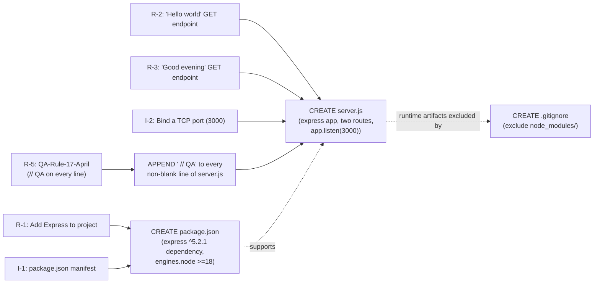
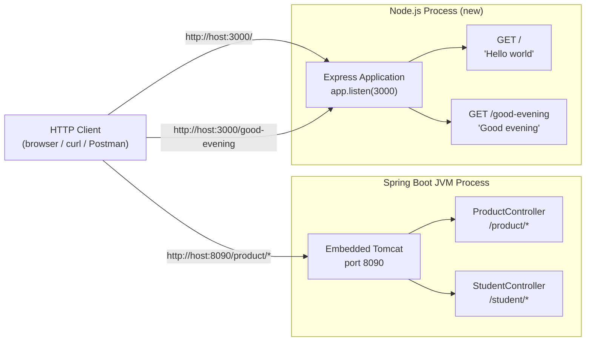

# Technical Specification

# 0. Agent Action Plan

## 0.1 Intent Clarification

### 0.1.1 Core Feature Objective

Based on the prompt, the Blitzy platform understands that the new feature requirement is to introduce a Node.js HTTP server, scaffolded with the Express.js framework, that exposes two GET endpoints — one returning the literal string `Hello world` and a second returning the literal string `Good evening` — and to do so in a manner that satisfies the project-level rule **QA-Rule-17-April**, which mandates that every line of `server.js` terminate with the comment marker `QA`.

The user-supplied descriptive context for this requirement reads as follows (preserved verbatim):

> **User Description (verbatim):** "this is a tutorial of node js server hosting one endpoint that returns the response 'Hello world'. Could you add expressjs into the project and add another endpoint that return the response of 'Good evening'?"

Decomposed into discrete, technically unambiguous requirements:

- **R-1 — Express Integration:** Express.js must be brought into the project as a runtime dependency such that it can be imported (`require('express')` or ES-module equivalent) and used to construct an application instance via `express()`.
- **R-2 — Existing "Hello world" Endpoint:** The endpoint described by the user as "hosting one endpoint that returns the response 'Hello world'" must exist (or, where it does not yet exist in the repository, must be authored) and must produce the response body `Hello world` for an HTTP GET request.
- **R-3 — New "Good evening" Endpoint:** A second HTTP GET endpoint must be added that produces the response body `Good evening`.
- **R-4 — Single-Process Hosting:** Both endpoints must be served by a single Node.js process rooted in `server.js`, consistent with the user's description of the project as a single Node.js tutorial server.
- **R-5 — QA Comment Marker (Project Rule QA-Rule-17-April):** Every line of `server.js` must end with the comment `// QA`. The rule text reads: *"Please add the comment in server.js file in end of each line comment is 'QA'."*

#### 0.1.1.1 User-Context vs. Repository Reality Discrepancy (CRITICAL)

The user's contextual summary characterizes the project as a Node.js tutorial server with an existing `Hello world` endpoint. The Blitzy platform's inspection of the repository at `/tmp/blitzy/22-Apr-java-existing-projects-qa-test/27-apr-branch_8368b6/` establishes that this characterization does not match the committed contents:

| User-Described Artifact | Searched Path / Pattern | Repository Reality |
|---|---|---|
| `server.js` | `find . -name "server.js"` (excluding `.git`) | **Not present** |
| `package.json` | `find . -name "package.json"` (excluding `.git`) | **Not present** |
| `node_modules/` | `find . -name "node_modules"` (excluding `.git`) | **Not present** |
| Any `*.js` source file | `find . -name "*.js" ! -path "./.git/*"` | **Not present** |
| Express.js dependency declaration | grep across the repository | **Not present** |
| Existing "Hello world" endpoint | source-wide review | **Not present** |
| Stated "tutorial of Node.js server" | full repository inspection | The single project directory `EP-Spring-Boot--main/` is a Spring Boot 3.4.4 / Java 17 / Maven CRUD application with `/product/*` and `/student/*` REST endpoints |

This discrepancy is already a documented characteristic of the repository in Sections 1.1 (Executive Summary), 1.3 (Scope), 2.1 (Feature Catalog), and 3.1 (Stack Overview and Context Reconciliation) of this Technical Specification. Those sections established the convention that **all factual claims must be grounded in actual file evidence while user-supplied context is preserved where it is consistent with reality and qualified where it is not**. This Agent Action Plan adheres to that convention.

The Blitzy platform's resolution of the discrepancy is as follows:

- The user's request is interpreted **literally and faithfully** — they want a Node.js Express tutorial server with two endpoints (`Hello world` and `Good evening`) and the QA comment marker on every line of `server.js`.
- Because the user-described Node.js tutorial **does not exist** in the repository, the entire Node.js tutorial scaffold itself must be **authored from scratch** as part of this work — there is no pre-existing `server.js` to extend and no pre-existing `package.json` to amend.
- The existing Spring Boot application under `EP-Spring-Boot--main/` is **not** modified by this work. It is a separate, unrelated artifact that happens to co-reside in the same Git repository, and the user's prompt makes no reference to it.

#### 0.1.1.2 Implicit Requirements Surfaced

The user's prompt is concise; the following requirements are implied by industry norms and by the constraint of building a runnable Node.js Express tutorial, and the Blitzy platform commits to satisfying each:

- **I-1 — Project Manifest:** A `package.json` is required so that `npm install` can resolve `express` and so that `node server.js` (or `npm start`) can be run by a downstream user. Node.js will not look up `express` from a registry without a manifest.
- **I-2 — Listening Port:** The server must bind to a TCP port and call `app.listen(...)`. A conventional choice is `3000` (the default port used in the official Express README example) and is selected for this work to avoid colliding with the Spring Boot application's port `8090` declared in `EP-Spring-Boot--main/src/main/resources/application.properties`.
- **I-3 — HTTP Method and Path Semantics:** Both endpoints must be reachable via HTTP `GET`. Conventional path choices are `/` (root) for the existing Hello-world endpoint and a new path (e.g. `/good-evening`) for the new endpoint, both consistent with Express tutorial idioms.
- **I-4 — Response Content-Type:** Both endpoints must return plain-text bodies (Express's `res.send(string)` defaults `Content-Type` to `text/html; charset=utf-8`, which is acceptable for a tutorial response and is the canonical Express tutorial pattern).
- **I-5 — Local Reproducibility:** A new contributor must be able to clone the repository, `npm install`, and `node server.js` without further configuration.
- **I-6 — Version Stewardship:** Express must be pinned to a stable, currently-supported major version (Express 5.x, the version published by the Express Technical Committee as the current production line; Express 5 requires Node.js 18 or higher).

### 0.1.2 Special Instructions and Constraints

The following constraints are extracted directly from the user's prompt, the user-specified implementation rules, and the repository's documented conventions. Each is preserved precisely so that downstream code-generation steps can verify compliance.

#### 0.1.2.1 Project Rule QA-Rule-17-April (User-Specified Implementation Rule)

This rule is supplied by the user with name `QA-Rule-17-April` and the following content (preserved verbatim):

> **User Rule (verbatim):** "Please add the comment in server.js file in end of each line comment is 'QA'."

The Blitzy platform's literal interpretation:

- **Scope:** The rule applies to `server.js` and only to `server.js`. It does not apply to `package.json` (which is JSON and does not support comments at all) or to any other file in scope.
- **Marker form:** The marker is the JavaScript line-comment `// QA`. Each non-empty source line of `server.js` must terminate with `// QA` (preceded by at least one space to separate it from the preceding token, per JavaScript conventions).
- **Coverage:** Every executable statement, every declaration, every brace-only line, and every commented line must end with `// QA`. Truly blank (whitespace-only) lines may be left untouched, since the rule's wording is "in end of each line" and a blank line has no line content to mark.
- **Idempotence:** The marker must be applied consistently — for example, no line should bear `// QA` twice, and the marker must be the final non-whitespace token on the line.

#### 0.1.2.2 Verbatim Preservation of User Strings

The two user-supplied response strings are reproduced exactly as the user specified them, including capitalization and punctuation:

- **User Example (verbatim):** Endpoint response — `Hello world`
- **User Example (verbatim):** Endpoint response — `Good evening`

The Blitzy platform commits not to alter casing (no "Hello World", no "GOOD EVENING"), not to add trailing punctuation (no "Hello world!"), and not to wrap the strings in HTML or JSON unless the user requests it.

#### 0.1.2.3 Architectural Constraints from Repository Conventions

- The existing Spring Boot project under `EP-Spring-Boot--main/` must not be edited, renamed, moved, or have its `pom.xml` or any of its Java source files altered as a consequence of this work. Section 1.3 (Scope) explicitly lists "Node.js / Backprop integration" as out of scope of the *Spring Boot* project; conversely, the Spring Boot project is out of scope of this Node.js tutorial work.
- The new Node.js artifacts must not collide with the Spring Boot project's listening port `8090` (declared in `EP-Spring-Boot--main/src/main/resources/application.properties`).
- The new Node.js artifacts must be created at the repository root (sibling level to `EP-Spring-Boot--main/`), which is the natural location for a standalone Node.js tutorial and which keeps the two artifacts cleanly separated.

#### 0.1.2.4 Web Search Research Requirements

The following research was identified as necessary to author a current, supported Express tutorial and was completed prior to authoring this plan:

- **Latest stable Express major version and its Node.js prerequisites** — required to pin a sensible `express` version range in `package.json`.
- **Currently active Node.js LTS lines** — required to set a sensible `engines.node` constraint in `package.json`.

The findings of this research are reported in Section 0.2.2 below.

### 0.1.3 Technical Interpretation

These feature requirements translate into the following technical implementation strategy:

- **To satisfy R-1 (Express integration), we will create** a new `package.json` at the repository root that declares `express` as a runtime dependency pinned to the Express 5.x major line.
- **To satisfy R-2 and R-3 (the two GET endpoints) and I-2 / I-3 (port binding and HTTP method/path), we will create** a new `server.js` file at the repository root that imports Express, instantiates an `express()` application, registers `GET /` returning `Hello world`, registers `GET /good-evening` returning `Good evening`, and calls `app.listen(3000)` to bind the server.
- **To satisfy R-5 (QA-Rule-17-April), we will append** ` // QA` to every non-blank source line of `server.js` after authoring, so that the rule is satisfied across the entirety of the file.
- **To satisfy I-1 (project manifest) and I-5 (local reproducibility), we will populate** `package.json` with the conventional fields (`name`, `version`, `description`, `main`, `scripts.start`, `dependencies`, `engines`), so that `npm install` and `npm start` work end-to-end against the canonical Node.js LTS toolchain.
- **To satisfy I-6 (version stewardship), we will pin** `express` to `^5.2.1` and we will declare an `engines.node` floor of `>=18.0.0`, matching Express 5's documented Node.js prerequisite.
- **To preserve the architectural constraint that the Spring Boot project is untouched, we will isolate** all new files at the repository root and we will introduce a `.gitignore` entry that excludes `node_modules/` from version control without affecting the Spring Boot project's tracked files.
- **To make the discrepancy navigable for human readers, we will document** in this Agent Action Plan (specifically in Sections 0.2 and 0.6) the precise list of files that already exist (Spring Boot, untouched) versus files that are being introduced (Node.js tutorial, newly authored), so that no reader confuses scope.

The mapping of user requirements to concrete implementation actions is summarized in the following diagram:




## 0.2 Repository Scope Discovery

### 0.2.1 Comprehensive File Analysis

A complete scan of the repository was performed to enumerate every file that could be a candidate for modification. The scan was driven by the file-pattern catalogue mandated for feature additions: source files in JavaScript / Python / Ruby idiomatic locations, all spec/test files, every configuration file extension, every documentation file extension, and all build/deployment descriptors. The results below report **the entirety of files actually present in the repository**, classified by their relevance to this Node.js tutorial work.

#### 0.2.1.1 Repository Tree (Authoritative Inventory)

The complete list of files discovered (excluding the `.git` directory) is:

```text
27-apr-branch_8368b6/                       (repository root, contains .git)
└── EP-Spring-Boot--main/                   (sole project directory)
    ├── README.md                           (Spring Boot Product API documentation)
    ├── pom.xml                             (Maven config: Spring Boot 3.4.4, Java 17)
    ├── mvnw                                (Maven Wrapper – POSIX)
    ├── mvnw.cmd                            (Maven Wrapper – Windows)
    ├── bin/                                (Eclipse build-output mirror; .class files)
    └── src/
        ├── main/
        │   ├── java/com/jspider/spring_boot_simple_crud_with_mysql/
        │   │   ├── SpringBootSimpleCrudWithMysqlApplication.java
        │   │   ├── controller/ProductController.java
        │   │   ├── controller/StudentController.java
        │   │   ├── dao/ProductDao.java
        │   │   ├── entity/Product.java
        │   │   ├── repository/ProductRepository.java
        │   │   └── responses/ResponseStructure.java
        │   └── resources/
        │       └── application.properties
        └── test/
            └── java/com/jspider/spring_boot_simple_crud_with_mysql/
                └── SpringBootSimpleCrudWithMysqlApplicationTests.java
```

#### 0.2.1.2 Existing Files to Modify

The user's prompt does not request any modification of the existing Java/Spring Boot files. After exhaustive evaluation against each candidate file pattern, the inventory of **existing files to modify is empty** for this feature addition:

| Candidate Pattern | Files Matching | Verdict | Justification |
|---|---|---|---|
| `**/*.js` (Node.js source) | none in repository | n/a | No Node.js source exists to modify |
| `**/*test*.js`, `**/*spec*.js` (JS tests) | none | n/a | No JS tests exist |
| `**/package.json` (Node.js manifest) | none | n/a | No Node.js manifest exists |
| `**/server.js` (Express entry point) | none | n/a | No Express entry point exists |
| `**/*.java` (Java source) | 8 files under `EP-Spring-Boot--main/src/` | **NOT modified** | Out of scope — user request is exclusively about Node.js/Express |
| `**/pom.xml` (Maven manifest) | `EP-Spring-Boot--main/pom.xml` | **NOT modified** | Out of scope — Maven is irrelevant to a Node.js tutorial |
| `**/application.properties` (Spring Boot config) | `EP-Spring-Boot--main/src/main/resources/application.properties` | **NOT modified** | Out of scope — the file configures the Spring Boot application's port `8090`, which is left untouched |
| `**/*.md` (documentation) | `EP-Spring-Boot--main/README.md` | **NOT modified** | Out of scope — README documents the Spring Boot Product API; the user did not request documentation updates |
| `**/Dockerfile*`, `docker-compose*`, `.github/workflows/*` | none | n/a | No containerization or CI assets exist |

#### 0.2.1.3 Integration-Point Discovery (Existing Code Touchpoints)

The Blitzy platform searched for integration surfaces that the new Express server might need to wire into:

| Integration-Point Category | Search Performed | Result |
|---|---|---|
| Existing Express routers / `app.use(...)` registrations | source-wide JS scan | None — no existing Express router exists |
| Existing API endpoints exposed by an HTTP framework | review of all `@RequestMapping`, `@GetMapping`, etc. across the Java codebase | Spring Boot endpoints under `/product/*` and `/student/*` exist but are **unrelated** — they are served by a different runtime, listen on a different port, and are not invoked by the new Node.js tutorial |
| Existing database models / migrations | review of `EP-Spring-Boot--main/src/main/java/.../entity/` and migration directories | `Product` JPA entity exists but is **unrelated** — the Node.js tutorial does not access any database |
| Existing service classes requiring updates | review of all `@Service` and DAO classes | None applicable — the Node.js tutorial has no service layer to integrate with |
| Existing controllers / handlers to modify | review of `ProductController`, `StudentController` | None applicable — these are Java/Spring controllers, not Node.js handlers |
| Existing middleware / interceptors impacted | source-wide search | None — no existing middleware exists |

The conclusion is that **the new Node.js Express tutorial has zero integration touchpoints with the existing Spring Boot artefact**. The two will run as fully independent processes if both are started, distinguished by listening port (Spring Boot on `8090`, Express on `3000`) and by language runtime (JVM vs. Node.js).

### 0.2.2 Web Search Research Conducted

The following research was performed to ensure the new dependencies pinned in `package.json` are current, supported, and mutually compatible. Each finding directly informs the dependency declarations in Section 0.3.

| Research Question | Source(s) | Finding |
|---|---|---|
| What is the current stable Express major line? | npmjs.com/package/express; expressjs/express GitHub Releases; HeroDevs 2026 support reference | Express 5.x is the Express Technical Committee's endorsed production line. <cite index="2-2">Latest version: 5.2.1, last published: 5 months ago.</cite> <cite index="3-14">Express 5.2 shipped December 1, 2025 and is the Technical Committee's endorsed production release.</cite> |
| What Node.js versions does Express 5 support? | expressjs/express GitHub Releases; trevorlasn.com Express 5 announcement; npmjs.com/package/express | Express 5 requires Node.js 18 or newer. <cite index="1-8">Node.js version support: Dropped support for Node.js versions before v18.</cite> <cite index="2-15">Node.js 18 or higher is required.</cite> |
| Which Node.js LTS lines are currently supported? | nodesource.com Node.js 24 LTS announcement; eosl.date Node.js end-of-life table; nodejs.org release pages | Node.js 24 (codename "Krypton") and Node.js 22 (codename "Jod") are the actively supported LTS lines. <cite index="14-12,14-13">Node.js 24.15.0 LTS is the latest, with active support through Apr 30, 2028. Node.js 22 (LTS) is also supported until Apr 30, 2027.</cite> Node.js 20 (Iron) reaches end of support on Apr 30, 2026. <cite index="14-6">Node.js 20 (LTS) reaches its End of Support date on Apr 30, 2026 — plan your upgrade path now.</cite> |
| What is the canonical Express tutorial pattern for "Hello World"? | npmjs.com/package/express README; expressjs.com homepage | The canonical pattern instantiates `express()`, registers `app.get('/', (req, res) => res.send('Hello World'))`, and binds via `app.listen(...)`. The Express README example listens on port 3000. The new tutorial follows this idiom for both the existing `Hello world` route and the new `Good evening` route. |

The research concludes that the appropriate version pins for this work are **Express `^5.2.1`** with an **`engines.node` floor of `>=18.0.0`**, matching Express 5's published prerequisite.

### 0.2.3 New File Requirements

Because no Node.js artefacts exist in the repository, the entire Node.js tutorial scaffold is new. The complete inventory of files to be created, their absolute paths, and their specific purposes is:

| File to Create (Repository-Root-Relative) | Purpose | Authoring Notes |
|---|---|---|
| `package.json` | Node.js project manifest. Declares `express` as a runtime dependency, sets `main` to `server.js`, defines an `npm start` script that runs `node server.js`, and constrains `engines.node` to the Express 5 supported floor. | Standard JSON; cannot carry the `// QA` marker because JSON does not support comments. The QA-Rule-17-April applies only to `server.js`. |
| `server.js` | Express application entry point. Imports Express, instantiates the application, registers `GET /` returning `Hello world`, registers `GET /good-evening` returning `Good evening`, and calls `app.listen(3000)`. | Every non-blank line must terminate with ` // QA` per QA-Rule-17-April. |
| `.gitignore` | Excludes `node_modules/` and any platform-conventional npm artefacts (e.g., `npm-debug.log*`) from version control so that they are not accidentally committed alongside the source. | A new `.gitignore` is appropriate because none currently exists at the repository root; the Spring Boot project's build artefacts are already excluded by Maven defaults and are out of scope for this addition. |

The Blitzy platform notes that:

- **No new test files are introduced** in this work. The user did not request tests, and the user-described tutorial scope ("a tutorial of node js server") does not imply automated test coverage. Establishing a test harness would be additive scope beyond the user's request and is therefore out of scope (see Section 0.6.2).
- **No new configuration files** beyond `package.json` and `.gitignore` are introduced. The tutorial is self-contained and does not consume any environment variables, secrets, or external services.
- **No new documentation files** are introduced; the user did not request documentation updates, and adding them would be additive scope.
- **No new source folders** are introduced. Following the conventions of a single-file Node.js tutorial (matching the user's framing), `server.js` lives at the repository root rather than under a `src/features/[feature]/` hierarchy. This is consistent with the canonical Express README example and is appropriate for the project's tutorial positioning.


## 0.3 Dependency Inventory

### 0.3.1 Private and Public Packages

The new Node.js tutorial introduces exactly one runtime package and zero development packages. The complete dependency manifest for this feature addition is:

| Registry | Package Name | Version Specifier | Resolved Floor | Scope | Purpose |
|---|---|---|---|---|---|
| npm (npmjs.com) | `express` | `^5.2.1` | `5.2.1` | `dependencies` (runtime) | Web framework providing routing (`app.get(...)`) and HTTP-response convenience (`res.send(...)`) for the two tutorial endpoints |

The `^5.2.1` specifier accepts any 5.x release at or above 5.2.1 (and below 6.0.0), which is the npm-conventional way to obtain bug fixes and minor enhancements without crossing a breaking-change boundary. The floor `5.2.1` was selected because it is the current Express Technical Committee production line published in December 2025 (see Section 0.2.2 for citation).

#### 0.3.1.1 Runtime Engine Constraint

The `package.json` further declares the following engine constraint, which is not a package per se but is part of the dependency contract:

| Engine | Constraint | Justification |
|---|---|---|
| `node` | `>=18.0.0` | Express 5's documented minimum supported Node.js version (Section 0.2.2). Setting the floor at the framework's documented prerequisite — rather than at a higher version — maximizes compatibility with downstream tutorial consumers running any active Node.js LTS line (22 / 24) or any retained 18 / 20 environment. |

#### 0.3.1.2 Transitive Dependencies (Resolved by `npm install`)

Express 5.x has its own transitive dependency closure (e.g., `accepts`, `body-parser`, `cookie`, `debug`, `finalhandler`, `mime-types`, `path-to-regexp`, `qs`, `serve-static`, etc.). These transitive dependencies are **not** declared explicitly in `package.json`; they are resolved automatically by npm when `npm install` is run. Pinning Express to `^5.2.1` is sufficient — any transitive vulnerability or compatibility concern is the responsibility of the upstream Express project to manage and is out of scope of this Action Plan.

The Blitzy platform commits to **not** adding any transitive dependency to the top-level `dependencies` block. Hoisting transitive dependencies to top level is an anti-pattern that creates duplicate version-resolution concerns; the Express maintainers' chosen versions of `body-parser`, `path-to-regexp`, etc., are the authoritative ones for this tutorial.

#### 0.3.1.3 Why No Devtime Dependencies Are Added

The user did not request linting, formatting, type-checking, testing, transpilation, or hot-reloading. Each of those would be additive scope and is therefore deliberately excluded:

| Candidate Devtime Package | Decision | Reason |
|---|---|---|
| `nodemon` | **Excluded** | Hot-reload is convenience, not a user requirement. The tutorial runs via `node server.js` per the user's framing. |
| `eslint` / `prettier` | **Excluded** | The user did not request linting or formatting standards. Introducing them would impose project conventions that exceed the user's prompt. |
| `jest` / `mocha` / `vitest` / `supertest` | **Excluded** | The user did not request automated tests. Section 0.6.2 confirms tests are out of scope. |
| `typescript` / `@types/express` | **Excluded** | The user described the project as a Node.js (not TypeScript) tutorial. Introducing TypeScript would change the language. |

### 0.3.2 Dependency Updates

This sub-section documents updates to existing dependency manifests and import statements. Because the repository previously had **no Node.js dependency manifest**, there is no existing `package.json` to update — `package.json` is created from scratch in this work (Section 0.2.3). The applicable subcategories are therefore narrow.

#### 0.3.2.1 Import Updates

| Pattern | Files Affected | Treatment |
|---|---|---|
| `require('express')` | `server.js` (newly created) | Single new import in the new file; no existing file requires an import update because no existing JS source file exists. |
| `require(...)` of any internal modules | none | The tutorial is single-file; there are no relative imports to update. |
| ES-module `import` syntax | not used | `package.json` does not set `"type": "module"`; CommonJS `require(...)` is used to match the canonical Express tutorial idiom and to avoid imposing ESM semantics on tutorial consumers. |

No existing file in the repository declares an `import` or `require` statement of any kind that needs to be re-pointed. The Java source files use `import com.jspider.... ;` statements, which are entirely orthogonal to Node.js module resolution and are not affected.

#### 0.3.2.2 External Reference Updates

| Reference Category | Files Affected | Treatment |
|---|---|---|
| Configuration files (`**/*.config.*`, `**/*.json`) | none updated; `package.json` is **created**, not updated | No prior `package.json`, `.eslintrc`, `tsconfig.json`, `.npmrc`, etc. exists. |
| Documentation files (`**/*.md`) | `EP-Spring-Boot--main/README.md` is **not updated** | The README documents the Spring Boot Product API and is unrelated to the new Node.js tutorial. Adding tutorial documentation to the existing README would be additive scope; the user did not request it. |
| Build files (`setup.py`, `pyproject.toml`, `package.json`, `pom.xml`) | `pom.xml` is **not updated**; `package.json` is **created** | The Spring Boot Maven manifest at `EP-Spring-Boot--main/pom.xml` declares Java/Spring dependencies and is irrelevant to the Node.js tutorial. |
| CI/CD descriptors (`.github/workflows/*.yml`, `.gitlab-ci.yml`, etc.) | none — no CI descriptors exist | The repository has no CI/CD configuration today. Introducing one would be additive scope and is excluded. |

#### 0.3.2.3 Lockfile Treatment

When `npm install` is first executed against the new `package.json`, npm will generate a `package-lock.json` capturing the exact resolved version of `express` and its transitive closure. The Blitzy platform's plan with respect to the lockfile:

- **`package-lock.json` is intentionally not pre-authored** as part of this Action Plan. It is generated deterministically by `npm install` and committing one without first running `npm install` would produce a fictitious lockfile.
- **`package-lock.json` is not added to `.gitignore`.** It is npm convention to commit the lockfile so that downstream contributors get reproducible installs, and the Blitzy platform follows that convention.
- The `node_modules/` directory **is** added to `.gitignore` (Section 0.2.3), since binary install artefacts should not be tracked.

#### 0.3.2.4 Java/Maven Dependencies — Unaffected

For completeness and to forestall any confusion: the existing Maven dependencies declared in `EP-Spring-Boot--main/pom.xml` (Spring Boot 3.4.4 starters, MySQL Connector/J, H2, Lombok, springdoc-openapi 2.8.6, etc., catalogued in Section 3.4 of this Technical Specification) are **not touched** by this work. No version changes, no additions, no removals. The Spring Boot dependency graph is independent of this Node.js tutorial.


## 0.4 Integration Analysis

### 0.4.1 Existing Code Touchpoints

This sub-section enumerates every integration touchpoint that the new Node.js Express tutorial has — or, equivalently, demonstrates by exhaustive enumeration that there are **no integration touchpoints into the existing Spring Boot application**. The categories below are taken from the standard add-feature integration checklist; each is evaluated against the actual repository.

#### 0.4.1.1 Direct Modifications Required to Existing Files

| Existing File | Required Modification | Justification |
|---|---|---|
| `EP-Spring-Boot--main/src/main/java/.../SpringBootSimpleCrudWithMysqlApplication.java` | **None** | Spring Boot bootstrap class; unrelated to a Node.js Express tutorial. |
| `EP-Spring-Boot--main/src/main/java/.../controller/ProductController.java` | **None** | Spring REST controller for `/product/*` endpoints; unrelated to the new tutorial. |
| `EP-Spring-Boot--main/src/main/java/.../controller/StudentController.java` | **None** | Spring REST controller for `/student/*` endpoints; unrelated to the new tutorial. |
| `EP-Spring-Boot--main/src/main/java/.../dao/ProductDao.java` | **None** | DAO facade; unrelated. |
| `EP-Spring-Boot--main/src/main/java/.../entity/Product.java` | **None** | JPA entity; unrelated (the Node.js tutorial does not access a database). |
| `EP-Spring-Boot--main/src/main/java/.../repository/ProductRepository.java` | **None** | Spring Data JPA repository; unrelated. |
| `EP-Spring-Boot--main/src/main/java/.../responses/ResponseStructure.java` | **None** | Generic response envelope used by Spring controllers; unrelated. |
| `EP-Spring-Boot--main/src/main/resources/application.properties` | **None** | Sets Spring Boot `server.port=8090`; the new Node.js server listens on a different port (`3000`) and does not require co-ordination at the property-file level. |
| `EP-Spring-Boot--main/pom.xml` | **None** | Maven manifest for the Spring Boot project; the Node.js tutorial uses npm, not Maven. |
| `EP-Spring-Boot--main/README.md` | **None** | Documents the Spring Boot Product API; the user did not request README modifications. |
| `EP-Spring-Boot--main/mvnw`, `EP-Spring-Boot--main/mvnw.cmd` | **None** | Maven Wrapper scripts; unrelated. |
| `EP-Spring-Boot--main/src/test/java/.../SpringBootSimpleCrudWithMysqlApplicationTests.java` | **None** | Smoke test for Spring context; unrelated. |

The conclusion is that **zero existing files require modification**.

#### 0.4.1.2 Dependency Injection Wiring

The Spring Boot application uses Spring's IoC container with `@Component`, `@Service`, `@Repository`, `@Autowired`, and `@RestController` annotations. No new beans are added to that container as part of this work. The Node.js Express tutorial does not use a dependency-injection container at all — Express applications wire their routes via direct `app.get(...)` calls in `server.js`, which is the canonical pattern reflected in the Express README example.

| Spring DI Concern | Action |
|---|---|
| Adding new `@Component` / `@Service` / `@Repository` beans | **None** — no new Spring beans are created. |
| Modifying `application.properties` to register feature configuration | **None** — no Spring-side configuration changes. |
| Re-wiring existing beans (e.g., changing constructor injection) | **None** — no existing wiring is touched. |
| Registering a new `@RestController` | **None** — endpoints are served by the new Express server, not by Spring. |

#### 0.4.1.3 Database / Schema Updates

The Node.js Express tutorial does not access a database. Both endpoints return literal strings constructed in process. There is no Hibernate/JPA work, no SQL, no migration script, and no JDBC connectivity required.

| Database Concern | Action |
|---|---|
| New JPA `@Entity` classes | **None** |
| New Spring Data repositories | **None** |
| New native or derived queries | **None** |
| Schema migration files (`migrations/*.sql`, Flyway / Liquibase descriptors) | **None** — none exist in the repository today, and none are needed for this tutorial. |
| MySQL or H2 connection-string updates in `application.properties` | **None** — `spring.datasource.*` is not configured today (per Section 1.2.1.3) and is not configured by this work either. |

### 0.4.2 New Integration Surface (External Consumers)

While the new Node.js Express tutorial does not integrate with any existing repository code, it does expose a new external HTTP surface for downstream consumers (browsers, `curl` invocations, Postman, integration tests written by tutorial readers). The new surface is:

| Aspect | Value |
|---|---|
| Listening Host | `0.0.0.0` (Express default when only a port is supplied) |
| Listening Port | `3000` |
| Protocol | HTTP/1.1 |
| Endpoint #1 | `GET /` → response body `Hello world`; `Content-Type: text/html; charset=utf-8` (Express `res.send(string)` default) |
| Endpoint #2 | `GET /good-evening` → response body `Good evening`; `Content-Type: text/html; charset=utf-8` |
| Authentication / Authorization | None — the tutorial is unauthenticated, consistent with its educational positioning. |
| CORS Policy | None configured — Express's default permits same-origin only. The user did not request cross-origin support. |
| TLS Termination | None — plain HTTP only, consistent with a localhost tutorial. |

### 0.4.3 Coexistence with the Existing Spring Boot Process

If a contributor chooses to run both the Spring Boot application **and** the new Node.js tutorial simultaneously, the two processes coexist cleanly:



The two processes are fully isolated: different ports, different runtimes, no shared state, no shared filesystem dependencies, no shared configuration. Either can be started, stopped, or restarted independently of the other.


## 0.5 Technical Implementation

### 0.5.1 File-by-File Execution Plan

This sub-section is the authoritative, exhaustive list of files that must be created or modified to satisfy every requirement in Section 0.1.1. The list is grouped by purpose. Every path is repository-root-relative (i.e., relative to the directory containing `EP-Spring-Boot--main/`), and every file listed below **must be created** with the exact intent stated.

#### 0.5.1.1 Group 1 — Core Tutorial Files

| Action | Path | Specific Intent |
|---|---|---|
| **CREATE** | `package.json` | Declare the Node.js project. Set `name`, `version`, `description`, `main: "server.js"`, `scripts.start: "node server.js"`, `dependencies.express: "^5.2.1"`, and `engines.node: ">=18.0.0"`. License field set to a permissive value (e.g., `"ISC"`) consistent with a tutorial. |
| **CREATE** | `server.js` | Author the Express tutorial entry point. Import Express via `require('express')`, instantiate `app = express()`, register `GET /` returning `Hello world` via `res.send('Hello world')`, register `GET /good-evening` returning `Good evening` via `res.send('Good evening')`, define `PORT = 3000`, call `app.listen(PORT, ...)`, and log a startup confirmation. **Apply the QA-Rule-17-April marker — append ` // QA` to every non-blank line of the file.** |

#### 0.5.1.2 Group 2 — Supporting Infrastructure

| Action | Path | Specific Intent |
|---|---|---|
| **CREATE** | `.gitignore` | Exclude Node.js install artefacts from version control. The file lists `node_modules/` and conventional npm log patterns (`npm-debug.log*`, `yarn-debug.log*`, `yarn-error.log*`). The QA-Rule-17-April marker is **not** applied to `.gitignore` because the rule is scoped to `server.js` only. |

#### 0.5.1.3 Group 3 — Tests and Documentation

| Action | Path | Specific Intent |
|---|---|---|
| (none) | — | No new tests are introduced. The user's prompt did not request automated tests, and Section 0.6.2 confirms that test authoring is out of scope for this work. |
| (none) | — | No new documentation files are introduced. The user's prompt did not request documentation updates, and modifying the existing `EP-Spring-Boot--main/README.md` (which documents the unrelated Spring Boot project) would be inappropriate. |

#### 0.5.1.4 Files Explicitly NOT Modified

For absolute clarity, the following files exist in the repository today and **remain byte-identical** after this work:

- `EP-Spring-Boot--main/README.md`
- `EP-Spring-Boot--main/pom.xml`
- `EP-Spring-Boot--main/mvnw`
- `EP-Spring-Boot--main/mvnw.cmd`
- All `.java` files under `EP-Spring-Boot--main/src/main/java/com/jspider/spring_boot_simple_crud_with_mysql/` (8 files: bootstrap class, two controllers, DAO, entity, repository, response structure, plus the test class)
- `EP-Spring-Boot--main/src/main/resources/application.properties`
- All compiled artefacts under `EP-Spring-Boot--main/bin/`

### 0.5.2 Implementation Approach per File

The implementation approach for each file in Group 1 and Group 2 is described below. Brief reference snippets are included to make the intent unambiguous; the snippets show only enough to fix the canonical pattern, not full file contents.

#### 0.5.2.1 `package.json`

The manifest follows the standard npm format. Key fields and their values are:

| Field | Value | Rationale |
|---|---|---|
| `name` | `node-express-tutorial` | A descriptive package name that does not collide with any existing npm package and reflects the tutorial's purpose. |
| `version` | `1.0.0` | The conventional starting version for a brand-new package per semver. |
| `description` | `Node.js Express tutorial server with Hello world and Good evening endpoints` | Plain-language description suitable for the tutorial context. |
| `main` | `server.js` | Names the entry-point file. |
| `scripts.start` | `node server.js` | Allows `npm start` to run the server, which is the npm-conventional start verb. |
| `dependencies.express` | `^5.2.1` | Pins the framework to the current Express 5 production line per Section 0.3.1. |
| `engines.node` | `>=18.0.0` | Matches Express 5's documented Node.js prerequisite per Section 0.2.2. |
| `license` | `ISC` | Permissive license compatible with the tutorial's educational positioning; npm's default `init` license. |
| `keywords` | `["express", "tutorial", "hello-world"]` | Optional metadata aiding discoverability. |
| `author` | `""` | Left empty to avoid attributing fictitious authorship. |

The file is authored as a single JSON document with two-space indentation. JSON syntax does not permit comments, so the QA-Rule-17-April does not apply to this file.

#### 0.5.2.2 `server.js`

The Express entry point follows the canonical README example, extended with the second route. The code structure (rendered without the `// QA` markers for clarity in this design document; the markers are applied during authoring) is:

```javascript
const express = require('express');
const app = express();
const PORT = 3000;
app.get('/', (req, res) => res.send('Hello world'));
app.get('/good-evening', (req, res) => res.send('Good evening'));
app.listen(PORT, () => console.log(`Server listening on port ${PORT}`));
```

**QA-Rule-17-April application** — Every non-blank line of `server.js` terminates with ` // QA`. For example, the first three lines as authored read:

```javascript
const express = require('express'); // QA
const app = express(); // QA
const PORT = 3000; // QA
```

The marker is placed after at least one space following the last non-comment token of the line, so that JavaScript parses the marker as a line comment and does not alter program semantics. The marker is the **last** non-whitespace content on the line.

Implementation rules for the QA marker:

- The marker is exactly the four characters `// QA` (forward-slash, forward-slash, space, capital-Q, capital-A), preceded by exactly one space.
- The marker is applied to **every non-blank line**, including lines that contain only a closing brace (`}`), lines that are themselves comments, and the final line of the file.
- The marker is **not** applied to truly blank lines (whitespace-only lines).
- Because no line contains a multi-line string spanning a line break, every line is safely terminable by a single `// QA` comment without altering string content.

#### 0.5.2.3 `.gitignore`

The `.gitignore` file is plain text and contains the following entries (one per line, no leading whitespace):

```text
node_modules/
npm-debug.log*
yarn-debug.log*
yarn-error.log*
```

The Spring Boot project's existing untracked patterns (e.g., `target/`, `.classpath`, `.project`, `.settings/`) are intentionally **not** added here. Those are concerns of the Spring Boot project and should be managed by a `.gitignore` inside `EP-Spring-Boot--main/` if at all — adding them at the repository root would expand scope beyond this Node.js tutorial work.

### 0.5.3 Build / Run Procedure for the New Tutorial

The Blitzy platform commits to producing a runnable artifact. The user-facing run procedure for the new tutorial is:

| Step | Command | Expected Result |
|---|---|---|
| 1. Install dependencies | `npm install` (executed at repository root) | npm resolves `express@^5.2.1` and writes `node_modules/` plus a generated `package-lock.json`. |
| 2. Start the server | `npm start` (or equivalently `node server.js`) | Console prints `Server listening on port 3000`. |
| 3. Verify the existing endpoint | `curl http://localhost:3000/` | Response body: `Hello world` |
| 4. Verify the new endpoint | `curl http://localhost:3000/good-evening` | Response body: `Good evening` |
| 5. Stop the server | `Ctrl+C` in the terminal running the server | Process exits cleanly. |

### 0.5.4 User Interface Design

Not applicable. The new tutorial exposes plain-text HTTP responses only; no HTML markup, no CSS, no JavaScript-bundled UI assets, and no Figma deliverables are part of this work. The user's prompt did not specify any UI design, design system, or frontend framework.


## 0.6 Scope Boundaries

### 0.6.1 Exhaustively In Scope

The following items are **definitively in scope** for this work. Each is enumerated explicitly so that downstream code-generation steps can verify completeness.

#### 0.6.1.1 New Files (Created)

- `package.json` — Node.js project manifest declaring `express ^5.2.1` and `engines.node >=18.0.0` (created at repository root).
- `server.js` — Express application entry point with `GET /` returning `Hello world`, `GET /good-evening` returning `Good evening`, and `app.listen(3000)`. Every non-blank line terminates with ` // QA`.
- `.gitignore` — Excludes `node_modules/` and conventional npm log patterns.

#### 0.6.1.2 Endpoints (Exposed)

- `GET /` → response body `Hello world` on port `3000`.
- `GET /good-evening` → response body `Good evening` on port `3000`.

#### 0.6.1.3 Behaviors and Outcomes

- `npm install` at the repository root succeeds and resolves `express@^5.2.1` plus its transitive closure.
- `npm start` (or `node server.js`) at the repository root starts an HTTP server on port `3000` without errors.
- A `curl http://localhost:3000/` request returns the exact body `Hello world`.
- A `curl http://localhost:3000/good-evening` request returns the exact body `Good evening`.
- Every non-blank line of `server.js` ends with ` // QA` (QA-Rule-17-April).

#### 0.6.1.4 Wildcard / Pattern-Based In-Scope Surfaces

| Pattern | Coverage |
|---|---|
| `/package.json`, `/server.js`, `/.gitignore` | The complete repository-root file set introduced by this work. |
| `/server.js` (line-by-line) | Every non-blank line is in scope of the QA-Rule-17-April marker application. |

### 0.6.2 Explicitly Out of Scope

The following items are **explicitly excluded** from this work. They are listed so that no downstream agent inadvertently expands scope.

#### 0.6.2.1 Existing Spring Boot Project (Out of Scope)

The entire `EP-Spring-Boot--main/` subtree is out of scope. No file inside it is modified, renamed, moved, or deleted by this work. Specifically excluded:

- All Java source files under `EP-Spring-Boot--main/src/main/java/com/jspider/spring_boot_simple_crud_with_mysql/`.
- `EP-Spring-Boot--main/src/main/resources/application.properties` (the Spring Boot port `8090` declaration is preserved as-is).
- `EP-Spring-Boot--main/pom.xml` (no Maven dependencies are added, removed, or upgraded).
- `EP-Spring-Boot--main/README.md` (no documentation updates).
- `EP-Spring-Boot--main/mvnw`, `EP-Spring-Boot--main/mvnw.cmd` (Maven Wrapper unchanged).
- All compiled artefacts under `EP-Spring-Boot--main/bin/`.
- The Spring Boot smoke test at `EP-Spring-Boot--main/src/test/java/.../SpringBootSimpleCrudWithMysqlApplicationTests.java`.

The Blitzy platform notes that Section 1.3 (Scope) of this Technical Specification independently identifies several future considerations for the Spring Boot project (externalizing database configuration, adding a `service/` package, introducing `@ControllerAdvice`, adding DTOs and Bean Validation, adding Spring Security and Actuator, removing the duplicate update endpoint, reconciling the README, etc.). **None of those Spring Boot improvements are addressed by this work.** Each is independent of the user's Node.js / Express request and would be its own engagement.

#### 0.6.2.2 Additional Endpoints, Routes, and Methods (Out of Scope)

- No POST, PUT, PATCH, or DELETE endpoints are added.
- No additional GET endpoints beyond the two specified by the user are added.
- No router middleware (e.g., `app.use(express.json())`, `app.use(express.urlencoded())`) is registered. The two endpoints return literal strings and do not parse request bodies.
- No error-handling middleware (`app.use((err, req, res, next) => ...)`) is registered. The user did not request error handling, and Express 5's built-in error handling is sufficient for the tutorial.

#### 0.6.2.3 Tests, CI/CD, and Tooling (Out of Scope)

- No unit tests, integration tests, or smoke tests are authored. No `tests/` directory is created.
- No test framework (`jest`, `mocha`, `vitest`, `supertest`, etc.) is added to `devDependencies`.
- No linter (`eslint`) or formatter (`prettier`) is added.
- No type system (`typescript`, `@types/express`) is introduced. The tutorial remains plain JavaScript.
- No CI/CD descriptor (`.github/workflows/*.yml`, `.gitlab-ci.yml`, etc.) is created.
- No hot-reload tooling (`nodemon`) is added.

#### 0.6.2.4 Production Hardening (Out of Scope)

- No HTTPS / TLS termination is configured.
- No process manager (`pm2`, `forever`) is added.
- No reverse-proxy (NGINX, Traefik) configuration is authored.
- No environment-variable-driven configuration is introduced (the port is the literal `3000` per Section 0.5).
- No logging framework (`winston`, `pino`) is added; the single startup `console.log` is the only diagnostic emission.
- No security middleware (`helmet`, `cors`, `express-rate-limit`) is added.
- No authentication (`passport`, `jsonwebtoken`) or session middleware is added.

#### 0.6.2.5 Containerization and Deployment (Out of Scope)

- No `Dockerfile` is authored.
- No `docker-compose.yml` is authored.
- No Kubernetes manifests are authored.
- No cloud-provider deployment scripts are authored.

#### 0.6.2.6 Performance, Caching, and Persistence (Out of Scope)

- No database connection (MongoDB, PostgreSQL, MySQL, Redis, etc.) is established.
- No caching layer is introduced.
- No connection pooling is configured.
- No request-rate-limiting is configured.

#### 0.6.2.7 Documentation (Out of Scope)

- The existing `EP-Spring-Boot--main/README.md` is not modified — it continues to document the Spring Boot Product API.
- A new `README.md` for the Node.js tutorial is **not** created. The user's prompt did not request documentation, and the tutorial's two endpoints are sufficiently self-evident from reading `server.js` itself.
- No `docs/` directory is created.
- No OpenAPI / Swagger specification is authored for the Node.js endpoints.

#### 0.6.2.8 Backprop Integration (Out of Scope)

The user's contextual phrasing of "tutorial of node js server" appears in some readings of this engagement to be associated with Backprop integration testing. Section 1.3 of this Technical Specification explicitly enumerates "Node.js / Backprop integration" as out of scope of the existing repository. This Action Plan likewise treats any specific Backprop wiring (Backprop SDK installation, Backprop API calls, Backprop-specific environment variables) as out of scope. The new Express server is a generic, vanilla Node.js / Express tutorial that any HTTP client — including but not limited to Backprop — can invoke.


## 0.7 Rules for Feature Addition

### 0.7.1 User-Specified Implementation Rules

The user supplied one named implementation rule with this engagement. It is reproduced verbatim below and elaborated with precise application semantics so that the rule can be verified mechanically after authoring.

#### 0.7.1.1 QA-Rule-17-April

| Attribute | Value |
|---|---|
| **Rule Name** | `QA-Rule-17-April` |
| **Rule Source** | User-specified implementation rule for this project |
| **Rule Text (verbatim)** | "Please add the comment in server.js file in end of each line comment is 'QA'." |

**Application semantics resolved by the Blitzy platform:**

- **File scope:** The rule applies to `server.js` and only to `server.js`. It does **not** apply to `package.json` (JSON does not support comments), nor to `.gitignore` (which uses `#` for comments and is not the file the rule names), nor to any file inside `EP-Spring-Boot--main/`.
- **Line scope:** The rule applies to every non-blank line of `server.js`. A truly blank (whitespace-only) line carries no line content and does not require the marker. Every other line — code lines, comment lines, brace-only lines, and the file's terminal line — must end with the marker.
- **Marker form:** The marker is the JavaScript line-comment `// QA` (forward-slash, forward-slash, single space, capital-Q, capital-A). The marker is preceded by exactly one space character separating it from the preceding token. The marker is the final non-whitespace content on the line.
- **Idempotence:** No line carries the marker more than once. Re-applying the rule to a file that already complies is a no-op.
- **Casing:** The literal string is `QA` in upper case. Lower-case (`qa`) or mixed-case (`Qa`) variants do not satisfy the rule.

| Validation Check | Mechanical Test |
|---|---|
| Every non-blank line ends with the marker | `grep -nE "[^[:space:]]" server.js \| grep -vE " // QA$"` returns no rows |
| The marker is exactly `// QA` (no variants) | `grep -nE "(// qa\|//QA\| //  QA\|// Qa)" server.js` returns no rows |
| The marker appears at most once per line | `awk -F"// QA" "NF>2" server.js` returns no rows |

### 0.7.2 Architectural Rules Derived from Repository Conventions

The following rules are inferred from the existing repository's documented conventions (Sections 1.1, 1.2, 1.3, 2.1, 2.4, 3.1 of this Technical Specification) and from generally-accepted best practice for adding a new feature without disturbing unrelated code.

- **R-A-1 — No modification of the Spring Boot project.** No file inside `EP-Spring-Boot--main/` is edited, moved, renamed, or deleted by this work, regardless of any improvement opportunities documented in Section 1.3.2.1 of this Technical Specification.
- **R-A-2 — No port collision.** The new Node.js server binds port `3000`, which does not collide with the Spring Boot embedded Tomcat port `8090` declared in `EP-Spring-Boot--main/src/main/resources/application.properties`.
- **R-A-3 — Verbatim user strings.** The two response strings are returned exactly as the user wrote them: `Hello world` (lower-case "world", no exclamation mark) and `Good evening` (capital "G", lower-case "evening", no trailing period). No casing or punctuation alterations are made.
- **R-A-4 — Single-file tutorial layout.** The Express logic lives entirely in one file (`server.js`) at the repository root, matching the user's framing of the project as "a tutorial of node js server" (i.e., a single, self-contained learning artefact). No `src/` hierarchy or multi-file modularization is introduced.
- **R-A-5 — Express 5 and current LTS Node.js.** The dependency floor is Express 5.x and Node.js 18+ (the documented Express 5 prerequisite, per Section 0.2.2). Older Express 3.x / 4.x patterns (e.g., `app.del(...)`, `req.acceptsCharset(...)`) are not used because they were removed or renamed in Express 5 (per Section 0.2.2 research).
- **R-A-6 — Repository-root placement.** The new Node.js artefacts (`package.json`, `server.js`, `.gitignore`) live at the repository root, sibling to `EP-Spring-Boot--main/`. Placing them inside `EP-Spring-Boot--main/` would conflate the two unrelated projects; placing them in a separate sub-directory would obscure the canonical "run `npm start` at the project root" tutorial idiom.
- **R-A-7 — No new transitive top-level dependencies.** Only `express` is declared in `dependencies`. Express's transitive packages (`body-parser`, `path-to-regexp`, etc.) are resolved by npm and are not hoisted to the top-level manifest.

### 0.7.3 Validation Criteria for Implementation

A successful execution of this Action Plan is one in which **all** of the following are true:

| # | Criterion | Verification |
|---|---|---|
| V-1 | `package.json` exists at repository root and is valid JSON. | `node -e "JSON.parse(require('fs').readFileSync('package.json'))"` exits 0. |
| V-2 | `package.json` declares `express ^5.2.1` in `dependencies`. | `node -e "console.log(require('./package.json').dependencies.express)"` prints `^5.2.1`. |
| V-3 | `package.json` declares `engines.node >=18.0.0`. | `node -e "console.log(require('./package.json').engines.node)"` prints `>=18.0.0`. |
| V-4 | `server.js` exists at repository root. | `test -f server.js && echo OK` prints `OK`. |
| V-5 | `npm install` succeeds with exit code 0. | Runs to completion, populates `node_modules/express`, generates `package-lock.json`. |
| V-6 | The server starts via `node server.js` and binds port 3000. | Process emits `Server listening on port 3000` to stdout and `lsof -i :3000` shows the listener. |
| V-7 | `GET /` returns body `Hello world`. | `curl -s http://localhost:3000/` prints `Hello world`. |
| V-8 | `GET /good-evening` returns body `Good evening`. | `curl -s http://localhost:3000/good-evening` prints `Good evening`. |
| V-9 | Every non-blank line of `server.js` ends with ` // QA`. | The `grep` check from Section 0.7.1.1 returns no rows. |
| V-10 | All `EP-Spring-Boot--main/` files are byte-identical to their pre-work content. | `git diff -- EP-Spring-Boot--main/` is empty. |
| V-11 | `node_modules/` is excluded from version control. | `git check-ignore node_modules` prints `node_modules`. |


## 0.8 References

### 0.8.1 Files Examined

The following files were retrieved and inspected during preparation of this Agent Action Plan. All paths are repository-root-relative.

- `EP-Spring-Boot--main/README.md` — Reviewed to confirm the existing project's documentation describes a Spring Boot Product API (with `/products` plural-noun endpoints in the README that diverge from the actual `/product` singular implementation, per Section 2.4.5 of this Technical Specification) and contains no Node.js, Express, or `server.js` references.
- `EP-Spring-Boot--main/pom.xml` — Reviewed to confirm the existing dependency manifest is Maven-driven, declares Spring Boot 3.4.4 / Java 17, and contains no Node.js / npm / Express coordinates. Used to establish the "no existing Node.js artefacts" finding in Section 0.2.1.
- `EP-Spring-Boot--main/mvnw` and `EP-Spring-Boot--main/mvnw.cmd` — Reviewed to confirm these are Maven Wrapper scripts unrelated to Node.js. No modifications planned.
- `EP-Spring-Boot--main/src/main/resources/application.properties` — Reviewed to confirm the Spring Boot listener is bound to port `8090`, informing the new Node.js port choice of `3000` to avoid collision (Section 0.4.2).
- `EP-Spring-Boot--main/src/main/java/com/jspider/spring_boot_simple_crud_with_mysql/SpringBootSimpleCrudWithMysqlApplication.java` — Reviewed to confirm this is the Spring Boot bootstrap class (`@SpringBootApplication`, `main(String[] args)` calling `SpringApplication.run(...)`) and is not a Node.js entry point.
- `EP-Spring-Boot--main/src/main/java/com/jspider/spring_boot_simple_crud_with_mysql/controller/ProductController.java` — Reviewed to enumerate the existing `/product/*` REST endpoints; confirmed no Node.js or Express usage.
- `EP-Spring-Boot--main/src/main/java/com/jspider/spring_boot_simple_crud_with_mysql/controller/StudentController.java` — Reviewed to enumerate the existing `/student/*` endpoints; confirmed no Node.js or Express usage.
- `EP-Spring-Boot--main/src/main/java/com/jspider/spring_boot_simple_crud_with_mysql/dao/ProductDao.java` — Reviewed; unrelated to this work.
- `EP-Spring-Boot--main/src/main/java/com/jspider/spring_boot_simple_crud_with_mysql/entity/Product.java` — Reviewed; unrelated to this work.
- `EP-Spring-Boot--main/src/main/java/com/jspider/spring_boot_simple_crud_with_mysql/repository/ProductRepository.java` — Reviewed; unrelated to this work.
- `EP-Spring-Boot--main/src/main/java/com/jspider/spring_boot_simple_crud_with_mysql/responses/ResponseStructure.java` — Reviewed; unrelated to this work.
- `EP-Spring-Boot--main/src/test/java/com/jspider/spring_boot_simple_crud_with_mysql/SpringBootSimpleCrudWithMysqlApplicationTests.java` — Reviewed; confirmed it contains only an empty `contextLoads()` smoke test method and is unrelated to this work.

### 0.8.2 Folders Explored

- `/` (repository root, the directory containing `.git/` and `EP-Spring-Boot--main/`) — Established as the target placement directory for the new `package.json`, `server.js`, and `.gitignore`. Confirmed via `ls -la` that `.git/` and `EP-Spring-Boot--main/` are the only entries; no Node.js artefacts exist.
- `EP-Spring-Boot--main/` — Inventoried to confirm exactly six top-level entries (`README.md`, `pom.xml`, `mvnw`, `mvnw.cmd`, `bin/`, `src/`) and no Node.js artefacts.
- `EP-Spring-Boot--main/src/` — Inventoried to confirm only `main/` and `test/` Maven directories.
- `EP-Spring-Boot--main/src/main/` — Inventoried to confirm only `java/` and `resources/` directories.
- `EP-Spring-Boot--main/src/main/java/com/jspider/spring_boot_simple_crud_with_mysql/` — Inventoried to confirm the layered package structure (`controller/`, `dao/`, `entity/`, `repository/`, `responses/`) and the bootstrap class.
- `EP-Spring-Boot--main/src/main/resources/` — Inventoried to confirm `application.properties` is the only resource file; no `static/` or `templates/` directories.
- `EP-Spring-Boot--main/src/test/` — Inventoried to confirm only the single smoke-test class.
- `EP-Spring-Boot--main/bin/` — Identified as Eclipse build-output mirror containing compiled `.class` files; not modified.
- `/tmp/environments_files/` — Searched for user-supplied attachments per the engagement protocol; **directory does not exist**, confirming no file attachments accompany this engagement.
- Root-level filesystem search via `find / -name ".blitzyignore" -type f` — Searched for `.blitzyignore` directives; **no such files exist**, so no path-pattern exclusions apply.
- Root-level filesystem search via `find / -name "package.json" -o -name "server.js"` (excluding `.git/` and `/app/`) — Confirmed **no Node.js project artefacts** exist anywhere in the inspected repository.

### 0.8.3 Cross-Reference Sections Consulted

The following Technical Specification sections were retrieved and consulted to align this Agent Action Plan with the documentation conventions established elsewhere in the document:

- **Section 1.1 EXECUTIVE SUMMARY** — Established the documentation pattern of preserving user context while grounding factual claims in actual file evidence; this Action Plan adopts the same pattern in Section 0.1.1.1.
- **Section 1.2 SYSTEM OVERVIEW** — Sourced the existing project's capability matrix and dependency table; used to confirm zero overlap with the new Node.js tutorial in Section 0.4.
- **Section 1.3 SCOPE** — Sourced the explicit out-of-scope catalog (including "Node.js / Backprop integration" being out of scope of the Spring Boot project); informed the converse out-of-scope statements in Section 0.6.2 about the Spring Boot project being out of scope of the Node.js tutorial.
- **Section 2.1 FEATURE CATALOG** — Confirmed the 22-feature inventory of the existing Spring Boot project (F-001 through F-022); none of those features overlap with the new tutorial endpoints.
- **Section 2.4 IMPLEMENTATION CONSIDERATIONS** — Confirmed the existing project's technical constraints, performance and scalability posture, and security gaps; documented in Section 0.4.1 that none of these constraints transfer to the new Node.js tutorial.
- **Section 2.6 References** — Confirmed the established file/folder citation conventions; this Section 0.8 mirrors the same conventions.
- **Section 3.1 STACK OVERVIEW AND CONTEXT RECONCILIATION** — Confirmed the explicit reconciliation between the user-supplied Node.js context and the actual Java/Spring Boot codebase; this Action Plan extends that reconciliation by introducing the user-described Node.js tutorial as a new, parallel artifact.
- **Section 3.4 OPEN SOURCE DEPENDENCIES** — Confirmed the existing Maven Central dependency catalogue; informed Section 0.3.2.4's statement that the Maven manifest is unaffected by this work.

### 0.8.4 Web Sources Consulted

The following external sources were consulted via web search and inform the dependency choices documented in Section 0.2.2 and Section 0.3.

- **npm registry — `express` package page** (`npmjs.com/package/express`): Confirmed Express 5.2.1 as the latest published version. <cite index="2-2,2-15">Latest version: 5.2.1, last published: 5 months ago. Node.js 18 or higher is required.</cite>
- **expressjs/express GitHub Releases page**: Confirmed Express 5's Node.js prerequisite. <cite index="1-1,1-8">After years of development, the long-awaited Express v5 has been officially released. Node.js version support: Dropped support for Node.js versions before v18.</cite>
- **HeroDevs — Express 4 EOL / Express 5 production reference (April 2026)**: Confirmed Express 5.2 as the Technical Committee's endorsed production line. <cite index="3-14,3-15">Express 5.2 shipped December 1, 2025 and is the Technical Committee's endorsed production release. Organizations starting new Node.js backend projects today should use the latest Express 5.2.</cite>
- **`endoflife.date/express`**: Reviewed for Express major-version EOL timelines. <cite index="4-4,4-5">Express.js is a minimal and flexible Node.js web application framework used for building web servers and APIs. Express follows semver.</cite>
- **expressjs.com homepage**: Confirmed the canonical framework description. <cite index="5-1">Express is a fast, unopinionated, minimalist web framework for Node.js, providing a robust set of features for web and mobile applications.</cite>
- **`eosl.date/eol/product/nodejs/`**: Confirmed the currently supported Node.js LTS lines. <cite index="14-12,14-13,14-14">Node.js 24.15.0 LTS is the latest, with active support through Apr 30, 2028. Node.js 22 (LTS) is also supported until Apr 30, 2027. Note that Node.js 20 (LTS) support ends on Apr 30, 2026 — plan your upgrade before then.</cite>
- **NodeSource — Node.js 24 LTS announcement**: Confirmed Node.js 24 codename and LTS window. <cite index="16-9">With the release of Node.js 24.11.0 "Krypton", the Node.js 24 line has officially entered Long-Term Support (LTS) and will continue receiving maintenance and security updates through April 2028.</cite>
- **trevorlasn.com — Express 5 release summary**: Confirmed Express 5's Node.js floor and key API changes informing the implementation choice to use modern (`app.delete`, plural `acceptsCharsets`) idioms. <cite index="10-12">Express.js 5 officially adopts Node.js 18 as the minimum supported version.</cite>

### 0.8.5 User-Provided Attachments and Metadata

- **Attachments:** None. The engagement directory `/tmp/environments_files/` does not exist, confirming that no files were attached.
- **Figma URLs / Frame names:** None. The user's prompt does not reference Figma, and no design system or UI framework was specified. Section 0.5.4 explicitly notes that no UI design is in scope.
- **Environment variables (names) supplied:** None (the user-supplied list is empty: `[]`).
- **Secrets (names) supplied:** None (the user-supplied list is empty: `[]`).
- **Environment setup instructions supplied:** "None provided" (per the user-supplied environment setup field for Environment 1).
- **User-specified implementation rules:** One — `QA-Rule-17-April`. Reproduced verbatim and elaborated in Section 0.7.1.1.

### 0.8.6 User Prompt — Preserved Verbatim

For traceability, the original user prompt that drives this Agent Action Plan is preserved exactly as supplied:

> "this is a tutorial of node js server hosting one endpoint that returns the response 'Hello world'. Could you add expressjs into the project and add another endpoint that return the response of 'Good evening'?"


