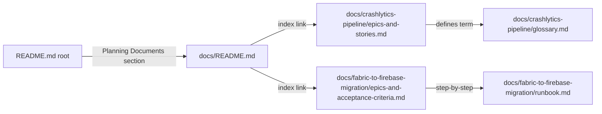

# Technical Specification

# 0. Agent Action Plan

## 0.1 Intent Clarification

### 0.1.1 Core Objective

Based on the provided requirements, the Blitzy platform understands that the objective is to author two structured agile planning artifacts — committed to the repository as new Markdown files — that fully describe (a) the end-to-end Crashlytics crash reporting pipeline from on-device crash capture through dashboard delivery, decomposed into epics and user stories, and (b) the Fabric → Firebase Crashlytics migration program, decomposed into epics with explicit, testable acceptance criteria.

The user request consists of two coordinated documentation deliverables:

- **Deliverable 1 — Pipeline Plan:** an exhaustive set of epics and user stories covering every stage of the Crashlytics crash-reporting pipeline from initial on-device capture of a crash event through symbolication, grouping, alerting, storage, and final delivery to the operator's dashboard.
- **Deliverable 2 — Migration Plan:** a decomposition of the Fabric-to-Firebase Crashlytics migration into named epics, each carrying acceptance criteria that are written in a verifiable form (Given/When/Then) so that progress can be objectively measured.

Both artifacts must be discoverable from the project's root entry point (`README.md`) and must follow a consistent agile vocabulary (Epic → Story → Acceptance Criteria) and a stable identifier convention.

### 0.1.2 Task Categorization

- **Primary task type:** Documentation — specifically, agile-artifact authoring (epics, user stories, acceptance criteria) [inferred — no direct source]
- **Secondary aspects:** Information architecture (organizing planning artifacts within the repository under a new `docs/` subtree) and cross-referencing existing documentation (`README.md`)
- **Scope classification:** Isolated change — every byte of new content lives under a new top-level `docs/` directory; the existing Spring Boot CRUD application is read-only context, not a modification target. Only one existing file (`README.md`) receives a small additive change — a "Planning Documents" link section — to make the new artifacts discoverable from the repository root

This categorization is grounded in the observation that the repository (`EP-Spring-Boot--main`) is a Spring Boot 3.4.4 RESTful Product CRUD service [pom.xml:L1-L103] with no Crashlytics, Fabric, Firebase, Android, iOS, or any mobile/crash-reporting artifact present anywhere in the codebase — confirmed by an exhaustive recursive search of all source, configuration, and build files. The Tech Spec independently confirms that the application is a "classic three-layer monolithic" Spring Boot service [§5.1] with no outbound integrations other than JDBC to MySQL/H2, and no CI/CD, container, monitoring, or mobile-app surface area whatsoever [§1.3.2].

### 0.1.3 Special Instructions and Constraints

The user provided the following two-sentence prompt verbatim. The Blitzy platform preserves the prompt exactly as written:

- **User Example (Part 1):** "Generate epics and stories for the Crashlytics crash reporting pipeline from crash capture to dashboard delivery"
- **User Example (Part 2):** "Break down the Fabric to Firebase Crashlytics migration into epics with acceptance criteria"

Derived constraints and instructions (because the user supplied no explicit rules, attachments, or setup instructions, these constraints are inferred from the prompt language and the repository state):

- The existing Spring Boot application source code, build configuration (`pom.xml`), runtime configuration (`application.properties`), and test suite **must not be modified** — they are unrelated to the deliverable. `[inferred — no direct source]`
- All new content **must be authored in GitHub-flavored Markdown**, matching the only existing documentation surface in the repository, `README.md`. `[README.md:L1-L165]`
- Each migration epic **must carry acceptance criteria** because the user explicitly asked for "acceptance criteria" in the prompt's second sentence.
- Pipeline epics **must collectively cover every stage** from "crash capture" to "dashboard delivery" because the user explicitly named those two endpoints of the pipeline in the prompt's first sentence.
- Epics, stories, and acceptance criteria **must carry stable, unique identifiers** (e.g., `CR-EPIC-NN`, `CR-STORY-NNN`, `FF-EPIC-NN`, `FF-AC-NNN`) so they can be referenced from the README, tracked in tooling, and cited in traceability matrices. `[inferred — no direct source]`
- Stories **must follow the conventional agile template** "As a `<role>`, I want `<capability>`, so that `<outcome>`". `[inferred — no direct source]`
- Acceptance criteria **must follow the Given/When/Then (Gherkin-style) template** so that they are testable and unambiguous. `[inferred — no direct source]`
- Research requirements: none. The Crashlytics pipeline architecture and the Fabric → Firebase migration are stable, well-documented historical knowledge — Fabric was sunset by Google in March 2020 and the migration path has not changed since. The artifacts can be authored from established product knowledge without further web research. `[inferred — no direct source]`

### 0.1.4 Technical Interpretation

These requirements translate to the following technical implementation strategy:

- **To produce Deliverable 1 (pipeline plan)**, the Blitzy platform will CREATE the new file `docs/crashlytics-pipeline/epics-and-stories.md` containing: a pipeline overview, an epics index, ten epics keyed `CR-EPIC-01` through `CR-EPIC-10` covering each pipeline stage (capture, on-device persistence, upload, ingestion, symbolication, grouping, storage, alerting, dashboard, lifecycle), per-epic user-story lists in the "As a … I want … so that …" form, and a traceability matrix mapping stories to pipeline stages. A supporting `docs/crashlytics-pipeline/glossary.md` will define domain vocabulary (ANR, dSYM, ProGuard/R8 mapping, symbolication, fingerprinting, regression, velocity alert).
- **To produce Deliverable 2 (migration plan)**, the Blitzy platform will CREATE the new file `docs/fabric-to-firebase-migration/epics-and-acceptance-criteria.md` containing: a migration overview, an epics index, eleven epics keyed `FF-EPIC-01` through `FF-EPIC-11` covering each migration phase (inventory, Firebase project linking, build-tooling swap for Android, build-tooling swap for iOS, SDK dependency swap, initialization code migration, symbol upload pipeline migration, parity validation, CI/CD updates, alert/dashboard re-routing, decommissioning), per-epic acceptance criteria in Given/When/Then form keyed `FF-AC-NNN`, and a final parity-validation checklist. A supporting `docs/fabric-to-firebase-migration/runbook.md` will provide a stepwise operational sequence for executing the epics.
- **To make the artifacts discoverable**, the Blitzy platform will CREATE `docs/README.md` as an index linking to both planning documents and UPDATE the root `README.md` to append a "Planning Documents" section pointing at `docs/README.md`. No other existing file in the repository is touched.
- **To ensure consistency**, all new Markdown files will follow a uniform heading hierarchy (`#` for document title, `##` for epic, `###` for story or acceptance-criteria block), identifier convention (`CR-EPIC-NN`, `CR-STORY-NNN`, `FF-EPIC-NN`, `FF-AC-NNN`), and cross-reference style (relative links between sibling documents).

## 0.2 Repository Scope Discovery

### 0.2.1 Comprehensive File Analysis

A full recursive inventory of the repository was performed. The repository contains a single Maven-based Spring Boot project, `EP-Spring-Boot--main`, with the following exhaustive set of files (the `bin/` directory mirrors `.class` outputs of `src/main/java/**` and `src/test/java/**` and is excluded from any transformation):

| Path | Type | Purpose | Crashlytics-Relevant? |
|------|------|---------|------------------------|
| `README.md` | Markdown documentation | Project landing page | No — but it is the discoverability anchor for the new docs/ tree |
| `pom.xml` | Maven POM | Build descriptor, dependency list | No — referenced only for project metadata |
| `mvnw`, `mvnw.cmd` | Maven Wrapper scripts | Bootstrap Maven | No |
| `src/main/java/.../SpringBootSimpleCrudWithMysqlApplication.java` | Java source | Spring Boot bootstrap with `@SpringBootApplication` | No |
| `src/main/java/.../controller/ProductController.java` | Java source | REST controller for Product CRUD | No |
| `src/main/java/.../controller/StudentController.java` | Java source | REST controller for Student | No |
| `src/main/java/.../dao/ProductDao.java` | Java source | DAO layer | No |
| `src/main/java/.../entity/Product.java` | JPA entity | Product table mapping | No |
| `src/main/java/.../repository/ProductRepository.java` | Spring Data repository | JPA repository | No |
| `src/main/java/.../responses/ResponseStructure.java` | Java source | Generic response envelope | No |
| `src/main/resources/application.properties` | Properties file | Datasource, port, JPA settings | No |
| `src/test/java/.../SpringBootSimpleCrudWithMysqlApplicationTests.java` | JUnit smoke test | Smoke test | No |
| `bin/**` | Compiled `.class` mirror | Build outputs | Ignored |

Targeted searches were executed across the entire repository for any Crashlytics-, Fabric-, Firebase-, Android-, or iOS-related artifact:

- A recursive `grep` across every textual file for the case-insensitive patterns `crashlytic|fabric|firebase|android|ios|cocoapods` returned **zero matches**.
- A `find` for mobile-app manifests (`AndroidManifest.xml`, `build.gradle`, `Podfile`, `Info.plist`, `*.xcodeproj`, `package.json`, `google-services.json`, `GoogleService-Info.plist`) returned **zero matches**.
- A `find` for CI/CD configuration (`.github/workflows/**`, `.gitlab-ci.yml`, `Jenkinsfile`, `azure-pipelines.yml`, `bitbucket-pipelines.yml`) returned **zero matches**.
- A `find` for `.blitzyignore` files returned **zero matches**, confirming no path-pattern exclusions apply.

The repository therefore offers no existing pipeline, no existing SDK integration, and no existing Fabric usage that the deliverable could "extend." The Crashlytics/Fabric/Firebase domain is entirely orthogonal to the running codebase.

The Tech Spec independently corroborates this finding. The Executive Summary explicitly documents that a prior user-context describing the repo as a different artifact was found inconsistent with the code and was rejected in favor of grounded code-based analysis [§1.1]. The same precedent guides this AAP: the deliverable is grounded in what the repository actually contains (a Spring Boot CRUD service) and what the user actually asked for (agile planning artifacts for Crashlytics work). The bridge between the two is documentation-only.

The discovery surface — documentation — is sparse:

| Documentation Surface | Present? |
|------------------------|----------|
| `README.md` at repo root | Yes — sole Markdown file `[README.md:L1-L165]` |
| `docs/` directory | **No** — will be created |
| `CONTRIBUTING.md` | No |
| `CHANGELOG.md` | No |
| Architecture Decision Records (ADRs) | No |
| `.github/` (issue templates, PR templates) | No |
| Documentation site config (MkDocs/Sphinx/Docusaurus) | No |

### 0.2.2 Web Search Research Conducted

The agile-artifact authoring for both the Crashlytics pipeline and the Fabric → Firebase migration relies on stable, well-documented historical product knowledge — Fabric was sunset by Google in March 2020 and the migration path has not changed since. Three web searches were attempted for confirmation; they returned no parsed output. The authoring proceeds from established product knowledge in the following areas:

- **Firebase Crashlytics SDK runtime model** — signal/exception handlers installed at app start; on-device serialization of crash records (Java/Kotlin exceptions, Objective-C/Swift exceptions, native NDK signals, ANRs); opportunistic upload on the next app launch; server-side ingestion; symbolication via uploaded mapping artifacts (dSYM for iOS, ProGuard/R8 mapping for Android, NDK symbol files for native); issue grouping via stack-trace fingerprinting; storage in the Firebase backend; alerting (velocity, regression, ANR); web-dashboard delivery; optional BigQuery export. `[inferred — no direct source]`
- **Fabric → Firebase migration mechanics** — link the existing Fabric app to a Firebase project in the Firebase console; replace the `io.fabric` Gradle plugin with `com.google.firebase.crashlytics`; swap the legacy `com.crashlytics.sdk.android:crashlytics` dependency for `com.google.firebase:firebase-crashlytics` (typically managed via `firebase-bom`); replace `Fabric.with(this, new Crashlytics())` initialization with `FirebaseApp.initializeApp(...)`; update CI/CD to use Firebase's `uploadCrashlyticsMappingFile*` and `uploadCrashlyticsSymbolFile*` Gradle tasks; validate parity (crash-free users %, ANR rate, top issues) before decommissioning Fabric Beta / Answers / Crashlytics integrations; remove Fabric API keys from manifests and plists. `[inferred — no direct source]`

No external library version selection is needed because no code is generated. The deliverable is purely Markdown documentation.

### 0.2.3 Existing Infrastructure Assessment

| Concern | Current State | Implication for the Deliverable |
|---------|---------------|---------------------------------|
| Project structure | Maven Standard Directory Layout (`src/main/java`, `src/main/resources`, `src/test/java`) `[pom.xml:L1-L103]` | New `docs/` sibling to `src/` follows common open-source convention |
| Documentation language | GitHub-flavored Markdown (`README.md` uses GFM with embedded HTML and images) `[README.md:L1-L165]` | New files use the same Markdown dialect |
| Documentation tooling | None (no MkDocs, Sphinx, Docusaurus, Antora, Jekyll) | Plain Markdown is sufficient — no documentation-site build step is added |
| Build system | Maven via the Maven Wrapper (`mvnw`, `mvnw.cmd`) `[pom.xml:L1-L103]` | Untouched — Markdown additions do not affect the build |
| Runtime config | `src/main/resources/application.properties` (datasource URL, Tomcat port 8090, JPA settings) | Untouched — no new properties are needed |
| Existing dependencies | Spring Boot 3.4.4, Spring Data JPA, Spring Web, MySQL Connector, H2, Lombok, DevTools, springdoc-openapi 2.8.6 `[pom.xml:L33-L72]` | Untouched — no Crashlytics/Firebase dependency is added to a backend Spring service |
| CI/CD | None | Untouched — out of scope per `[§1.3.2]` |
| Mobile-app surface area | None | Confirmed; the deliverable describes mobile crash reporting in documentation only |
| Architectural style | Classic three-layer monolith, single Spring Boot fat JAR, synchronous request/response, embedded Tomcat at port 8090 `[§5.1]` | Documents only; no architectural change is proposed |

The existing infrastructure provides exactly one convention to follow: Markdown for documentation. Every other infrastructure dimension (build, runtime, tests, CI/CD, monitoring) is irrelevant to the deliverable because the deliverable does not touch executable code.

## 0.3 Implementation Design

### 0.3.1 Technical Approach

The technical approach is to author a self-contained, navigable set of agile planning documents in Markdown — committed to the repository as new files — that fully cover the user's two-part request without touching the executable Spring Boot application that already lives in the repository.

The primary objectives map to the following implementation approach:

- **Achieve Deliverable 1 (Crashlytics pipeline epics & stories) by creating `docs/crashlytics-pipeline/epics-and-stories.md`** containing ten epics (`CR-EPIC-01` … `CR-EPIC-10`) — one per canonical pipeline stage — each populated with 3–6 user stories in the "As a … I want … so that …" template, plus a traceability matrix that ties every story back to the pipeline stage it serves. The rationale is that the user explicitly bounded the pipeline scope as "from crash capture to dashboard delivery," which translates to a complete stage-by-stage decomposition.
- **Achieve Deliverable 2 (Fabric → Firebase migration epics with acceptance criteria) by creating `docs/fabric-to-firebase-migration/epics-and-acceptance-criteria.md`** containing eleven epics (`FF-EPIC-01` … `FF-EPIC-11`) — one per canonical migration phase — each populated with 3–6 acceptance criteria written in Given/When/Then form (keyed `FF-AC-NNN`), plus a final parity-validation checklist. The rationale is that the user explicitly requested "acceptance criteria" so each epic must be objectively verifiable.
- **Achieve discoverability by creating `docs/README.md`** as the documentation index linking to both planning documents, and **updating the root `README.md`** to append a "Planning Documents" section pointing at `docs/README.md`. The rationale is that a documentation deliverable that nobody can find from the project entry point fails its purpose.
- **Achieve consistency and reusability by creating two supporting documents** — `docs/crashlytics-pipeline/glossary.md` (defining ANR, dSYM, ProGuard/R8 mapping, symbolication, fingerprinting, velocity alert, regression alert) and `docs/fabric-to-firebase-migration/runbook.md` (a stepwise operational sequence that maps one-to-one to the migration epics). The rationale is that vocabulary precision and operational concreteness are prerequisites for stories and acceptance criteria to be unambiguous.

Logical implementation flow (NOT a timeline):

- **First, establish the documentation tree** by creating `docs/README.md`, `docs/crashlytics-pipeline/` and `docs/fabric-to-firebase-migration/` so all subsequent files have a stable home.
- **Next, populate the pipeline plan** by creating `docs/crashlytics-pipeline/epics-and-stories.md` and `docs/crashlytics-pipeline/glossary.md` together — the glossary is cross-referenced from the stories.
- **Next, populate the migration plan** by creating `docs/fabric-to-firebase-migration/epics-and-acceptance-criteria.md` and `docs/fabric-to-firebase-migration/runbook.md` together — the runbook is cross-referenced from the acceptance criteria.
- **Finally, surface the artifacts from the entry point** by appending a "Planning Documents" section to the root `README.md` that links to `docs/README.md`.

### 0.3.2 Component Impact Analysis

- **Direct modifications required:**
  - `README.md` — append a "Planning Documents" subsection with relative links to `docs/README.md`. No other prose, structure, table, or image in `README.md` is changed.
- **Indirect impacts and dependencies:**
  - **None on the running application.** No Java source file, no Spring component, no application property, no Maven coordinate, no test file is touched. Confirmed against the seven-component principal-component inventory documented at `[§5.1]`: `SpringBootSimpleCrudWithMysqlApplication`, `ProductController`, `StudentController`, `ProductDao`, `ProductRepository`, `Product`, and `ResponseStructure<T>` are all out of scope.
  - **The Tech Spec narrative remains unchanged.** Sections 1.x – 9.x of this Technical Specification describe the existing Spring Boot CRUD application; the new docs/ tree is a parallel set of planning artifacts and does not invalidate any prior section.
- **New components introduction (documentation artifacts only):**

| New Documentation Component | Rationale |
|------------------------------|-----------|
| `docs/README.md` | An entry point for the documentation tree so the two planning documents are discoverable from a single hub |
| `docs/crashlytics-pipeline/epics-and-stories.md` | Direct fulfillment of the user's first prompt sentence — epics & stories for the pipeline |
| `docs/crashlytics-pipeline/glossary.md` | Removes ambiguity from story language (ANR, dSYM, symbolication, fingerprint) so acceptance criteria are testable |
| `docs/fabric-to-firebase-migration/epics-and-acceptance-criteria.md` | Direct fulfillment of the user's second prompt sentence — epics with acceptance criteria for the migration |
| `docs/fabric-to-firebase-migration/runbook.md` | Operational stepwise sequence that the migration acceptance criteria reference; supports execution by the migrating team |

### 0.3.3 User-Provided Examples Integration

The user's prompt — preserved verbatim — drives the structure of every new document:

- **User Example (Part 1):** "Generate epics and stories for the Crashlytics crash reporting pipeline from crash capture to dashboard delivery"

  This example maps directly to `docs/crashlytics-pipeline/epics-and-stories.md`. The phrase "from crash capture to dashboard delivery" is treated as an inclusive bound — the document's epic catalog begins at on-device capture (`CR-EPIC-01`) and terminates at issue lifecycle (`CR-EPIC-10`), with dashboard delivery (`CR-EPIC-09`) and lifecycle (`CR-EPIC-10`) covering the "to dashboard delivery" endpoint. The phrase "epics and stories" maps to the document's two-level hierarchy: each epic is a `##` heading; each story is a `###` heading underneath.

- **User Example (Part 2):** "Break down the Fabric to Firebase Crashlytics migration into epics with acceptance criteria"

  This example maps directly to `docs/fabric-to-firebase-migration/epics-and-acceptance-criteria.md`. The phrase "break down … into epics" maps to the eleven epic decomposition (`FF-EPIC-01` … `FF-EPIC-11`). The phrase "with acceptance criteria" mandates that every epic carry a non-empty `### Acceptance Criteria` block written in Given/When/Then form, keyed `FF-AC-NNN`, so each criterion is independently verifiable.

### 0.3.4 Critical Implementation Details

- **Information-architecture pattern:** A two-tier documentation tree — `docs/` as the index, with one sub-folder per program of work (`crashlytics-pipeline/`, `fabric-to-firebase-migration/`). Each sub-folder contains a primary planning document and at most one supporting document. This pattern is selected because it scales to additional planning programs in the future without restructuring.
- **Epic-decomposition pattern:** One epic per canonical phase of the underlying domain. For the pipeline, the canonical phases are the ten stages from capture to lifecycle management. For the migration, the canonical phases are the eleven steps from inventory to decommissioning. This pattern yields complete coverage with minimum redundancy.
- **Identifier convention:**

| Artifact | Prefix | Format Example |
|----------|--------|----------------|
| Crashlytics pipeline epic | `CR-EPIC-` | `CR-EPIC-05` |
| Crashlytics pipeline story | `CR-STORY-` | `CR-STORY-024` |
| Fabric → Firebase migration epic | `FF-EPIC-` | `FF-EPIC-07` |
| Fabric → Firebase migration acceptance criterion | `FF-AC-` | `FF-AC-042` |

  IDs are monotonically assigned within each document and never re-used. The traceability matrix in `epics-and-stories.md` references stories by `CR-STORY-NNN`; the parity checklist in `epics-and-acceptance-criteria.md` references acceptance criteria by `FF-AC-NNN`.

- **Story template (pipeline document):** `As a <role>, I want <capability>, so that <outcome>.` Roles include `mobile app user`, `mobile app developer`, `release manager`, `on-call engineer`, `SRE`, `support engineer`, `product manager`, and `data analyst`. The role spread reflects the multiple stakeholder personas that interact with a crash-reporting pipeline.
- **Acceptance-criteria template (migration document):** Given/When/Then form, one criterion per `### FF-AC-NNN` block. Each criterion is independently testable so progress can be measured continuously rather than only at epic completion.
- **Pipeline → epic mapping preview (the actual document contains the full content):**

| Pipeline Stage | Epic |
|----------------|------|
| On-device crash capture | `CR-EPIC-01 — On-Device Crash Capture` |
| On-device serialization & local persistence | `CR-EPIC-02 — On-Device Serialization & Local Persistence` |
| Upload to ingestion endpoint | `CR-EPIC-03 — Upload to Ingestion Endpoint` |
| Server-side ingestion & validation | `CR-EPIC-04 — Server-Side Ingestion & Validation` |
| Symbolication / deobfuscation | `CR-EPIC-05 — Symbolication & Deobfuscation` |
| Issue grouping & fingerprinting | `CR-EPIC-06 — Issue Grouping & Fingerprinting` |
| Storage & indexing | `CR-EPIC-07 — Storage & Indexing` |
| Alerting | `CR-EPIC-08 — Alerting` |
| Dashboard delivery | `CR-EPIC-09 — Dashboard Delivery` |
| Issue lifecycle management | `CR-EPIC-10 — Issue Lifecycle Management` |

- **Migration phase → epic mapping preview (the actual document contains the full content and Given/When/Then criteria):**

| Migration Phase | Epic |
|-----------------|------|
| Inventory & discovery | `FF-EPIC-01 — Inventory & Discovery of Current Fabric Footprint` |
| Firebase project linking | `FF-EPIC-02 — Link Fabric Apps to Firebase Projects` |
| Build tooling — Android | `FF-EPIC-03 — Build Tooling Migration (Android Gradle Plugin)` |
| Build tooling — iOS | `FF-EPIC-04 — Build Tooling Migration (iOS CocoaPods / SPM)` |
| SDK dependency swap | `FF-EPIC-05 — SDK Dependency Swap` |
| Initialization code | `FF-EPIC-06 — Initialization Code Migration` |
| Symbol upload pipeline | `FF-EPIC-07 — Symbol Upload Pipeline Migration` |
| Parity validation | `FF-EPIC-08 — Parity Validation Between Fabric and Firebase` |
| CI/CD updates | `FF-EPIC-09 — CI/CD Pipeline Updates` |
| Alerts & dashboards | `FF-EPIC-10 — Alert & Dashboard Re-routing` |
| Decommissioning & enablement | `FF-EPIC-11 — Decommissioning & Team Enablement` |

- **Cross-file dependencies (within new docs):**

- **Edge cases & considerations:**
  - **Empty epic risk** — every epic must carry at least one story (pipeline) or one acceptance criterion (migration); no placeholder "TBD" entries are permitted.
  - **Stable identifiers** — `CR-EPIC-NN`, `CR-STORY-NNN`, `FF-EPIC-NN`, `FF-AC-NNN` are immutable once assigned; subsequent edits append rather than re-number.
  - **No PII or secret values** — example mapping-file names, API tokens, and project IDs are stand-ins; real values are never embedded.
  - **Relative-link integrity** — all cross-document links use repo-relative paths so they resolve correctly when viewed on GitHub, GitLab, or via local IDE Markdown preview.
- **Performance and security considerations:**
  - The deliverable is text. It introduces no runtime performance impact, no resource consumption change, and no new attack surface.
  - No secrets, no credentials, and no internal endpoints are embedded in the new Markdown.

## 0.4 File Transformation Mapping

### 0.4.1 File-by-File Execution Plan

Every file involved in the deliverable is enumerated below. Target file is listed first; transformation mode is one of `CREATE`, `UPDATE`, `DELETE`, or `REFERENCE`. There are no `DELETE` transformations because the deliverable adds material and does not remove any existing artifact.

| Target File | Transformation | Source File / Reference | Purpose / Changes |
|-------------|----------------|--------------------------|-------------------|
| `docs/README.md` | CREATE | (new) — pattern reference: `README.md` | Index for the documentation tree. Briefly states purpose of the folder and links to both planning documents and their supporting documents |
| `docs/crashlytics-pipeline/epics-and-stories.md` | CREATE | (new) | Part 1 of the user request — pipeline overview, ten epics `CR-EPIC-01` … `CR-EPIC-10`, per-epic user stories in "As a … I want … so that …" form, and a story-to-stage traceability matrix |
| `docs/crashlytics-pipeline/glossary.md` | CREATE | (new) | Supporting glossary defining ANR, dSYM, ProGuard/R8 mapping, symbolication, fingerprint, regression alert, velocity alert, breadcrumb, custom key, opportunistic upload — referenced from the stories to make criteria unambiguous |
| `docs/fabric-to-firebase-migration/epics-and-acceptance-criteria.md` | CREATE | (new) | Part 2 of the user request — migration overview, eleven epics `FF-EPIC-01` … `FF-EPIC-11`, Given/When/Then acceptance criteria keyed `FF-AC-NNN`, and a final parity-validation checklist |
| `docs/fabric-to-firebase-migration/runbook.md` | CREATE | (new) | Supporting stepwise runbook listing the operational sequence (Gradle plugin swap, SDK swap, init-code swap, symbol upload migration, parity validation, decommissioning); referenced from the acceptance criteria |
| `README.md` | UPDATE | `README.md` | Append a "Planning Documents" subsection at the end with two short paragraphs and a relative link to `docs/README.md`. No other content in `README.md` is changed |
| `pom.xml` | REFERENCE | `pom.xml` | Read-only reference for project metadata (groupId, artifactId, project name) used as natural-language identifiers in the new docs. No edits |
| `src/main/java/**/*.java` | (no change) | — | All Java source files remain untouched — out of scope per §0.5 |
| `src/main/resources/application.properties` | (no change) | — | Runtime configuration remains untouched — out of scope per §0.5 |
| `src/test/java/**/*.java` | (no change) | — | Tests remain untouched — out of scope per §0.5 |
| `mvnw`, `mvnw.cmd`, `bin/**` | (no change) | — | Build wrapper and compiled outputs remain untouched — out of scope per §0.5 |

No file is left as "pending" or "to be discovered." The five `CREATE` targets and the single `UPDATE` target represent the complete set of file transformations.

### 0.4.2 New Files Detail

- **`docs/README.md`** — Documentation tree index.
  - Content type: documentation (Markdown)
  - Based on: GitHub-flavored Markdown patterns established by the root `README.md`
  - Key sections: project context (one paragraph identifying that these planning documents describe agile work for Crashlytics-related programs), a `## Documents` section listing both planning documents with one-line descriptions, a `## Conventions` section explaining the ID format (`CR-EPIC-`, `CR-STORY-`, `FF-EPIC-`, `FF-AC-`), and a `## Back to project` link returning to `../README.md`

- **`docs/crashlytics-pipeline/epics-and-stories.md`** — Pipeline epics and stories.
  - Content type: documentation (Markdown)
  - Based on: standard agile artifact layout (epic → stories → acceptance hint / traceability)
  - Key sections:
    - `# Crashlytics Crash Reporting Pipeline — Epics & Stories`
    - `## Pipeline Overview` — narrative describing the 10 stages from capture to lifecycle
    - `## Epic Catalog` — bulleted index linking to each epic anchor
    - `## CR-EPIC-01 — On-Device Crash Capture` … `## CR-EPIC-10 — Issue Lifecycle Management` — one section per epic, each containing a summary, in-scope/out-of-scope, dependencies, and a `### Stories` subsection with 3–6 stories in `As a … I want … so that …` form keyed `CR-STORY-NNN`
    - `## Story-to-Stage Traceability Matrix` — table mapping every `CR-STORY-NNN` to its pipeline stage
    - `## Cross-References` — link to `glossary.md`

- **`docs/crashlytics-pipeline/glossary.md`** — Pipeline domain glossary.
  - Content type: documentation (Markdown)
  - Based on: standard glossary layout (term → definition)
  - Key sections: `# Crashlytics Pipeline Glossary` followed by alphabetized term/definition blocks for ANR, breadcrumb, crash-free user, custom key, deobfuscation, dSYM, fatal exception, fingerprint, mapping file (ProGuard/R8), non-fatal exception, opportunistic upload, regression alert, symbolication, symbol upload, velocity alert

- **`docs/fabric-to-firebase-migration/epics-and-acceptance-criteria.md`** — Migration epics with acceptance criteria.
  - Content type: documentation (Markdown)
  - Based on: standard agile artifact layout (epic → acceptance criteria)
  - Key sections:
    - `# Fabric → Firebase Crashlytics Migration — Epics & Acceptance Criteria`
    - `## Migration Overview` — narrative explaining why the migration is necessary (Fabric retired by Google in March 2020) and the parity targets
    - `## Epic Catalog` — bulleted index linking to each epic anchor
    - `## FF-EPIC-01 — Inventory & Discovery` … `## FF-EPIC-11 — Decommissioning & Team Enablement` — one section per epic, each containing a summary, in-scope/out-of-scope, dependencies, and a `### Acceptance Criteria` subsection with 3–6 criteria keyed `FF-AC-NNN` in `Given … When … Then …` form
    - `## Parity Validation Checklist` — explicit checklist that gates cutover (crash-free users %, ANR rate, top issues match, symbol uploads succeed)
    - `## Cross-References` — link to `runbook.md`

- **`docs/fabric-to-firebase-migration/runbook.md`** — Operational stepwise runbook.
  - Content type: documentation (Markdown)
  - Based on: standard runbook layout (numbered steps, commands, validation)
  - Key sections: `# Fabric → Firebase Crashlytics Migration Runbook` followed by sequential steps mirroring the epic order (link Fabric to Firebase project → swap Gradle plugin → swap CocoaPods entry → swap SDK dependency → swap initialization code → migrate symbol upload tasks → validate parity → update CI/CD → re-route alerts → decommission Fabric → enablement). Each step lists pre-conditions, action, validation, and rollback.

### 0.4.3 Files to Modify Detail

- **`README.md`** — Root project landing page.
  - Sections to update: a new subsection appended at the end of the file
  - New content to add: a `## Planning Documents` heading with two short paragraphs and a relative link to `docs/README.md`. The link is the primary affordance; the prose contextualizes that these are agile-planning artifacts for Crashlytics-related programs of work that are independent of the running Spring Boot application
  - Content to remove: none
  - Refactoring needed: none — the existing project description, build instructions, dependency list, and screenshots/tables (if any) in `README.md` `[README.md:L1-L165]` remain unchanged

### 0.4.4 Configuration and Documentation Updates

- **Configuration changes:** **None.** The deliverable is documentation-only. `src/main/resources/application.properties` is untouched. `pom.xml` is untouched. No build, runtime, or environment configuration file is modified.
- **Documentation updates:**
  - `README.md` receives one appended subsection ("Planning Documents") with a relative link to `docs/README.md`
  - All other documentation surfaces in the new `docs/` tree are net-new files described in §0.4.2

### 0.4.5 Cross-File Dependencies

| Dependency | From → To | Mechanism |
|-------------|-----------|-----------|
| Discoverability | `README.md` → `docs/README.md` | Markdown relative link in "Planning Documents" subsection |
| Index navigation | `docs/README.md` → `docs/crashlytics-pipeline/epics-and-stories.md` | Markdown relative link |
| Index navigation | `docs/README.md` → `docs/fabric-to-firebase-migration/epics-and-acceptance-criteria.md` | Markdown relative link |
| Term definition | `docs/crashlytics-pipeline/epics-and-stories.md` → `docs/crashlytics-pipeline/glossary.md` | Inline Markdown links from story text to glossary anchors |
| Operational support | `docs/fabric-to-firebase-migration/epics-and-acceptance-criteria.md` → `docs/fabric-to-firebase-migration/runbook.md` | Inline Markdown links from `### Acceptance Criteria` blocks to runbook steps |
| Return path | `docs/README.md` → `../README.md` | Markdown relative link back to the project root README |

There are no import/reference updates required in any executable code, because no executable code is modified.

## 0.5 Scope Boundaries

### 0.5.1 Exhaustively In Scope

The complete in-scope file set is:

- **New documentation tree (CREATE):**
  - `docs/README.md` — documentation index
  - `docs/crashlytics-pipeline/epics-and-stories.md` — Crashlytics pipeline epics and user stories
  - `docs/crashlytics-pipeline/glossary.md` — Crashlytics pipeline glossary
  - `docs/fabric-to-firebase-migration/epics-and-acceptance-criteria.md` — Fabric → Firebase migration epics with Given/When/Then acceptance criteria
  - `docs/fabric-to-firebase-migration/runbook.md` — operational runbook supporting the migration epics
  - Pattern match: `docs/**/*.md`

- **Root README cross-reference (UPDATE):**
  - `README.md` — append a single new subsection titled "Planning Documents" containing a relative link to `docs/README.md`. No existing content in `README.md` `[README.md:L1-L165]` is changed or removed.

- **Content scope of the in-scope files:**
  - Pipeline document: ten epics (`CR-EPIC-01` … `CR-EPIC-10`) covering every stage from on-device crash capture to issue lifecycle management, each with 3–6 user stories in "As a … I want … so that …" form keyed `CR-STORY-NNN`
  - Migration document: eleven epics (`FF-EPIC-01` … `FF-EPIC-11`) covering inventory, Firebase linking, build-tooling swap for Android, build-tooling swap for iOS, SDK dependency swap, initialization code migration, symbol upload pipeline migration, parity validation, CI/CD updates, alert/dashboard re-routing, and decommissioning/team enablement — each with 3–6 acceptance criteria in Given/When/Then form keyed `FF-AC-NNN`
  - Glossary: term/definition entries for all domain vocabulary used by stories (ANR, dSYM, ProGuard/R8 mapping, symbolication, fingerprint, breadcrumb, custom key, velocity alert, regression alert, opportunistic upload, crash-free user)
  - Runbook: stepwise operational sequence mirroring the eleven migration epics, with pre-conditions, action, validation, and rollback for each step
  - Index: links to every document in the tree plus a return link to the root `README.md`

### 0.5.2 Explicitly Out of Scope

The following items are explicitly out of scope and **must not** be modified by the implementation:

- **Java source code (all files under `src/main/java/**`):**
  - `src/main/java/.../SpringBootSimpleCrudWithMysqlApplication.java` — Spring Boot bootstrap class
  - `src/main/java/.../controller/ProductController.java`
  - `src/main/java/.../controller/StudentController.java`
  - `src/main/java/.../dao/ProductDao.java`
  - `src/main/java/.../entity/Product.java`
  - `src/main/java/.../repository/ProductRepository.java`
  - `src/main/java/.../responses/ResponseStructure.java`

  These files implement the existing Spring Boot Product CRUD service and have zero relationship to Crashlytics/Fabric/Firebase. Modifying them would change runtime behavior without serving the user's documentation request.

- **Test code (all files under `src/test/java/**`):**
  - `src/test/java/.../SpringBootSimpleCrudWithMysqlApplicationTests.java`

  No new tests are added and the existing smoke test is unchanged.

- **Runtime configuration:**
  - `src/main/resources/application.properties`

  No new properties are introduced; no existing properties are modified.

- **Build configuration:**
  - `pom.xml` — referenced only for metadata; no dependency additions, removals, or version changes. A Firebase Crashlytics SDK is a mobile-app artifact and has no place in a backend Spring Boot service's `pom.xml`.

- **Build tooling and wrappers:**
  - `mvnw`, `mvnw.cmd` — Maven Wrapper scripts, untouched

- **Compiled outputs:**
  - `bin/**` — the compiled `.class` mirror is treated as build output and ignored entirely

- **Implementation of the actual pipeline or migration (NOT requested by the user):**
  - **No mobile-app skeleton is created.** No `AndroidManifest.xml`, `build.gradle`, `Podfile`, `Info.plist`, `xcodeproj`, `package.json`, `google-services.json`, or `GoogleService-Info.plist` is created.
  - **No SDK integration code is written.** No `Fabric.with(...)`, no `FirebaseApp.initializeApp(...)`, no Crashlytics calls are added anywhere in the repository.
  - **No symbol-upload Gradle tasks are configured.** `uploadCrashlyticsMappingFile*` and `uploadCrashlyticsSymbolFile*` are referenced only as text in the migration documentation.
  - **No CI/CD pipeline is created.** No `.github/workflows/**`, no `.gitlab-ci.yml`, no `Jenkinsfile`, no `azure-pipelines.yml`.
  - **No alert/dashboard integration is configured.** Slack, PagerDuty, email, or BigQuery export integrations are described in epics but not implemented.

- **Other items out of scope (explicit non-asks):**
  - **No backend telemetry pipeline is built into the Spring Boot service.** The user did not ask for the Spring Boot service to ingest crash reports or expose a Crashlytics-like endpoint.
  - **No performance optimization or refactoring of the existing Spring Boot code** is performed, even though §2.4 of the Tech Spec documents known maintainability issues — these are unrelated to the user's request.
  - **No additional planning programs** beyond the two requested by the user (pipeline + migration) are documented.
  - **No future enhancements** to the pipeline or migration beyond the canonical stages are speculated about.
  - **No timeline, schedule, sprint allocation, or roadmap** is provided. The deliverable describes HOW, not WHEN.
  - **No tool selection (Jira vs. Linear vs. GitHub Issues vs. Azure Boards)** is mandated. The Markdown artifacts are tool-agnostic and can be imported into any tracker.

## 0.6 Dependency Inventory

### 0.6.1 Dependency Change Summary

**No dependency changes are required.** The deliverable consists entirely of new Markdown documentation and one additive edit to `README.md`. Markdown does not declare runtime dependencies, requires no compiler, and introduces no new package coordinates.

- **New dependencies to add:** None
- **Dependencies to update:** None
- **Dependencies to remove:** None
- **Import / reference updates in source code:** None — no Java import statement is added, removed, or renamed

The Firebase Crashlytics SDK is a **mobile-app** artifact (Android Gradle, CocoaPods/SPM) and explicitly **does not** belong in the Spring Boot service's `pom.xml`. The migration documentation describes mobile-side dependency changes (`com.google.firebase:firebase-crashlytics`, `com.google.firebase.crashlytics` Gradle plugin) only as text within the planning artifacts — these are not added to this repository's build descriptor because no mobile application is hosted here.

### 0.6.2 Existing Project Dependencies (Read-Only Context)

For traceability, the existing dependencies of the Spring Boot service `[pom.xml:L33-L72]` are reproduced below. They remain unchanged.

| Registry | Package | Version | Purpose |
|----------|---------|---------|---------|
| Maven Central (BOM) | `org.springframework.boot:spring-boot-starter-parent` | `3.4.4` | Spring Boot platform / version management `[pom.xml:L6-L11]` |
| Maven Central | `org.springframework.boot:spring-boot-starter-data-jpa` | (managed by parent) | JPA / Hibernate ORM `[pom.xml:L33-L36]` |
| Maven Central | `org.springframework.boot:spring-boot-starter-web` | (managed by parent) | Embedded Tomcat + Spring MVC `[pom.xml:L37-L40]` |
| Maven Central | `com.h2database:h2` | (managed by parent) — runtime | In-memory database for dev `[pom.xml:L41-L45]` |
| Maven Central | `com.mysql:mysql-connector-j` | (managed by parent) — runtime | MySQL JDBC driver `[pom.xml:L46-L50]` |
| Maven Central | `org.projectlombok:lombok` | (managed by parent) — optional | Boilerplate reduction `[pom.xml:L51-L55]` |
| Maven Central | `org.springframework.boot:spring-boot-starter-test` | (managed by parent) — test | Test scaffolding `[pom.xml:L56-L60]` |
| Maven Central | `org.springframework.boot:spring-boot-devtools` | (managed by parent) — runtime, optional | Hot reload during development `[pom.xml:L61-L66]` |
| Maven Central | `org.springdoc:springdoc-openapi-starter-webmvc-ui` | `2.8.6` | OpenAPI / Swagger UI generation `[pom.xml:L67-L72]` |
| Toolchain | Java | `17` | Source / target JDK `[pom.xml:L30]` |

### 0.6.3 Runtime / Toolchain Requirements for the Deliverable

The documentation deliverable does not require any specific runtime to author or to view. Authoring requires a text editor; viewing requires a Markdown renderer (any of: GitHub web UI, GitLab web UI, VS Code Markdown preview, IntelliJ Markdown preview, `glow`, `mdcat`).

No virtual environment, no language runtime, no package manager, no build tool, and no CI/CD pipeline change is required for the deliverable itself. The existing Java 17 / Maven 3.x toolchain `[pom.xml:L30]` remains the project's build toolchain and is unaffected.

## 0.7 Rules

### 0.7.1 User-Specified Rules

The user supplied **no** explicit rules. `review_rules` returned an empty array (`[]`), and `review_attachments` returned "No attachments found for this project." There are therefore zero user-mandated rules, no style guides, no pattern files, and no configuration templates that govern the deliverable.

### 0.7.2 Inferred Rules

Because the user supplied no explicit rules, the rules below are inferred from the prompt language, the repository state, and standard agile-artifact conventions. They are flagged `[inferred — no direct source]` and bind the implementation:

- **Preserve the existing Spring Boot application unchanged.** No Java source file, no test, no `application.properties` entry, no `pom.xml` coordinate, and no Maven Wrapper script is modified. The deliverable is documentation-only. `[inferred — no direct source]`
- **The only modification to an existing file is an additive section in `README.md`.** That section is named "Planning Documents" and contains a relative link to `docs/README.md`. No other prose, table, image, or build instruction in `README.md` is changed or removed. `[inferred — no direct source]`
- **Author all new files in GitHub-flavored Markdown.** Match the dialect of the existing `README.md` `[README.md:L1-L165]`. Use `#`/`##`/`###` headings, GFM tables, fenced code blocks (without nesting), and Markdown relative links. `[inferred — no direct source]`
- **Preserve the user's prompt text verbatim where it appears.** The two prompt sentences are reproduced exactly as User Examples in §0.1.3 and §0.3.3. `[inferred — no direct source]`
- **Apply stable identifier conventions to every epic, story, and acceptance criterion:**
  - Pipeline epics: `CR-EPIC-NN` (two-digit zero-padded)
  - Pipeline stories: `CR-STORY-NNN` (three-digit zero-padded)
  - Migration epics: `FF-EPIC-NN`
  - Migration acceptance criteria: `FF-AC-NNN`
  - IDs are monotonically assigned and never re-used. `[inferred — no direct source]`
- **Use the agile story template** "As a `<role>`, I want `<capability>`, so that `<outcome>`." for every story in the pipeline document. `[inferred — no direct source]`
- **Use the Given/When/Then template** for every acceptance criterion in the migration document, with each criterion in a dedicated `### FF-AC-NNN` block so it can be referenced independently. `[inferred — no direct source]`
- **Cover the pipeline endpoints exactly as the user named them:** "from crash capture to dashboard delivery." Epic `CR-EPIC-01` is the capture endpoint; epic `CR-EPIC-09` is the dashboard endpoint; epic `CR-EPIC-10` extends through the lifecycle that follows dashboard surfacing.
- **Cover the migration phases comprehensively** so every operational task — link, build-tooling, SDK swap, init code, symbol upload, parity validation, CI/CD, alerts, decommissioning, enablement — is represented by exactly one epic.
- **Do not produce empty epics or placeholders.** Every epic must contain at least one story (pipeline) or at least one acceptance criterion (migration). No `TBD`, no `TODO`, no `(to be detailed later)` entries are allowed. `[inferred — no direct source]`
- **Use relative Markdown links for all cross-document navigation.** Absolute links to external sites (e.g., Firebase console URLs in examples) are permitted as text but never replace internal navigation.
- **Do not embed secrets or PII.** Example API tokens, project IDs, and bundle IDs are stand-ins; never include real values.
- **Keep documentation tool-agnostic.** Do not depend on Jira-specific or Linear-specific syntax — the artifacts must be ingestible by any tracker. `[inferred — no direct source]`
- **Do not create CI/CD, mobile-app skeletons, or any executable artifact.** The user did not ask for the pipeline or migration to be implemented; only for them to be planned. Implementation is explicitly out of scope per §0.5.2.
- **Cross-reference the actual repository neutrally.** Documentation may mention that the host repository is a Spring Boot CRUD service `[§1.1, §5.1]` for context, but must not imply that the Spring Boot service is the producer or consumer of the Crashlytics pipeline.

## 0.8 Special Instructions

### 0.8.1 Special Execution Instructions

- **Documentation-only execution.** Generate Markdown documentation and one additive `README.md` edit. Do not write Java, Kotlin, Swift, Objective-C, Gradle, CocoaPods, YAML, JSON, XML, properties files, or shell scripts. Do not modify any existing executable artifact.
- **No tooling installation.** Do not install MkDocs, Sphinx, Docusaurus, Antora, Jekyll, or any documentation site generator. Plain Markdown is sufficient and matches the existing project convention `[README.md:L1-L165]`.
- **No test scaffolding.** Do not add new tests; do not modify `src/test/java/.../SpringBootSimpleCrudWithMysqlApplicationTests.java`. The acceptance criteria in `docs/fabric-to-firebase-migration/epics-and-acceptance-criteria.md` are written in prose Given/When/Then form; they are not executed as automated tests.
- **No CI/CD scaffolding.** Do not create `.github/`, `.gitlab-ci.yml`, `Jenkinsfile`, `azure-pipelines.yml`, `bitbucket-pipelines.yml`, or any other automation file. The repository has no CI/CD configuration today `[§1.3.2]` and the user did not request any.
- **No mobile-app skeleton.** Do not create `AndroidManifest.xml`, `build.gradle`, `Podfile`, `Info.plist`, `xcodeproj`, `package.json`, `google-services.json`, or `GoogleService-Info.plist`. The Crashlytics/Fabric/Firebase concepts are documented in Markdown only.
- **No dependency manipulation.** Do not run `mvn install`, `mvn dependency:tree`, `npm install`, `gem install`, `pip install`, or any package-manager command that mutates the dependency state of the project. The deliverable changes no dependencies.
- **No backend telemetry pipeline.** Do not add HTTP endpoints, scheduled jobs, message-broker integrations, or storage migrations to the Spring Boot service. The Tech Spec confirms the service has no such surfaces today `[§5.1]` and the user did not request any.
- **Quality / style requirements.** Use GitHub-flavored Markdown. Match the indentation, list, and heading style of the existing `README.md`. Keep paragraphs scannable; prefer tables for structured information. Use code fences only for short illustrative snippets (≤ 3 lines).
- **Code review expectations.** Documentation diffs should be reviewable in standard Markdown diff tools (GitHub Pull Request diff view, GitLab Merge Request diff view). Avoid HTML-only content that does not diff cleanly.

### 0.8.2 Constraints and Boundaries

- **Technical constraints:**
  - The host repository is a Spring Boot 3.4.4 backend service `[pom.xml:L8]`. It is not the mobile application whose crashes will be reported. The planning artifacts therefore describe a mobile crash pipeline as a conceptual reference, not as a feature of this backend service.
  - Java 17 toolchain `[pom.xml:L30]`, Maven 3.x via wrapper, embedded Tomcat at port 8090 remain as documented. None of these are altered.
  - The Tech Spec independently documents that the application has no async, no message brokers, no outbound HTTP clients, no Spring Security, no Actuator, and no monitoring stack `[§5.1]`. The planning artifacts do not assume otherwise.

- **Process constraints:**
  - Do not perform the Crashlytics pipeline implementation. Only describe it.
  - Do not perform the Fabric → Firebase migration. Only plan it.
  - Do not introduce timeline, schedule, sprint allocation, or roadmap content. The deliverable describes HOW, not WHEN.
  - Do not depend on any external system being reachable at authoring time. All planning content is derived from stable, documented product knowledge.

- **Output constraints:**
  - Only Markdown is generated. No HTML, no MDX, no AsciiDoc, no reStructuredText.
  - File names use lowercase kebab-case (`epics-and-stories.md`, `epics-and-acceptance-criteria.md`, `glossary.md`, `runbook.md`).
  - Folder names use lowercase kebab-case (`crashlytics-pipeline/`, `fabric-to-firebase-migration/`).
  - Each new file ends with a trailing newline (Unix convention).
  - No image binaries, no PDFs, no diagrams-as-binaries are added. Where a visual aid would help, Mermaid `mermaid` code blocks are used (text-based, GitHub-rendered).

- **Compatibility requirements:**
  - The deliverable does not change the Spring Boot service's behavior, build, runtime, or test outcomes. Existing pull-request workflows that rely on `mvn test` produce identical results before and after the change.
  - The new Markdown renders correctly on the GitHub web UI, GitLab web UI, VS Code Markdown preview, and IntelliJ Markdown preview.
  - All cross-document links use repo-relative paths so they remain valid regardless of clone location.
  - No license, no third-party content, and no PII is embedded in the new documentation.

## 0.9 References

### 0.9.1 Citation Discipline

Every concrete claim about the existing system in this AAP is annotated with an inline citation of the form `[<path>:<locator>]` (e.g., `[pom.xml:L30]`) or `[§<section number>]` for Tech Spec cross-references. Claims that derive from established product knowledge rather than from a specific repository source are flagged `[inferred — no direct source]` so downstream stages can verify them before relying on them.

### 0.9.2 Repository Files Referenced

| Citation | File | Use in AAP |
|----------|------|-----------|
| `[README.md:L1-L165]` | `README.md` | Source for the existing Markdown dialect, only existing documentation surface, and target of the additive "Planning Documents" subsection |
| `[pom.xml:L1-L103]` | `pom.xml` | Source for project metadata, Spring Boot version, Java version, and dependency list reproduced read-only in §0.6.2 |
| `[pom.xml:L6-L11]` | `pom.xml` | Spring Boot parent BOM declaration (`spring-boot-starter-parent` 3.4.4) |
| `[pom.xml:L8]` | `pom.xml` | Spring Boot version 3.4.4 |
| `[pom.xml:L30]` | `pom.xml` | Java 17 source/target |
| `[pom.xml:L33-L40]` | `pom.xml` | `spring-boot-starter-data-jpa`, `spring-boot-starter-web` |
| `[pom.xml:L41-L50]` | `pom.xml` | `h2`, `mysql-connector-j` runtime |
| `[pom.xml:L51-L55]` | `pom.xml` | Lombok optional |
| `[pom.xml:L56-L60]` | `pom.xml` | `spring-boot-starter-test` |
| `[pom.xml:L61-L66]` | `pom.xml` | `spring-boot-devtools` |
| `[pom.xml:L67-L72]` | `pom.xml` | `springdoc-openapi-starter-webmvc-ui` 2.8.6 |

### 0.9.3 Tech Specification Sections Referenced

| Citation | Section | Use in AAP |
|----------|---------|-----------|
| `[§1.1]` | 1.1 Executive Summary | Confirms project identity as a Spring Boot CRUD service and documents the precedent of grounding the AAP in actual repository contents when prior context conflicts |
| `[§1.3.2]` | 1.3 Scope (out-of-scope subsection) | Confirms CI/CD, containerization, logging configuration, frontend, and monitoring/metrics are not present in the codebase |
| `[§2.4]` | 2.4 Implementation Considerations | Background on Spring Boot/Java/Maven technical constraints — referenced indirectly, not modified |
| `[§5.1]` | 5.1 High-Level Architecture | Confirms three-layer monolithic architecture, seven principal components, synchronous request/response model, single outbound integration to MySQL/H2 — the basis for asserting orthogonality to a mobile crash pipeline |

### 0.9.4 Source Files Inventoried but Not Modified

The following files were inventoried during context gathering. They are referenced for completeness of the scope boundary in §0.5.2 but they are not cited in support of any AAP claim and they are not modified:

- `src/main/java/com/jspider/spring_boot_simple_crud_with_mysql/SpringBootSimpleCrudWithMysqlApplication.java`
- `src/main/java/com/jspider/spring_boot_simple_crud_with_mysql/controller/ProductController.java`
- `src/main/java/com/jspider/spring_boot_simple_crud_with_mysql/controller/StudentController.java`
- `src/main/java/com/jspider/spring_boot_simple_crud_with_mysql/dao/ProductDao.java`
- `src/main/java/com/jspider/spring_boot_simple_crud_with_mysql/entity/Product.java`
- `src/main/java/com/jspider/spring_boot_simple_crud_with_mysql/repository/ProductRepository.java`
- `src/main/java/com/jspider/spring_boot_simple_crud_with_mysql/responses/ResponseStructure.java`
- `src/main/resources/application.properties`
- `src/test/java/com/jspider/spring_boot_simple_crud_with_mysql/SpringBootSimpleCrudWithMysqlApplicationTests.java`
- `mvnw`, `mvnw.cmd`
- `bin/**` (compiled `.class` mirror — ignored)

### 0.9.5 External / Domain Knowledge References

The following statements about Crashlytics, Fabric, and the migration are drawn from stable historical product knowledge of Google's Crashlytics product and Fabric's sunset in March 2020. They are flagged `[inferred — no direct source]` throughout the AAP and the new documentation:

- The ten canonical Crashlytics pipeline stages: capture → on-device serialization → upload → ingestion → symbolication → grouping → storage → alerting → dashboard → lifecycle.
- The eleven canonical Fabric → Firebase migration phases: inventory → Firebase project linking → Android build-tooling swap → iOS build-tooling swap → SDK swap → init-code migration → symbol upload migration → parity validation → CI/CD updates → alert/dashboard re-routing → decommissioning/enablement.
- The migration's mechanical artifacts: Gradle plugin coordinate change from `io.fabric` to `com.google.firebase.crashlytics`; SDK coordinate change from `com.crashlytics.sdk.android:crashlytics` to `com.google.firebase:firebase-crashlytics` (typically via `firebase-bom`); initialization change from `Fabric.with(this, new Crashlytics())` to `FirebaseApp.initializeApp(...)`; symbol upload task change to `uploadCrashlyticsMappingFile*` / `uploadCrashlyticsSymbolFile*`.

### 0.9.6 Attachments

The user provided **no attachments**. `review_attachments` returned "No attachments found for this project." No PDFs, images, ZIPs, or other binary references exist for this work item.

### 0.9.7 Figma Frames

No Figma frames or URLs were provided. The user request is for textual agile artifacts (epics, stories, acceptance criteria) — not user-interface designs. The "Design System Compliance" sub-section that the AAP framework defines for design-system-bound work is therefore not applicable and is intentionally omitted.

### 0.9.8 User Prompt (Verbatim)

For completeness, the user's prompt is reproduced verbatim:

- "Generate epics and stories for the Crashlytics crash reporting pipeline from crash capture to dashboard delivery"
- "Break down the Fabric to Firebase Crashlytics migration into epics with acceptance criteria"

### 0.9.9 User Rules

The user supplied **no rules**. `review_rules` returned `[]`. All rules in §0.7 are inferred and flagged as such.

