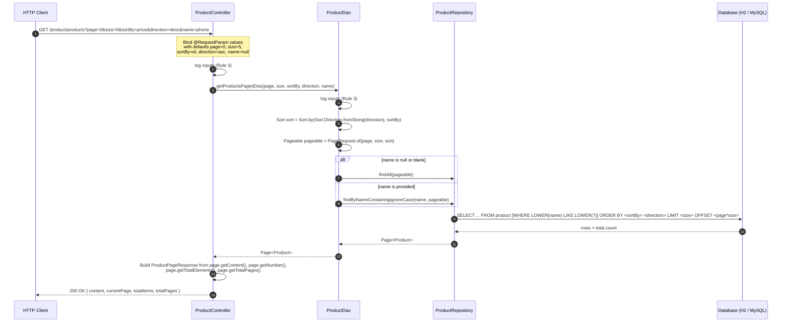

# Technical Specification

# 0. Agent Action Plan

## 0.1 Intent Clarification

### 0.1.1 Core Feature Objective

Based on the provided requirements, the Blitzy platform understands that the objective is to **add a new server-rendered listing endpoint to the existing Product REST API that returns products in a paginated, sortable, and optionally name-filtered form, while preserving every endpoint that is currently exposed**. The new endpoint is built on Spring Data JPA's `Pageable` and `Sort` primitives and returns a structured envelope containing the rows for the requested page along with the page metadata required to drive client-side pagination controls.

- Request classification: **Add Feature** (extends the existing CRUD surface with a new read endpoint and a new response shape)
- Implementation type: REST endpoint addition spanning the web, persistence-facade, and repository layers, plus a new response DTO class
- Implicit documentation needs (deferred — not requested by the user): updating `[EP-Spring-Boot--main/README.md:§"API Endpoints"]` and the SpringDoc `@OpenAPIDefinition` metadata would be natural follow-ups, but the user's input does not require either and they are therefore **out of scope** for this change

### 0.1.2 Restated Functional Requirements

The user's intent translates to the following precise technical requirements:

| # | Requirement | Technical Interpretation |
|---|-------------|--------------------------|
| R1 | Add a new endpoint `GET /products` | Add a new `@GetMapping` handler to `ProductController` keyed on the relative path `/products`. The class-level `@RequestMapping(value = "/product")` <cite index="0-1">at the top of `ProductController`</cite> is left unchanged to honor the "Do not break existing APIs" constraint; the resolved URL therefore becomes `/product/products`. |
| R2 | Accept query param `page` (default: 0) | `@RequestParam(name = "page", defaultValue = "0") int page` |
| R3 | Accept query param `size` (default: 5) | `@RequestParam(name = "size", defaultValue = "5") int size` |
| R4 | Accept query param `sortBy` (default: id) | `@RequestParam(name = "sortBy", defaultValue = "id") String sortBy` — the value names a `Product` field |
| R5 | Accept query param `direction` (default: asc) | `@RequestParam(name = "direction", defaultValue = "asc") String direction` — translated to `org.springframework.data.domain.Sort.Direction` via `Sort.Direction.fromString(direction)` |
| R6 | Accept query param `name` (optional, filter) | `@RequestParam(name = "name", required = false) String name`. When `name` is non-null and non-blank, results are restricted to products whose `name` contains the value (case-insensitive `LIKE %name%`). When `name` is null or blank, no name predicate is applied. |
| R7 | Use Spring Data JPA `Pageable` and `Sort` | Construct `PageRequest.of(page, size, Sort.by(Sort.Direction.fromString(direction), sortBy))` and pass it to the repository |
| R8 | Return paginated response with `content`, `currentPage`, `totalItems`, `totalPages` | Introduce a new DTO class `ProductPageResponse` in the `responses` package carrying exactly these four fields, populated from the `Page<Product>` returned by the repository |
| R9 | Keep existing endpoint behavior compatible if params are not provided | All existing handlers and DAO methods remain untouched. The defaults on R2–R5 ensure the new endpoint also functions when invoked with no query parameters. |
| R10 | Update repository to support pagination and filtering | Add a derived query `Page<Product> findByNameContainingIgnoreCase(String name, Pageable pageable)` to `ProductRepository`. The inherited `findAll(Pageable)` from `JpaRepository<Product, Integer>` is reused for the no-filter branch. |
| R11 | Implement logic in service/dao layer | Add a new `ProductDao.getProductsPagedDao(...)` method that builds the `PageRequest`, chooses the filtered vs. unfiltered repository call based on `name`, and returns the `Page<Product>` (or the assembled `ProductPageResponse`) |
| R12 | Update controller to accept query params | The new `getProductsPagedController(...)` method is added to `ProductController` |

### 0.1.3 Technical Interpretation Statement

These requirements translate to the following technical implementation strategy:

- To **expose a paginated product list**, the Blitzy platform will add a new `@GetMapping("/products")` handler on `ProductController` accepting five `@RequestParam` bindings with the user-specified defaults.
- To **filter optionally by name**, the platform will add a derived Spring Data JPA finder `findByNameContainingIgnoreCase(String, Pageable)` on `ProductRepository`. The handler delegates to the filtered finder when `name` is provided and to `findAll(Pageable)` otherwise.
- To **return the prescribed response shape**, the platform will introduce a new DTO `ProductPageResponse` in the existing `com.jspider.spring_boot_simple_crud_with_mysql.responses` package, populated from the `Page<Product>` getters (`getContent`, `getNumber`, `getTotalElements`, `getTotalPages`).
- To **honor the layering convention** observed throughout the codebase (`Controller → DAO → Repository`, as documented in `[5.1 HIGH-LEVEL ARCHITECTURE:§5.1.1.1]`), the new code respects the same path of execution.
- To **preserve compatibility**, no existing method signature, URL path, response shape, or annotation is altered; the new code is purely additive.

### 0.1.4 Inferred Implementation Needs

Beyond the literal user requirements, the Blitzy platform has surfaced the following implicit needs based on repository analysis:

- A **new response DTO** is mandatory because the existing `ResponseStructure<T>` envelope at `[EP-Spring-Boot--main/src/main/java/com/jspider/spring_boot_simple_crud_with_mysql/responses/ResponseStructure.java:L11-L16]` carries only `statusCode`, `apiDescription`, and `data` — it does not have `currentPage`, `totalItems`, or `totalPages` fields, so it cannot satisfy R8 as-is. A separate dedicated class avoids mutating the existing envelope, which is also wired as an `@Autowired` singleton bean in `ProductController` `[ProductController.java:L36-L37]` and modified in `saveProductController` and `updateProductController` — changing it would risk breaking those endpoints.
- A **new repository finder** is mandatory because the existing `findByName(String)` at `[EP-Spring-Boot--main/src/main/java/com/jspider/spring_boot_simple_crud_with_mysql/repository/ProductRepository.java:L15]` is an *exact-match* derived query and does not return a `Page` — it cannot satisfy the user's "filter products by name (contains/like)" requirement nor the "Return paginated response" requirement. Modifying the existing `findByName` would break feature F-005 (`GET /product/getProductByName/{name}`) `[2.1 FEATURE CATALOG:§2.1.2.5]`. The new finder is therefore added alongside it.
- A **default `Sort.Direction` resolution** is required because `direction` is received as a `String` ("asc"/"desc") but Spring Data's `Sort.by` requires the typed enum. `Sort.Direction.fromString(direction)` performs case-insensitive parsing and throws `IllegalArgumentException` for unrecognized values; the handler should catch invalid values and either fall back to `ASC` or return HTTP 400. The simplest conservative implementation is to call `Sort.Direction.fromString(direction)` directly and let Spring's default `HttpMessageConverter` exception flow handle malformed inputs.
- A **URL-path reconciliation note** is required because the user wrote `GET /products` (plural) but `ProductController` carries `@RequestMapping(value = "/product")` (singular) `[ProductController.java:L29]`. Because Spring concatenates class-level and method-level paths, a method-level `@GetMapping("/products")` resolves to `/product/products`. The Blitzy platform's interpretation is documented explicitly in 0.4 (Implementation Design) — the implementer adds the new method to the existing controller and the resolved URL becomes `/product/products`. This is the safest interpretation of "Update controller to accept query params" (the user said "update" not "create new controller") while preserving every existing endpoint.
- A **case-insensitive contains match** is the more useful interpretation of the user's "contains/like" phrase for catalog-style search. The Spring Data derived name is `findByNameContainingIgnoreCase` and produces SQL of the form `WHERE LOWER(name) LIKE LOWER('%phone%')`. If strict case-sensitive matching is preferred, the implementer may use `findByNameContaining` instead.

## 0.2 Special Instructions and Constraints

### 0.2.1 User-Provided Specification (Verbatim)

The following directives appear in the user's input and are preserved here exactly so that downstream agents can confirm the platform interpreted them faithfully.

**User Objective:**
> Enhance the Product API by adding pagination, sorting, and optional filtering capabilities.

**User Feature Statement:**
> Add a new endpoint to fetch products with pagination, sorting, and optional name filtering.

**User API Endpoint:**
> GET /products

**User Query Parameters:**

- `page` (default: 0)
- `size` (default: 5)
- `sortBy` (default: id)
- `direction` (default: asc)
- `name` (optional filter)

**User Example (preserved verbatim):**
> GET /products?page=0&size=5&sortBy=price&direction=desc&name=phone

**User Requirements (verbatim):**

- Use Spring Data JPA Pageable and Sort
- If 'name' is provided, filter products by name (contains/like)
- Return paginated response
- Keep existing endpoint behavior compatible if params are not provided

**User Implementation Details (verbatim):**

- Update repository to support pagination and filtering
- Implement logic in service/dao layer
- Update controller to accept query params
- Return structured response with:
    - content (list of products)
    - currentPage
    - totalItems
    - totalPages

**User Constraints (verbatim):**

- Do not break existing APIs
- Maintain clean architecture
- Ensure code compiles and runs

**User Output Expectations (verbatim):**

- Updated controller, service/dao, repository
- Pagination + sorting + filtering working
- Rule changes visible in code

### 0.2.2 Critical Directives

- **Strict rule compliance.** The user opened with "Strictly follow all selected rules. Do not ignore them." The three rules in 0.10 are therefore non-negotiable acceptance criteria; their absence in any modified/new class is a defect.
- **Additive-only changes.** The user explicitly requires that existing APIs continue to function. No existing method signature, URL path, or response shape is to be altered. All net-new code is added alongside existing code.
- **Clean architecture preservation.** The layering pattern observed in the codebase — `ProductController → ProductDao → ProductRepository` `[5.1 HIGH-LEVEL ARCHITECTURE:§5.1.1.2]` — must be carried through the new code. The controller does not call the repository directly; the DAO does not contain HTTP concerns.
- **Compile-and-run guarantee.** The change must build under `./mvnw clean package` with Java 17 and execute under Spring Boot 3.4.4 without configuration changes to `application.properties`.

### 0.2.3 Style and Code-Convention Preferences

- **camelCase identifiers** are mandated by Rule 1. Java conventions for fields, methods, and local variables already align with this; the rule is reiterated to ensure new query parameters (`page`, `size`, `sortBy`, `direction`, `name`) and new response fields (`content`, `currentPage`, `totalItems`, `totalPages`) keep their published camelCase names through Jackson serialization.
- **Marker comment `// Rule Applied`** is mandated by Rule 2 in every modified or new class. Placement convention: directly above the class declaration or just inside the class body, somewhere visually distinct so reviewers can confirm the rule was honored.
- **Logging in new methods** is mandated by Rule 3 — at least one log statement or `System.out.println(...)` call per new method. The existing codebase uses `System.out.println` (see `[ProductController.java:L62,L77]` and `[SpringBootSimpleCrudWithMysqlApplication.java:L28]`); the implementer may follow the same convention or use SLF4J `Logger` for cleaner output. Either is acceptable per Rule 3's exact wording ("log or System.out.println").

### 0.2.4 Web Search Requirements

No external web research is required to satisfy this change. The Spring Data JPA `Pageable` / `Sort` / `Page` / `PageRequest` API and Spring Web MVC `@RequestParam` semantics are fully covered by the Spring Boot 3.4.4 dependencies already declared in `[EP-Spring-Boot--main/pom.xml:L33-L36]`. All implementation guidance in this AAP is derived from in-repository evidence and Spring Data's well-known conventions.

## 0.3 Technical Scope and Discovery

### 0.3.1 Repository Infrastructure Assessment

The repository is a single-module Maven Spring Boot 3.4.4 / Java 17 application `[EP-Spring-Boot--main/pom.xml:L7-L8,L30]`. Persistence is provided by `spring-boot-starter-data-jpa` `[EP-Spring-Boot--main/pom.xml:L33-L36]`, which transitively bundles `spring-data-commons` and `spring-data-jpa` — the libraries that contribute `org.springframework.data.domain.Pageable`, `Page`, `PageRequest`, and `Sort`. **No new third-party dependency is required** for this feature.

The Product domain spans five files in package `com.jspider.spring_boot_simple_crud_with_mysql`:

| Component | File | Current Behavior Relevant to This Change |
|-----------|------|------------------------------------------|
| Web controller | `controller/ProductController.java` | Class-level `@RequestMapping(value = "/product")` `[ProductController.java:L27-L29]`; 10 existing handler methods; uses `ProductDao` and an autowired `ResponseStructure<Product>` |
| Persistence facade (DAO) | `dao/ProductDao.java` | `@Repository` bean; `displayAllProductDao()` calls `productRepository.findAll()` `[ProductDao.java:L31-L33]`; `getProductByNameDao(String)` calls `findByName` (exact match) `[ProductDao.java:L43-L47]` |
| Spring Data repository | `repository/ProductRepository.java` | Extends `JpaRepository<Product, Integer>` `[ProductRepository.java:L13]`; declares `findByName(String)` `[ProductRepository.java:L15]`, plus two native queries |
| Domain entity | `entity/Product.java` | `@Entity` with `int id` (no `@GeneratedValue`), `String name`, `String color`, `double price` `[Product.java:L13-L22]` |
| Response envelope | `responses/ResponseStructure.java` | Generic singleton bean with `int statusCode`, `String apiDescription`, `T data` `[ResponseStructure.java:L11-L16]` — **does not** carry `currentPage`, `totalItems`, `totalPages` |

### 0.3.2 Spring Data JPA Usage Analysis

The current codebase exercises three Spring Data idioms but does **not** use pagination:

- Inherited finder: `productRepository.findAll()` — unbounded, returns `List<Product>` `[ProductDao.java:L31-L33]`
- Derived query (method-name convention): `findByName(String)` `[ProductRepository.java:L15]`
- Native query with positional parameters: `getProductByPrice(double)` `[ProductRepository.java:L17-L18]` and `deleteProductByPrice(double)` `[ProductRepository.java:L20-L23]`

The new code introduces a fourth idiom — a derived query that returns `Page<Product>` and accepts a `Pageable` argument — without disturbing the three idioms above.

### 0.3.3 Endpoint and URL Mapping Inventory

The existing 10 endpoints under `/product` are enumerated in `[2.1 FEATURE CATALOG:§2.1.2-§2.1.3]` and `[1.3 SCOPE:§1.3.1.1]`. None of them is impacted by this change. The new endpoint occupies the previously unused path `/product/products` (the resolution of method-level `@GetMapping("/products")` combined with class-level `@RequestMapping("/product")`).

### 0.3.4 Documentation Gap Note

The README at `[EP-Spring-Boot--main/README.md:§"API Endpoints"]` advertises endpoints under the path `/products` (plural). The implementation has always used `/product` (singular) `[ProductController.java:L29]`. Tech spec section `[1.3 SCOPE:§1.3.2.1]` explicitly lists "Reconciling README endpoint paths" as a future-phase cleanup item. The user's spec also says `GET /products`. This AAP does not attempt to resolve the README mismatch — that is out of scope. The user's `/products` intent is honored by adding the new method-level path `/products`, which (because of the class-level prefix) resolves to `/product/products`. If the user expects the literal `/products` URL, the implementation agent should ask for confirmation before introducing a second top-level controller.

### 0.3.5 Persistence-Backend Considerations

The committed `application.properties` declares only `spring.application.name` and `server.port=8090` and configures **no JDBC datasource** `[application.properties:L1-L4]`. The repository carries both `mysql-connector-j` and `h2` at runtime scope `[pom.xml:L41-L50]`. When the application is started without MySQL connection properties, Spring Boot's auto-configuration falls back to the embedded H2 driver, which is sufficient to exercise the new endpoint end-to-end. No database schema changes are introduced by this feature — the existing `product` table (with columns `id`, `name`, `color`, `price`) supports every new operation.

## 0.4 Implementation Design

### 0.4.1 End-to-End Request Flow

The new endpoint follows the canonical `Controller → DAO → Repository → Database` layering that the codebase already enforces, with the addition of an assembly step that wraps the `Page<Product>` into the new `ProductPageResponse` DTO before the response is serialized.



### 0.4.2 Component Design

**0.4.2.1 New DTO — `ProductPageResponse`**

A new class in the existing `com.jspider.spring_boot_simple_crud_with_mysql.responses` package. Lombok's `@Data` (already used in `[Product.java:L11]` and `[ResponseStructure.java:L11]`) is the conventional choice in this codebase and produces the getters/setters required by Jackson serialization. The class must also carry the `// Rule Applied` marker per Rule 2.

| Field | Type | Source from `Page<Product>` |
|-------|------|-----------------------------|
| `content` | `List<Product>` | `page.getContent()` |
| `currentPage` | `int` | `page.getNumber()` |
| `totalItems` | `long` | `page.getTotalElements()` |
| `totalPages` | `int` | `page.getTotalPages()` |

`totalItems` is `long` (not `int`) because `Page#getTotalElements` returns `long`; this preserves correctness for catalogs larger than `Integer.MAX_VALUE` and avoids a lossy cast. The published JSON field name remains `totalItems` (camelCase), satisfying Rule 1.

**0.4.2.2 Repository Method Addition — `ProductRepository.findByNameContainingIgnoreCase`**

A new derived-query method is added to the existing repository interface. Spring Data parses the method name and synthesizes the implementation; no method body is needed (the interface convention is preserved from `[ProductRepository.java:L15]`). The `// Rule Applied` comment is added inside the interface body per Rule 2. Rule 3 (log statement in each new method) is not applicable to abstract interface declarations because they cannot contain bodies — this is documented as an acknowledged Rule 3 exemption for the repository's new method declaration.

Recommended signature:

```java
Page<Product> findByNameContainingIgnoreCase(String name, Pageable pageable);
```

**0.4.2.3 DAO Method Addition — `ProductDao.getProductsPagedDao`**

A new method is added to the existing `ProductDao` class. It constructs the `Sort` from `direction` + `sortBy`, builds a `PageRequest`, selects between `findAll(pageable)` and `findByNameContainingIgnoreCase(name, pageable)` based on whether `name` is null or blank, and returns the `Page<Product>` to the controller. Rules 2 and 3 apply: the `// Rule Applied` marker is added to the class, and the method emits at least one log statement.

Recommended signature:

```java
public Page<Product> getProductsPagedDao(int page, int size, String sortBy, String direction, String name)
```

The implementer may alternatively return the assembled `ProductPageResponse` from the DAO (pushing assembly downward) — both placements are consistent with "clean architecture". This AAP recommends keeping the DAO layer focused on `Page<Product>` and assembling `ProductPageResponse` in the controller, since the DTO is a presentation concern.

**0.4.2.4 Controller Method Addition — `ProductController.getProductsPagedController`**

A new handler is added to `ProductController`. Rules 2 and 3 apply: the `// Rule Applied` marker is added to the class (if not already present from another change), and the method emits at least one log/println.

Recommended signature:

```java
@GetMapping("/products")
public ProductPageResponse getProductsPagedController(
        @RequestParam(name = "page", defaultValue = "0") int page,
        @RequestParam(name = "size", defaultValue = "5") int size,
        @RequestParam(name = "sortBy", defaultValue = "id") String sortBy,
        @RequestParam(name = "direction", defaultValue = "asc") String direction,
        @RequestParam(name = "name", required = false) String name)
```

The method calls `productDao.getProductsPagedDao(...)`, builds and returns a `ProductPageResponse`. The resolved URL is `/product/products` because the class-level mapping is `/product` `[ProductController.java:L29]`.

### 0.4.3 Diagram Strategy

One Mermaid sequence diagram (above, in 0.4.1) describes the runtime control flow. No additional diagrams are required; the change is layered linearly and does not introduce new component relationships beyond the existing controller-dao-repository chain already documented in `[5.1 HIGH-LEVEL ARCHITECTURE:§5.1.1.2]`.

## 0.5 File Transformation Mapping

### 0.5.1 File-by-File Transformation Plan

The table below enumerates every file affected by this change. Target file is listed first; transformation mode is one of `CREATE` (new file), `UPDATE` (existing file modified), or `REFERENCE` (used as a pattern source, not modified).

| Target File | Transformation | Source / Reference | Content / Changes |
|-------------|----------------|--------------------|--------------------|
| `EP-Spring-Boot--main/src/main/java/com/jspider/spring_boot_simple_crud_with_mysql/responses/ProductPageResponse.java` | CREATE | `EP-Spring-Boot--main/src/main/java/com/jspider/spring_boot_simple_crud_with_mysql/responses/ResponseStructure.java` (style reference) | New DTO class in the `responses` package. Fields: `List<Product> content`, `int currentPage`, `long totalItems`, `int totalPages`. Use Lombok `@Data` to match existing convention `[ResponseStructure.java:L8-L11]`. Add `// Rule Applied` marker comment per Rule 2. |
| `EP-Spring-Boot--main/src/main/java/com/jspider/spring_boot_simple_crud_with_mysql/repository/ProductRepository.java` | UPDATE | self (`[ProductRepository.java:L1-L25]`) | Add a new derived finder method signature: `Page<Product> findByNameContainingIgnoreCase(String name, Pageable pageable);` Add the required imports for `org.springframework.data.domain.Page` and `org.springframework.data.domain.Pageable`. Leave the existing `findByName(String)`, `getProductByPrice(double)`, and `deleteProductByPrice(double)` declarations unchanged. Add the `// Rule Applied` marker comment per Rule 2. |
| `EP-Spring-Boot--main/src/main/java/com/jspider/spring_boot_simple_crud_with_mysql/dao/ProductDao.java` | UPDATE | self (`[ProductDao.java:L1-L75]`) | Add a new method `public Page<Product> getProductsPagedDao(int page, int size, String sortBy, String direction, String name)`. Body: build `Sort sort = Sort.by(Sort.Direction.fromString(direction), sortBy)`, build `Pageable pageable = PageRequest.of(page, size, sort)`, branch on `name == null || name.isBlank()` to call either `productRepository.findAll(pageable)` or `productRepository.findByNameContainingIgnoreCase(name, pageable)`, return the resulting `Page<Product>`. Emit at least one log/println in the method (Rule 3). Add the `// Rule Applied` marker comment per Rule 2. Add imports for `org.springframework.data.domain.Page`, `Pageable`, `PageRequest`, `Sort`. Leave all existing methods unchanged. |
| `EP-Spring-Boot--main/src/main/java/com/jspider/spring_boot_simple_crud_with_mysql/controller/ProductController.java` | UPDATE | self (`[ProductController.java:L27-L161]`) | Add a new handler method `@GetMapping("/products") public ProductPageResponse getProductsPagedController(...)` with the five `@RequestParam` bindings specified in 0.1.2. Body: call `productDao.getProductsPagedDao(...)`, then build and return a `ProductPageResponse` populated from `page.getContent()`, `page.getNumber()`, `page.getTotalElements()`, `page.getTotalPages()`. Emit at least one log/println in the method (Rule 3). Add the `// Rule Applied` marker comment per Rule 2. Add imports for `org.springframework.data.domain.Page` and the new `ProductPageResponse` class. Leave all existing handlers, `@Autowired` fields, and class-level annotations untouched. |

The four target files above constitute the **complete** in-scope file set for this change. No other files in the repository are modified.

### 0.5.2 New File Detail — `ProductPageResponse.java`

```
File: EP-Spring-Boot--main/src/main/java/com/jspider/spring_boot_simple_crud_with_mysql/responses/ProductPageResponse.java
Type: Response DTO
Package: com.jspider.spring_boot_simple_crud_with_mysql.responses
Class purpose: Carries the four-field pagination envelope mandated by the user (content, currentPage, totalItems, totalPages) for the GET /products endpoint.
Fields:
    - private List<Product> content
    - private int currentPage
    - private long totalItems
    - private int totalPages
Annotations:
    - @Data (Lombok) — generates getters, setters, toString, equals, hashCode
Marker comment:
    - // Rule Applied  (Rule 2)
Key citations:
    - Style reference: [ResponseStructure.java:L1-L16]
    - Imports the Product entity from: [Product.java:L1-L24]
```

### 0.5.3 Updated File Detail — `ProductRepository.java`

```
Existing declarations preserved verbatim:
    - findByName(String) [ProductRepository.java:L15]
    - getProductByPrice(double) [ProductRepository.java:L17-L18]
    - deleteProductByPrice(double) [ProductRepository.java:L20-L23]
New additions:
    - Method signature:  Page<Product> findByNameContainingIgnoreCase(String name, Pageable pageable);
    - New imports:       org.springframework.data.domain.Page; org.springframework.data.domain.Pageable
    - Marker comment:    // Rule Applied  (Rule 2)
Rule 3 exemption rationale:
    - Repository finders are abstract interface method declarations and cannot contain bodies; Rule 3 (log/println per new method) does not apply to interface declarations.
```

### 0.5.4 Updated File Detail — `ProductDao.java`

```
Existing methods preserved verbatim (no signature changes):
    - saveProductDao(Product), saveMultipleProductDao(List<Product>), displayAllProductDao(),
      getProductByIdDao(Integer), getProductByNameDao(String), getProductByPriceDao(double),
      deleteProductByPriceDao(double), updateProductDao(Product, Integer)
New additions:
    - New method:     public Page<Product> getProductsPagedDao(int page, int size, String sortBy, String direction, String name)
    - New imports:    org.springframework.data.domain.Page;
                      org.springframework.data.domain.Pageable;
                      org.springframework.data.domain.PageRequest;
                      org.springframework.data.domain.Sort
    - Marker comment: // Rule Applied  (Rule 2)
    - Log statement:  at least one System.out.println or logger.info line inside the new method (Rule 3)
Logic outline:
    1. Sort sort = Sort.by(Sort.Direction.fromString(direction), sortBy);
    2. Pageable pageable = PageRequest.of(page, size, sort);
    3. if (name != null && !name.isBlank()) return productRepository.findByNameContainingIgnoreCase(name, pageable);
       else return productRepository.findAll(pageable);
```

### 0.5.5 Updated File Detail — `ProductController.java`

```
Existing methods preserved verbatim (no signature, annotation, or path changes):
    - getTodaysDate() [L40-L43]
    - saveProductController(Product) [L46-L73]
    - saveProductController(List<Product>) [L76-L81]
    - findAllProductController() [L83-L86]
    - getProductByIdController(Integer) [L89-L92]
    - getProductByNameDao(String) [L95-L97]
    - getProductByPriceController(double) [L100-L102]
    - deleteProductByPriceController(double) [L105-L108]
    - updateProductController(Product, Integer) [L116-L143]
    - updateProduct(Product, Integer) [L146-L153]
New additions:
    - New method:     @GetMapping("/products") public ProductPageResponse getProductsPagedController(...)
    - @RequestParam bindings: page (default "0"), size (default "5"), sortBy (default "id"),
      direction (default "asc"), name (required = false)
    - New imports:    org.springframework.data.domain.Page;
                      com.jspider.spring_boot_simple_crud_with_mysql.responses.ProductPageResponse
    - Marker comment: // Rule Applied  (Rule 2)
    - Log statement:  at least one System.out.println or logger.info line inside the new method (Rule 3)
Logic outline:
    1. Call productDao.getProductsPagedDao(page, size, sortBy, direction, name) → Page<Product> page
    2. Construct a ProductPageResponse, set content = page.getContent(),
       currentPage = page.getNumber(), totalItems = page.getTotalElements(),
       totalPages = page.getTotalPages()
    3. Return the ProductPageResponse
Resolved URL:
    /product/products  (class-level "/product" [ProductController.java:L29] +
                        method-level "/products")
```

### 0.5.6 Files Explicitly Not Modified

The following files are listed to make the boundary explicit:

- `EP-Spring-Boot--main/src/main/java/com/jspider/spring_boot_simple_crud_with_mysql/entity/Product.java` — entity is unchanged
- `EP-Spring-Boot--main/src/main/java/com/jspider/spring_boot_simple_crud_with_mysql/responses/ResponseStructure.java` — existing envelope is unchanged; the new DTO is added as a separate class
- `EP-Spring-Boot--main/src/main/java/com/jspider/spring_boot_simple_crud_with_mysql/controller/StudentController.java` — out of scope
- `EP-Spring-Boot--main/src/main/java/com/jspider/spring_boot_simple_crud_with_mysql/SpringBootSimpleCrudWithMysqlApplication.java` — bootstrap class unchanged
- `EP-Spring-Boot--main/src/main/resources/application.properties` — no configuration changes
- `EP-Spring-Boot--main/pom.xml` — no dependency changes
- `EP-Spring-Boot--main/src/test/java/com/jspider/spring_boot_simple_crud_with_mysql/SpringBootSimpleCrudWithMysqlApplicationTests.java` — existing `contextLoads()` smoke test is preserved
- `EP-Spring-Boot--main/README.md` — out of scope (the README/code path mismatch is acknowledged in 0.3.4 but not resolved by this change)
- `EP-Spring-Boot--main/bin/**` — build-output directory, not a source location

## 0.6 Dependency Inventory

### 0.6.1 Dependency Changes

**No dependency changes are required for this feature.** All APIs needed by the implementation — `org.springframework.data.domain.Pageable`, `Page`, `PageRequest`, `Sort`, and `Sort.Direction` — are transitively provided by `spring-boot-starter-data-jpa` 3.4.4 (managed version), which is already declared at `[EP-Spring-Boot--main/pom.xml:L33-L36]`. Spring Web MVC's `@RequestParam` is provided by `spring-boot-starter-web` `[EP-Spring-Boot--main/pom.xml:L37-L40]`, also already present.

The complete `pom.xml` therefore needs no additions, version upgrades, or removals as part of this change.

### 0.6.2 Runtime-Relevant Dependencies (Already Present, For Reference Only)

The table below is provided for situational awareness only; **none of these entries change** as part of this AAP.

| Registry | Group ID | Artifact ID | Version | Role for This Feature |
|----------|----------|-------------|---------|------------------------|
| Maven Central | `org.springframework.boot` | `spring-boot-starter-parent` | 3.4.4 `[pom.xml:L7-L8]` | Manages versions of all Spring dependencies below |
| Maven Central | `org.springframework.boot` | `spring-boot-starter-web` | managed `[pom.xml:L37-L40]` | Provides Spring Web MVC, `@GetMapping`, `@RequestParam`, embedded Tomcat |
| Maven Central | `org.springframework.boot` | `spring-boot-starter-data-jpa` | managed `[pom.xml:L33-L36]` | Provides `JpaRepository`, `Page`, `Pageable`, `PageRequest`, `Sort`, and Hibernate |
| Maven Central | `com.h2database` | `h2` | managed `[pom.xml:L41-L45]` | Runtime fallback database for local execution |
| Maven Central | `com.mysql` | `mysql-connector-j` | managed `[pom.xml:L46-L50]` | Primary JDBC driver (used when datasource is externally configured) |
| Maven Central | `org.projectlombok` | `lombok` | managed `[pom.xml:L51-L55]` | Provides `@Data` for the new DTO and existing entities |

### 0.6.3 Documentation Reference Updates

Not applicable to this change. The user did not request documentation updates, and the AAP-mandated scope excludes README, Swagger metadata, and `@OpenAPIDefinition` modifications. Cross-document link updates are therefore unnecessary.

## 0.7 Coverage and Quality Targets

### 0.7.1 Functional Acceptance Criteria

The implementation is acceptable when **all** of the following statements hold:

| # | Scenario | Expected Outcome |
|---|----------|------------------|
| AC1 | `GET /product/products` (no query parameters) against a non-empty `product` table | HTTP 200; response body is a JSON object with the four keys `content`, `currentPage`, `totalItems`, `totalPages`; `currentPage == 0`; `content` length is `min(5, totalItems)`; results are ordered by `id` ascending |
| AC2 | `GET /product/products?page=0&size=5&sortBy=price&direction=desc&name=phone` | HTTP 200; `content` contains only products whose `name` contains `phone` (case-insensitive substring match); rows are ordered by `price` descending; `currentPage == 0`; `totalItems` is the count of name-matching rows; `totalPages == ceil(totalItems / 5.0)` |
| AC3 | `GET /product/products?page=2&size=3&sortBy=id&direction=asc` | HTTP 200; `currentPage == 2`; `content.size() ≤ 3`; rows are the third "page" (zero-indexed) ordered by `id` ascending |
| AC4 | `GET /product/products?name=` (empty string) | HTTP 200; the empty/blank name is treated as "no filter"; behaves identically to AC1 |
| AC5 | `GET /product/products?page=0&size=5&sortBy=color&direction=asc` against a name field with non-distinct rows | HTTP 200; sort is applied on `color`; tie-breaking is undefined (Spring/JPA default) — acceptable |

### 0.7.2 Backward-Compatibility Validation

All ten existing endpoints under `/product` must continue to behave exactly as before. The following spot-checks are sufficient evidence:

| # | Existing Endpoint | Validation |
|---|-------------------|-----------|
| BC1 | `GET /product/findAllProduct` `[ProductController.java:L83-L86]` | Still returns the unbounded `List<Product>` (not the new paginated envelope) |
| BC2 | `GET /product/getProductByName/{name}` `[ProductController.java:L95-L97]` | Still performs exact-match (not contains) — its underlying `findByName` `[ProductRepository.java:L15]` is unchanged |
| BC3 | `POST /product/saveProduct` `[ProductController.java:L46-L73]` | Still returns `ResponseStructure<Product>` with `statusCode`, `apiDescription`, `data` |
| BC4 | `PUT /product/updateProduct/{id}` `[ProductController.java:L116-L143]` | Still returns `ResponseStructure<Product>` |
| BC5 | `PUT /product/{id}` `[ProductController.java:L146-L153]` | Still returns `ResponseEntity<Product>` with HTTP 404 mapping for not-found |
| BC6 | `DELETE /product/deleteProductByPrice/{price}` `[ProductController.java:L105-L108]` | Still uses native SQL via `[ProductRepository.java:L20-L23]` |

### 0.7.3 Build and Runtime Quality Criteria

| # | Criterion | Verification Command |
|---|-----------|----------------------|
| Q1 | Sources compile under Java 17 | `./mvnw clean compile` returns exit code 0 |
| Q2 | All tests pass | `./mvnw test` returns exit code 0 and the existing `contextLoads()` `[SpringBootSimpleCrudWithMysqlApplicationTests.java:L8-L10]` smoke test is green |
| Q3 | Executable JAR builds | `./mvnw clean package` returns exit code 0 and produces `target/spring-boot-simple-crud-with-mysql-0.0.1-SNAPSHOT.jar` |
| Q4 | Application starts and binds port 8090 | `java -jar target/spring-boot-simple-crud-with-mysql-0.0.1-SNAPSHOT.jar` reaches "Tomcat started on port 8090" without an exception |
| Q5 | New endpoint is reachable | `curl -s http://localhost:8090/product/products` returns HTTP 200 |

### 0.7.4 Rule-Compliance Coverage

Every rule must be visibly applied in the diff. The matrix below is the acceptance grid against which compliance is checked.

| File | Rule 1 (camelCase) | Rule 2 (`// Rule Applied`) | Rule 3 (log/println in new methods) |
|------|--------------------|-----------------------------|--------------------------------------|
| `ProductPageResponse.java` (CREATE) | All fields camelCase | Marker comment present | N/A — class has no behavior methods |
| `ProductRepository.java` (UPDATE) | New method name camelCase | Marker comment present | N/A — abstract finder declarations cannot contain bodies |
| `ProductDao.java` (UPDATE) | New method name camelCase | Marker comment present | At least one log/println inside `getProductsPagedDao(...)` |
| `ProductController.java` (UPDATE) | New method name and `@RequestParam` names camelCase | Marker comment present | At least one log/println inside `getProductsPagedController(...)` |

### 0.7.5 Non-Goals for This Change

The following are explicitly **not** validated as part of acceptance:

- Unit or integration tests for the new endpoint (the user did not request tests; only the existing `contextLoads()` must remain green)
- Bean Validation on query parameters (no `@Min`, `@Max`, or `@Pattern` constraints — the user did not specify them)
- OpenAPI `@Operation` / `@ApiResponse` annotations on the new method (consistent with most existing endpoints which also omit them, per `[2.1 FEATURE CATALOG:§2.1.2.2-§2.1.2.7]`)
- Performance benchmarks under load
- Database schema migrations (no schema changes are introduced)

## 0.8 Scope Boundaries

### 0.8.1 Exhaustively In Scope

The following files and modifications constitute the **complete** in-scope surface for this change:

- **New source files:**
    - `EP-Spring-Boot--main/src/main/java/com/jspider/spring_boot_simple_crud_with_mysql/responses/ProductPageResponse.java` — new DTO carrying `content`, `currentPage`, `totalItems`, `totalPages`
- **Modified source files:**
    - `EP-Spring-Boot--main/src/main/java/com/jspider/spring_boot_simple_crud_with_mysql/controller/ProductController.java` — new `@GetMapping("/products")` handler `getProductsPagedController(...)`, plus imports and the `// Rule Applied` marker
    - `EP-Spring-Boot--main/src/main/java/com/jspider/spring_boot_simple_crud_with_mysql/dao/ProductDao.java` — new `getProductsPagedDao(...)` method, plus imports and the `// Rule Applied` marker
    - `EP-Spring-Boot--main/src/main/java/com/jspider/spring_boot_simple_crud_with_mysql/repository/ProductRepository.java` — new `findByNameContainingIgnoreCase(String, Pageable)` derived finder, plus imports and the `// Rule Applied` marker
- **Rule-mandated artifacts:** The `// Rule Applied` marker comment in all four target files (Rule 2). Logging statements in the two new method bodies (Rule 3). camelCase for all new identifiers (Rule 1).

The four files above constitute the entire footprint of this change; no further files are added, modified, or deleted.

### 0.8.2 Explicitly Out of Scope

The following are explicitly **excluded** from this change. They appear here so that downstream review can confirm the boundary was honored.

- **Modifications to existing handlers, DAO methods, or repository finders.** No existing signature, annotation, return type, or URL path is altered. In particular:
    - `findByName(String)` `[ProductRepository.java:L15]` remains an exact-match query
    - `findAllProductController()` `[ProductController.java:L83-L86]` continues to return the unbounded `List<Product>`
    - `ResponseStructure<T>` `[ResponseStructure.java:L1-L16]` is not mutated
- **Class-level `@RequestMapping` change on `ProductController`.** Remains `value = "/product"` `[ProductController.java:L29]`. Changing it would alter every existing endpoint's URL — a breaking change forbidden by the user's "Do not break existing APIs" constraint.
- **`Product` entity changes.** No new fields, no `@GeneratedValue`, no `@Column` constraints, no `@Version` `[Product.java:L13-L22]`.
- **`application.properties` changes.** No new `spring.datasource.*` properties, no `spring.jpa.*` overrides, no Hibernate dialect, no logging configuration.
- **`pom.xml` changes.** No new dependencies, no version bumps, no plugin additions (per 0.6.1).
- **README, Swagger/OpenAPI metadata, or `@OpenAPIDefinition` updates.** The user did not request documentation changes; the README/code path mismatch is acknowledged in 0.3.4 but not resolved here.
- **Tests.** No new unit or integration tests. The existing `contextLoads()` smoke test `[SpringBootSimpleCrudWithMysqlApplicationTests.java:L8-L10]` must remain green; that is a pass-through, not a scope addition.
- **`StudentController.java`** and its endpoints. Out of scope.
- **Bootstrap class `SpringBootSimpleCrudWithMysqlApplication.java`.** Out of scope.
- **Centralized exception handling, `@ControllerAdvice`, custom validators, or DTO request bodies.** Listed in `[1.3 SCOPE:§1.3.2]` as currently absent and not requested by the user.
- **Database schema management (`schema.sql`, Flyway, Liquibase).** The `product` table is assumed to exist; no schema artifacts are introduced.
- **Production hardening (Actuator, metrics, rate limiting, caching, Spring Security).** Out of scope, consistent with `[1.3 SCOPE:§1.3.2]`.
- **`bin/` directory contents.** Build-output artifacts only; never edited by source changes.

## 0.9 Execution Parameters

### 0.9.1 Build and Verification Commands

All commands assume the working directory is the project root (`EP-Spring-Boot--main/`). The Maven Wrapper bundled at `[EP-Spring-Boot--main/mvnw]` is the canonical build entry point and does not require a system Maven installation `[2.1 FEATURE CATALOG:§2.1.4.6]`.

| Purpose | Command | Expected Outcome |
|---------|---------|------------------|
| Clean and compile sources | `./mvnw clean compile` | Exit code 0; `target/classes` populated |
| Run unit tests | `./mvnw test` | Exit code 0; the existing `contextLoads()` smoke test passes |
| Build executable JAR | `./mvnw clean package` | Exit code 0; artifact at `target/spring-boot-simple-crud-with-mysql-0.0.1-SNAPSHOT.jar` |
| Run the application | `./mvnw spring-boot:run` (or `java -jar target/spring-boot-simple-crud-with-mysql-0.0.1-SNAPSHOT.jar`) | Embedded Tomcat binds port 8090 `[application.properties:L3]` |
| Smoke-test the new endpoint (no params) | `curl -s "http://localhost:8090/product/products"` | HTTP 200; JSON object with the four keys `content`, `currentPage`, `totalItems`, `totalPages` |
| Smoke-test the new endpoint (full example) | `curl -s "http://localhost:8090/product/products?page=0&size=5&sortBy=price&direction=desc&name=phone"` | HTTP 200; matching JSON |

### 0.9.2 Resolved URL Note

The user-specified endpoint path is `GET /products`. Because `ProductController` is annotated with `@RequestMapping(value = "/product")` at the class level `[ProductController.java:L27-L29]` and the user's constraint "Do not break existing APIs" prohibits changing this class-level mapping, the new method `@GetMapping("/products")` resolves to the URL **`/product/products`**. This is the AAP-recommended interpretation. If the user requires the literal top-level path `/products`, the implementer should request clarification and consider introducing a separate `ProductsController` with `@RequestMapping("/products")` as the alternative.

### 0.9.3 Default Format and Conventions

- **Response format:** JSON via Spring Boot's default Jackson configuration `[5.1 HIGH-LEVEL ARCHITECTURE:§5.1.3.1]`. The `ProductPageResponse` class uses Lombok `@Data` to expose camelCase getters, which Jackson serializes as camelCase JSON keys — satisfying Rule 1 in the on-the-wire contract.
- **Citation discipline (for the implementation diff):** every new identifier (method name, parameter name, field name) must remain consistent with the names declared in this AAP. Deviations should be commented inline so the diff can be reviewed against this plan.
- **Style alignment:** The implementation should mirror the existing coding style — `@Autowired` field injection (as used in `ProductController` `[L35-L37]` and `ProductDao` `[L20-L21]`), Lombok `@Data` on the DTO, and either `System.out.println` or SLF4J `Logger` for the Rule 3 logs.

### 0.9.4 Validation Workflow

1. Apply the four file changes listed in 0.5.
2. Run `./mvnw clean compile` and confirm no compilation errors.
3. Run `./mvnw test` and confirm `contextLoads()` still passes.
4. Run `./mvnw spring-boot:run` to start the application.
5. Issue the smoke-test `curl` commands in 0.9.1 and validate the response structure against acceptance criteria AC1–AC5 in 0.7.1.
6. Confirm Rule 1 / 2 / 3 are visible in the diff per the matrix in 0.7.4.

## 0.10 Rules for Implementation

### 0.10.1 User-Specified Rules (Verbatim)

The user opened with the directive **"Strictly follow all selected rules. Do not ignore them."** The three rules below are reproduced verbatim and are mandatory acceptance criteria.

- **Rule 1.** Use camelCase naming convention
- **Rule 2.** Add comment "// Rule Applied" in all modified or new classes
- **Rule 3.** Add at least one log or System.out.println in each new method

### 0.10.2 Application Matrix (Per File)

The following matrix specifies exactly how each rule applies to the four target files of this change. This matrix is a normative restatement of 0.7.4.

| Target File | Rule 1 Application | Rule 2 Application | Rule 3 Application |
|-------------|--------------------|---------------------|---------------------|
| `responses/ProductPageResponse.java` (CREATE) | Field names `content`, `currentPage`, `totalItems`, `totalPages` are camelCase | `// Rule Applied` comment inside the class body | Not applicable — DTO has no behavior methods. Lombok-generated getters/setters are accessor methods, not "new methods" authored by the developer. |
| `repository/ProductRepository.java` (UPDATE) | New method name `findByNameContainingIgnoreCase` is camelCase | `// Rule Applied` comment inside the interface body | Not applicable — abstract interface declarations cannot contain bodies. Acknowledged Rule 3 exemption documented in 0.5.3. |
| `dao/ProductDao.java` (UPDATE) | New method name `getProductsPagedDao` is camelCase; new local variables (`sort`, `pageable`) are camelCase | `// Rule Applied` comment inside the class body | At least one `System.out.println(...)` or `logger.info(...)` inside `getProductsPagedDao(...)` |
| `controller/ProductController.java` (UPDATE) | New method name `getProductsPagedController`, parameter names `page`, `size`, `sortBy`, `direction`, `name` are camelCase | `// Rule Applied` comment inside the class body | At least one `System.out.println(...)` or `logger.info(...)` inside `getProductsPagedController(...)` |

### 0.10.3 User Constraints (Verbatim)

- "Do not break existing APIs"
- "Maintain clean architecture"
- "Ensure code compiles and runs"

These constraints are honored by the additive-only file plan in 0.5 (no existing signature is altered), the strict adherence to the `Controller → DAO → Repository` layering observed in `[5.1 HIGH-LEVEL ARCHITECTURE:§5.1.1.2]`, and the build/run validation commands in 0.9.

### 0.10.4 User Output Expectations (Verbatim)

- "Updated controller, service/dao, repository"
- "Pagination + sorting + filtering working"
- "Rule changes visible in code"

These expectations are met when the four file transformations in 0.5 are applied, the acceptance criteria in 0.7.1 pass, and the rule matrix in 0.10.2 is observable in the final diff.

### 0.10.5 No Additional Repository-Level Rules

The user-supplied implementation rules section is empty (`[]`). The three numbered rules above are therefore the **only** rule constraints for this change. No design-system protocol applies (no UI library is in use; this is a backend-only Spring Boot service).

## 0.11 References and Search Log

### 0.11.1 Citation Index — Files Cited in This AAP

Every claim about the existing system is grounded in one of the source locations below. Locators are line ranges (Java/properties) or section anchors (markdown / tech spec).

| Source Location | What It Anchors |
|-----------------|-----------------|
| `EP-Spring-Boot--main/pom.xml:L7-L8` | Spring Boot parent version 3.4.4 |
| `EP-Spring-Boot--main/pom.xml:L30` | `<java.version>17</java.version>` |
| `EP-Spring-Boot--main/pom.xml:L33-L36` | `spring-boot-starter-data-jpa` declaration |
| `EP-Spring-Boot--main/pom.xml:L37-L40` | `spring-boot-starter-web` declaration |
| `EP-Spring-Boot--main/pom.xml:L41-L45` | `h2` runtime dependency |
| `EP-Spring-Boot--main/pom.xml:L46-L50` | `mysql-connector-j` runtime dependency |
| `EP-Spring-Boot--main/pom.xml:L51-L55` | Lombok declaration |
| `EP-Spring-Boot--main/src/main/resources/application.properties:L1-L4` | `spring.application.name` and `server.port=8090` |
| `EP-Spring-Boot--main/src/main/java/com/jspider/spring_boot_simple_crud_with_mysql/SpringBootSimpleCrudWithMysqlApplication.java:L28` | `System.out.println("All Right Sudhir...........")` baseline for the existing println convention |
| `EP-Spring-Boot--main/src/main/java/com/jspider/spring_boot_simple_crud_with_mysql/controller/ProductController.java:L27-L29` | Class-level `@RequestMapping(value = "/product")` |
| `EP-Spring-Boot--main/src/main/java/com/jspider/spring_boot_simple_crud_with_mysql/controller/ProductController.java:L35-L37` | `@Autowired ProductDao`, `@Autowired ResponseStructure<Product>` |
| `EP-Spring-Boot--main/src/main/java/com/jspider/spring_boot_simple_crud_with_mysql/controller/ProductController.java:L40-L43` | `getTodaysDate()` handler |
| `EP-Spring-Boot--main/src/main/java/com/jspider/spring_boot_simple_crud_with_mysql/controller/ProductController.java:L46-L73` | `saveProductController(Product)` handler |
| `EP-Spring-Boot--main/src/main/java/com/jspider/spring_boot_simple_crud_with_mysql/controller/ProductController.java:L76-L81` | `saveProductController(List<Product>)` handler |
| `EP-Spring-Boot--main/src/main/java/com/jspider/spring_boot_simple_crud_with_mysql/controller/ProductController.java:L83-L86` | `findAllProductController()` handler |
| `EP-Spring-Boot--main/src/main/java/com/jspider/spring_boot_simple_crud_with_mysql/controller/ProductController.java:L89-L92` | `getProductByIdController(Integer)` handler |
| `EP-Spring-Boot--main/src/main/java/com/jspider/spring_boot_simple_crud_with_mysql/controller/ProductController.java:L95-L97` | `getProductByNameDao(String)` handler (method name on controller per existing source) |
| `EP-Spring-Boot--main/src/main/java/com/jspider/spring_boot_simple_crud_with_mysql/controller/ProductController.java:L100-L102` | `getProductByPriceController(double)` handler |
| `EP-Spring-Boot--main/src/main/java/com/jspider/spring_boot_simple_crud_with_mysql/controller/ProductController.java:L105-L108` | `deleteProductByPriceController(double)` handler |
| `EP-Spring-Boot--main/src/main/java/com/jspider/spring_boot_simple_crud_with_mysql/controller/ProductController.java:L116-L143` | `updateProductController(Product, Integer)` handler |
| `EP-Spring-Boot--main/src/main/java/com/jspider/spring_boot_simple_crud_with_mysql/controller/ProductController.java:L146-L153` | `updateProduct(Product, Integer)` handler |
| `EP-Spring-Boot--main/src/main/java/com/jspider/spring_boot_simple_crud_with_mysql/dao/ProductDao.java:L20-L21` | `@Autowired ProductRepository` injection point |
| `EP-Spring-Boot--main/src/main/java/com/jspider/spring_boot_simple_crud_with_mysql/dao/ProductDao.java:L31-L33` | `displayAllProductDao()` → `productRepository.findAll()` |
| `EP-Spring-Boot--main/src/main/java/com/jspider/spring_boot_simple_crud_with_mysql/dao/ProductDao.java:L43-L47` | `getProductByNameDao(String)` exact-match wrapper |
| `EP-Spring-Boot--main/src/main/java/com/jspider/spring_boot_simple_crud_with_mysql/repository/ProductRepository.java:L13` | `extends JpaRepository<Product, Integer>` |
| `EP-Spring-Boot--main/src/main/java/com/jspider/spring_boot_simple_crud_with_mysql/repository/ProductRepository.java:L15` | `List<Product> findByName(String name)` derived query (exact match) |
| `EP-Spring-Boot--main/src/main/java/com/jspider/spring_boot_simple_crud_with_mysql/repository/ProductRepository.java:L17-L18` | `getProductByPrice(double)` native query |
| `EP-Spring-Boot--main/src/main/java/com/jspider/spring_boot_simple_crud_with_mysql/repository/ProductRepository.java:L20-L23` | `deleteProductByPrice(double)` native + `@Modifying @Transactional` |
| `EP-Spring-Boot--main/src/main/java/com/jspider/spring_boot_simple_crud_with_mysql/entity/Product.java:L11` | Lombok `@Data` annotation |
| `EP-Spring-Boot--main/src/main/java/com/jspider/spring_boot_simple_crud_with_mysql/entity/Product.java:L13-L22` | `int id; String name; String color; double price;` field set |
| `EP-Spring-Boot--main/src/main/java/com/jspider/spring_boot_simple_crud_with_mysql/responses/ResponseStructure.java:L1-L16` | Generic `ResponseStructure<T>` envelope class |
| `EP-Spring-Boot--main/src/test/java/com/jspider/spring_boot_simple_crud_with_mysql/SpringBootSimpleCrudWithMysqlApplicationTests.java:L8-L10` | `contextLoads()` smoke test |
| `EP-Spring-Boot--main/README.md:§"API Endpoints"` | README's `/products` (plural) endpoint table — known mismatch with implementation |

### 0.11.2 Tech Spec Cross-References

The following sections of the broader Technical Specification informed this AAP and are cited inline above:

| Section | Relevance |
|---------|-----------|
| `1.2 SYSTEM OVERVIEW` | High-level component inventory; baseline endpoint list |
| `1.3 SCOPE` | Out-of-scope inventory; future-phase notes — including the explicit mention of pagination as "currently unsupported" `[§1.3.2.2]` and the README/code path mismatch `[§1.3.2.1]` |
| `2.1 FEATURE CATALOG` | Detailed line-citation map for every existing Product endpoint; defines F-005 (exact-match `findByName`) and F-014 (Product entity shape) |
| `3.4 OPEN SOURCE DEPENDENCIES` | Dependency manifest verifying Spring Data JPA availability without new additions |
| `5.1 HIGH-LEVEL ARCHITECTURE` | Layering convention (Controller → DAO → Repository) and request-flow pipeline that the new code must honor |
| `6.2 Database Design` | Confirms persistence backend (MySQL primary, H2 fallback) and applicability of the existing `product` table |

### 0.11.3 Search Log Appendix

The following inspection actions were performed to derive the conclusions in this AAP. Each row records the artifact accessed and its purpose.

| # | Artifact Accessed | Purpose |
|---|-------------------|---------|
| 1 | Repository root `.blitzyignore` search via `bash find / -name ".blitzyignore"` | Verified no ignore patterns apply |
| 2 | Repository root folder contents (path `""`) | Confirmed single-module layout under `EP-Spring-Boot--main/` |
| 3 | `EP-Spring-Boot--main/` folder contents | Enumerated top-level files and folders |
| 4 | `EP-Spring-Boot--main/pom.xml` (full read) | Confirmed Spring Boot 3.4.4, Java 17, and dependency set |
| 5 | `EP-Spring-Boot--main/src/` folder contents | Verified standard Maven `main`/`test` split |
| 6 | `EP-Spring-Boot--main/src/main/` folder contents | Enumerated `java` and `resources` subtrees |
| 7 | `bash find EP-Spring-Boot--main/src -type f` | Enumerated all source files in the project |
| 8 | `SpringBootSimpleCrudWithMysqlApplication.java` (full read) | Inspected bootstrap class and `@OpenAPIDefinition` |
| 9 | `application.properties` (full read) | Verified port 8090 and absence of datasource config |
| 10 | `SpringBootSimpleCrudWithMysqlApplicationTests.java` (full read) | Confirmed `contextLoads()` is the only test |
| 11 | `ProductController.java` (full read) | Mapped all 10 existing handlers and class-level mapping |
| 12 | `StudentController.java` (full read) | Confirmed it is out of scope (no product concerns) |
| 13 | `ProductDao.java` (full read) | Mapped all existing DAO methods |
| 14 | `Product.java` (full read) | Confirmed entity shape (`id`, `name`, `color`, `price`) |
| 15 | `ProductRepository.java` (full read) | Confirmed `JpaRepository<Product, Integer>` base and existing derived/native queries |
| 16 | `ResponseStructure.java` (full read) | Confirmed envelope shape and noted it does not satisfy the new pagination contract |
| 17 | `README.md` (full read) | Documented `/products` vs `/product` mismatch |
| 18 | `EP-Spring-Boot--main/bin/` contents | Confirmed build-output directory — not in source scope |
| 19 | Tech spec section `1.2 SYSTEM OVERVIEW` | Cross-referenced component model |
| 20 | Tech spec section `1.3 SCOPE` | Confirmed pagination as a known unsupported capability and the README path mismatch |
| 21 | Tech spec section `2.1 FEATURE CATALOG` | Cross-referenced existing endpoints and line ranges |
| 22 | Tech spec section `3.4 OPEN SOURCE DEPENDENCIES` | Confirmed dependency stack and version sources |
| 23 | Tech spec section `5.1 HIGH-LEVEL ARCHITECTURE` | Confirmed layering convention |
| 24 | Tech spec section `6.2 Database Design` | Confirmed persistence applicability and absence of schema management |

### 0.11.4 Attachments and External Metadata

- **User-provided file attachments:** none. The check at `/tmp/environments_files` returned no folder.
- **User-provided Figma URLs:** none.
- **Environment variables and secrets supplied by the user:** none (both lists are empty in the user input).
- **Web search performed during AAP authoring:** none. The implementation relies entirely on Spring Data JPA APIs already provided by the project's existing dependencies, and the conventions used by the codebase, as evidenced by the in-repository sources cited above.

### 0.11.5 Inferred Claims (Flagged for Verification)

The following statements in this AAP are not directly anchored to a source location and are marked here so the implementation agent can verify them before relying on them:

- `[inferred — no direct source]` Spring Boot 3.4.4 transitively bundles `spring-data-commons` and `spring-data-jpa` such that `Pageable`, `Page`, `PageRequest`, and `Sort` are import-resolvable without adding a dependency. The standard Spring Boot dependency graph supports this, but the implementer should confirm with `./mvnw dependency:tree` if any doubt remains.
- `[inferred — no direct source]` The runtime database (MySQL or the H2 fallback) supports the implicit `product` table with columns `id`, `name`, `color`, `price` compatible with the JPA entity at `[Product.java:L13-L22]`. The repository carries no `schema.sql` / Flyway / Liquibase artifact `[1.3 SCOPE:§1.3.2]`, so the table is assumed to be created by Hibernate auto-DDL or to exist externally. The new endpoint inherits this assumption from the existing endpoints and adds no new schema dependency.
- `[inferred — no direct source]` `Sort.Direction.fromString("asc"|"desc")` performs case-insensitive parsing and throws `IllegalArgumentException` for unrecognized inputs. The standard Spring Data behavior supports this; the implementer should validate at runtime (or wrap in a try/catch with a 400 response if strict input handling is desired).

